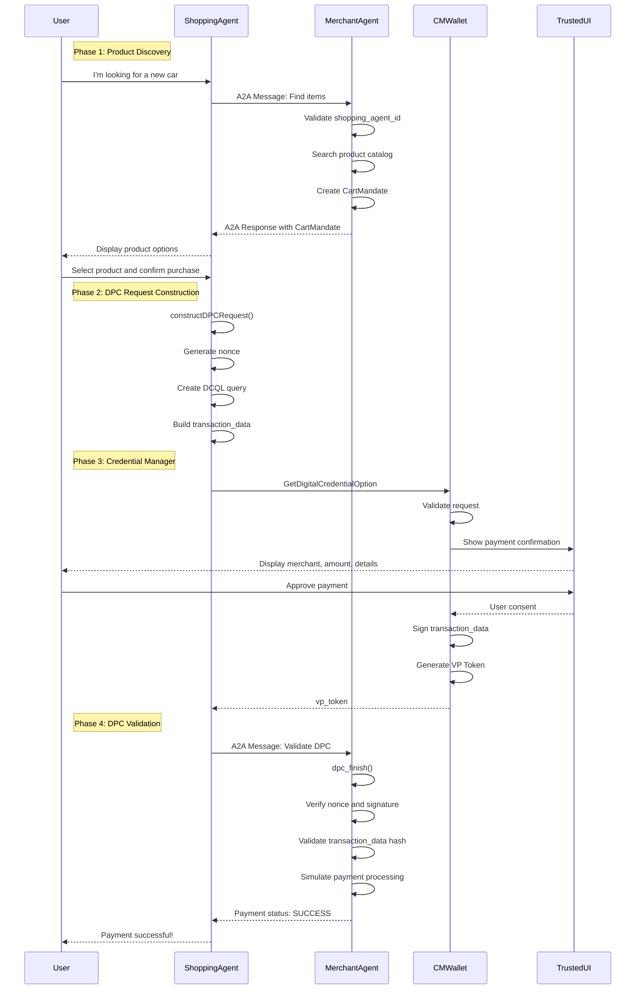

# DPC 시나리오

This illustrates the complete flow of the Digital Payment Credentials scenario using the AP2 framework with the A2A protocol.

## Sequence Diagram



## Key Components

### 1. OpenID4VP Request Structure
The DPC request follows the OpenID for Verifiable Presentations protocol:

```json
{
  "protocol": "openid4vp-v1-unsigned",
  "request": {
    "response_type": "vp_token",
    "response_mode": "dc_api",
    "nonce": "<UUID>",
    "dcql_query": {
      "credentials": [{
        "id": "cred1",
        "format": "mso_mdoc",
        "meta": {
          "doctype_value": "com.emvco.payment_card"
        },
        "claims": [
          {"path": ["com.emvco.payment_card.1", "card_number"]},
          {"path": ["com.emvco.payment_card.1", "holder_name"]}
        ]
      }]
    },
    "transaction_data": ["<base64url-encoded-json>"],
    "client_metadata": {
      "vp_formats_supported": {
        "mso_mdoc": {
          "issuerauth_alg_values": [-7],
          "deviceauth_alg_values": [-7]
        }
      }
    }
  }
}
```

### 2. Transaction Data Structure
The `transaction_data` contains payment details that get signed:

```json
{
  "type": "payment_card",
  "credentialIds": ["cred1"],
  "transactionDataHashesAlg": ["sha-256"],
  "merchantName": "Example Merchant",
  "amount": "US 25000.00",
  "additionalInfo": {
    "title": "Please confirm your purchase details...",
    "tableHeader": ["Name", "Qty", "Price", "Total"],
    "tableRows": [
      ["Tesla Model 3", "1", "25000.0", "25000.0"]
    ],
    "footer": "Your total is 25000.00"
  }
}
```

### 3. Security Features

- **Nonce**: Prevents replay attacks (should be validated by merchant)
- **Transaction Data Signing**: User signs over the exact transaction details
- **Trusted UI**: System-controlled UI prevents UI spoofing
- **Selective Disclosure**: Only requested claims are shared (DCQL)
- **Device Authentication**: ES256 signature from secure element
- **Issuer Authentication**: Credential validity from issuer

## Protocol Standards

This implementation follows several key standards:

1. **OpenID4VP**: OpenID for Verifiable Presentations protocol
2. **ISO/IEC 18013-5**: Mobile driver's license (mdoc) format
3. **DCQL**: Digital Credentials Query Language for selective disclosure
4. **A2A**: Agent-to-Agent communication protocol (AP2 extension)
5. **Android Credential Manager**: Platform API for credential access

## Comparison with EUDI Wallet

| Aspect | DPC Implementation | EUDI Wallet |
|--------|-------------------|-------------|
| **Protocol** | OpenID4VP | OpenID4VP ✓ |
| **Format** | ISO mdoc (mso_mdoc) | ISO mdoc ✓ |
| **Doctype** | com.emvco.payment_card | eu.europa.ec.eudi.pid.1 |
| **Use Case** | Payment authentication | Identity verification |
| **Selective Disclosure** | DCQL ✓ | DCQL ✓ |
| **Signature** | ES256 (COSE -7) ✓ | ES256 (COSE -7) ✓ |
| **Platform** | Android Credential Manager | EUDI Wallet App |

## Notes

- This is a demonstration implementation showing the DPC flow
- Full signature validation is marked as TODO in the merchant agent
- Production implementations should:
  - Validate all cryptographic signatures
  - Check certificate chains
  - Verify nonces and timestamps
  - Forward to payment processors for actual processing
  - Implement proper error handling
  - Add fraud detection mechanisms

## CMWallet 개요

CMWallet은 Android Credential Manager 생태계에서 **Credential Provider** 역할을 하는 앱입니다. Digital Credential을 관리하는 전용 앱으로, 샘플에서는 2개의 가상 신용카드를 제공합니다.


**핵심 기능:**
- **Digital Payment Credentials (DPC) 보관**: 사용자의 결제 카드 정보를 디지털 자격 증명서로 보관합니다
- **Credential Manager 통합**: Android 시스템의 Credential Manager API를 통해 다른 앱에 자격 증명을 제공합니다
- **사용자 승인 UI**: 결제 승인 시 거래 세부 정보를 표시하고 사용자 확인을 요청합니다
- **암호화 서명**: 기기의 보안 요소를 사용하여 거래에 암호화 서명을 생성합니다

**기술 사양:**
- 사용자는 결제 시 복수의 카드 중 선택 가능
- 각 카드는 ISO 18013-5 mDOC 형식으로 저장
- ES256 알고리즘으로 서명되어 위변조 방지

**왜 별도 앱인가?**
- **역할 분리**: Shopping Agent는 쇼핑 경험에 집중, CMWallet은 결제 자격 증명 관리 역할에 집중합니다
- **보안 격리**: 민감한 결제 정보를 별도 앱에서 관리하여 보안을 강화합니다
- **재사용성**: 하나의 CMWallet이 여러 쇼핑 앱에서 사용 가능합니다
- **표준 준수**: Android Credential Manager의 표준 아키텍처 패턴을 준수합니다

**필수 요구사항:**
- CMWallet은 Shopping Agent와 동일 기기에 설치되어야 합니다

## Android Credential Manager API 통합 흐름

```{mermaid}
sequenceDiagram
    participant SA as Shopping Assistant
    participant ACM as Android Credential Manager API
    participant CMW as CM Wallet (Credential Provider)

    SA->>ACM: (1) credentialManager.getCredential(request)
    ACM->>ACM: (2) Find appropriate Credential Provider
    ACM->>CMW: (3) Invoke CM Wallet
    CMW->>CMW: (4) Show UI & get user approval
    CMW->>ACM: (5) Generate signed token
    ACM->>SA: (6) Return token
```

**코드 예시:**

```kotlin
// Credential Manager를 통한 DPC 요청
val credentialManager = CredentialManager.create(context)
val result = credentialManager.getCredential(
    request = GetCredentialRequest(
        credentialOptions = listOf(dpcRequest)
    )
)
```

## DPC 기술 상세 분석

이 예제 시나리오는 DPC (Digital Payment Credential) 요청을 생성합니다. 주요 기능은 쇼핑 카트 정보를 받아 OID4VP (OpenID 4 Verifiable Presentation) 프로토콜 기반의 인증 요청을 생성하는 것입니다.

## EUID Wallet (EU Digital Identity Wallet) 표준 연관성

DPC 시나리오는 EUID Wallet 표준과 여러 측면에서 밀접하게 연관되어 있습니다

### OID4VP (OpenID for Verifiable Presentaiton) 프로토콜 사용

```{code-block} kotlin
:caption: DpcHelper.kt:110~120

val dcRequest =
  Request(
    responseType = "vp_token",
    responseMode = "dc_api",
    nonce = nonce,
    dcqlQuery = dcqlQuery,
    transactionData = listOf(encodedTransactionData),
    clientMetadata = clientMetadata,
  )

val dpcRequest = DpcRequest(protocol = "openid4vp-v1-unsigned", request = dcRequest)
```

* EUDI Wallet 표준의 핵심: EUDI Wallet 은 OpenID4VP 를 주요 프로토콜로 사용합니다.
* Protocol = "openid4vp-v1-unsigned" - EUDI Wallet 도 동일한 프로토콜을 사용하여 Verifiable Presentation 을 요청합니다
* responseType = "vp_token"

### ISO/IEC 18013-5 mode 형식 지원

```{code-block} kotlin
:caption: DpcHelper.kt:85~91

val credentialQuery =
    CredentialQuery(
        id = credId,
        format = mdocIdentifier,
        meta = Meta(doctypeValue = "com.emvco.payment_card"),
        claims = claims,
)
```

```{code-block} kotlin
:caption: DpcHelper.kt:96~100

val mdocFormatsSupported =
    MdocFormatsSupported(
        issuerauthAlgValues = listOf(-7), // ES256
        deviceauthAlgValues = listOf(-7),
    )
```

* EUID Wallet 의 주요 형식: EUID Wallet 은 ISO mdoc (mDL - Mobile Driver's License) 형식을 핵심 credential 형식으로 사용합니다
* Format = mdocIdentifier (mso_mdoc) - EUID Wallet 에서도 동일한 mdoc 형식을 사용합니다
* ES256 알고리즘 - EUID Wallet 에서 권장하는 암호화 알고리즘입니다

### DCQL (Digital Credentials Query Language) 사용

```{code-block} kotlin
:caption: DpcHelper.kt:78~93

  // Build the DCQL query to request specific credential claims.
  val claims =
    listOf(
      Claim(path = listOf("com.emvco.payment_card.1", "card_number")),
      Claim(path = listOf("com.emvco.payment_card.1", "holder_name")),
    )

  val credentialQuery =
    CredentialQuery(
      id = credId,
      format = mdocIdentifier,
      meta = Meta(doctypeValue = "com.emvco.payment_card"),
      claims = claims,
    )

  val dcqlQuery = DcqlQuery(credentials = listOf(credentialQuery))
```

* 선택적 공개 (Selective Disclosure) - EUDI Wallet 의 핵심 원칙입니다
* DCQL 을 사용하여 필요한 특정 claim 만 요청합니다 (카드 번호, 소유자 이름 만)
* EUDI Wallet 도 동일한 방식으로 사용자가 공개할 정보를 선택할 수 있습니다

### Android Credential Manager API 통합

```{code-block} kotlin
:caption: DpcHelpper.kt:67~76

  // Build transaction_data payload.
  val transactionData =
    TransactionData(
      type = "payment_card",
      credentialIds = listOf(credId),
      transactionDataHashesAlg = listOf("sha-256"),
      merchantName = merchantName,
      amount = "US ${String.format("%.2f", totalValue)}",
      additionalInfo = json.encodeToString(additionalInfo), // Serialize the inner object
    )
```

* Android Credential Manager API 는 EUDI Wallet 의 구현 플랫폼 중 하나입니다
* Transaction Data 에 대한 서명 - EUDI Wallet 에서도 중요한 보안 메커니즘입니다
* transactionDataHashesAlg = "sha-256" - 거래 무결성을 보장합니다

```{code-block} kotkin
:caption: DpcHelper.kt:59~65
  val additionalInfo =
    AdditionalInfo(
      title = "Please confirm your purchase details...",
      tableHeader = listOf("Name", "Qty", "Price", "Total"),
      tableRows = tableRows,
      footer = footerText,
    )
```

* EUID Wallet 의 핵심 원칙: 사용자가 공유하는 정보를 명확히 보고 동의해야 합니다
* 구매 세부사항을 표시하여 사용자가 서명하는 내용을 정확히 이해할 수 있게 합니다

### DPC vs EUDI Wallet 차이점

* **용도**: DPC는 결제에 특화 (payment_card), EUDI Wallet은 신원 증명이 주요 목적
* **doctype**: com.emvco.payment_card vs EUDI Wallet의 eu.europa.ec.eudi.pid.1 (Personal ID)
* **서명**: 현재는 unsigned 버전을 사용하지만, EUDI Wallet은 강력한 암호화 서명 요구

### DPC 한계점 및 고려사항

**현재의 제약사항:**
- **플랫폼 한정**: 현재 Android에만 구현, iOS 지원 제한적
- **생태계 미성숙**: CMWallet 등 credential provider가 아직 초기 단계
- **사용자 교육**: 새로운 개념으로 사용자 이해와 신뢰 구축 필요
- **표준화 진행 중**: OpenID4VP, mDOC 등이 아직 완전히 확립되지 않음

**보안 및 개인정보:**
- **검증 메커니즘**: 현재 샘플은 unsigned 버전, 실제 운영에서는 완전한 서명 검증 필수
- **키 관리**: 사용자 기기에서의 안전한 키 저장 및 관리 중요
- **재생 공격 방지**: Nonce 및 타임스탬프 검증 필요
- **프라이버시 역설**: 강력한 인증이 익명성과 상충될 수 있음

**기술적 고려사항:**
- **성능**: 암호학적 연산으로 인한 지연 시간 (일반적으로 1-2초)
- **저장 공간**: mDOC 형식의 credential 저장에 필요한 공간
- **네트워크 의존성**: 초기 credential 발급 시 온라인 연결 필요
- **호환성**: 다양한 Android 버전 및 기기 지원 필요

**사업적 고려사항:**
- **가맹점 수용**: 새로운 결제 방식에 대한 가맹점 시스템 업그레이드 필요
- **규제 준수**: 각국의 금융 규제 및 데이터 보호법 준수
- **비즈니스 모델**: 기존 카드 네트워크와의 수익 모델 차이
- **사용자 인센티브**: 복잡한 새 시스템 도입을 정당화할 혜택 제공 필요

## DPC 개선 방향 (Next Steps)

### 서명된 OpenID4VP 흐름으로의 전환

현재 샘플은 `openid4vp-v1-unsigned` 프로파일을 사용하므로, Merchant Agent 는 토큰 진위 여부를 검증하지 못합니다. ARF(Security Level High)와 EUDI Wallet 파일럿에서는 서명/검증이 필수 요소로 간주되므로 다음 작업이 필요합니다.

- **서명 프로파일 채택**: EMVCo DC-API 서명 확장 또는 OpenID4VP `signed` 프로파일로 업그레이드하고, mdoc 기반 credential 서명을 해석할 수 있는 검증 로직을 Merchant Agent 에 추가합니다.
- **검증 서비스 분리**: 지갑에서 반환한 VP 토큰에 대해 issuer 서명, credential 유효기간, nonce를 검증하는 Verifier/Wallet Back-End를 구성합니다.
- **Trust Framework 정합성**: ARF 가이드라인에서 요구하는 신뢰 anchor(국가/회원국 발급자 루트 인증서)와 Revocation 검사를 통합합니다.

### 재현 공격 및 키 관리 개선

- **Replay 방지**: nonce·session binding을 강화하고 Merchants/logger 쪽에서 사용된 토큰을 기록하여 재사용을 차단합니다.
- **지갑 키보호**: Android 하드웨어 백업 키 저장소(Keystore) 및 향후 iOS Secure Enclave를 이용한 키 저장/attestation을 도입합니다.

### Merchant 측 보증 수준 상향

- **거래 영수증**: Merchant Agent 가 검증 결과와 고객 동의 evidence를 보관해 non-repudiation을 달성합니다.
- **Fallback 흐름**: 증명 실패 시 기존 카드 결제 혹은 스텝업 인증으로 전환하는 사용자 경험을 설계합니다.

### iOS 및 기타 플랫폼 정합성

- **iOS 지원 현실화**: WWDC24에서 공개된 IdentityCredential / Digital Credentials API는 개발자 프리뷰 수준이므로, Apple의 Public Release 일정을 추적하고 베타 프레임워크 실험을 병행합니다.
- **프로토콜 정렬**: 현재 iOS 프레임워크는 ISO 18013-5/7 기반 mdoc 흐름만 공식 지원 예정으로 알려져 있으므로, OpenID4VP support roadmap 공개 시까지는 SD-JWT VC 또는 web-based bridge 방식을 병행합니다.
- **플랫폼 추상화**: Credential Manager (Android)·IdentityCredential(iOS)·WebAuthn 기반 브라우저 API를 아우르는 공통 추상화 레이어를 설계하여, 지갑/발급자/검증자 역할을 ARF와 동일한 구조로 매핑합니다.

### 생태계 및 규제 대응

- **규제 일치**: EMVCo DC-API, ETSI TS 119 495(수신자 서명) 등 결제용 표준을 모니터링하고, EUDI Wallet 시행규정(2024/1183)에서 요구하는 PID/EAA(전자 속성) 처리 절차를 문서화합니다.
- **인증 준비**: 지갑·검증자 모듈을 EUDI Wallet Conformity Assessment (BR-EL, DR-EL) 요구사항에 맞춰 테스트하고, 파일럿 참여국(예: EWC, NOBCCS)에서 공개한 상호운용성 체크리스트를 반영합니다.

