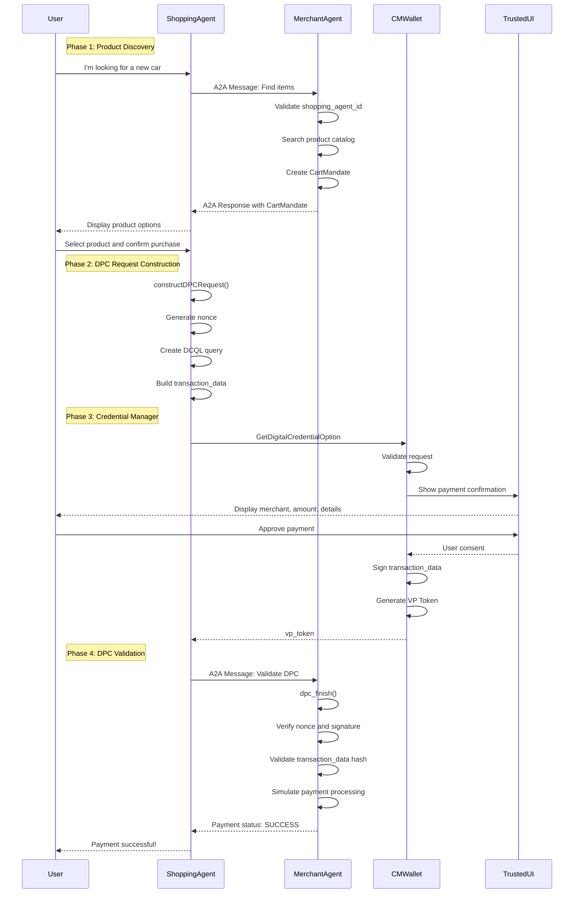
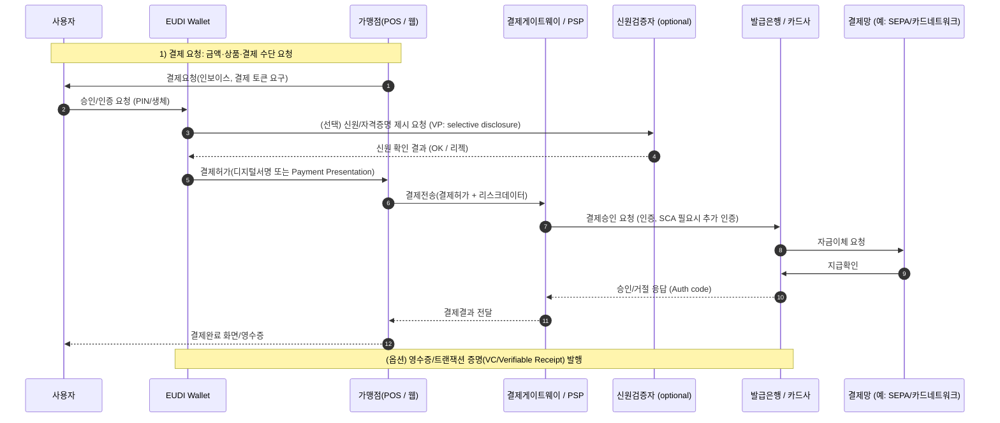
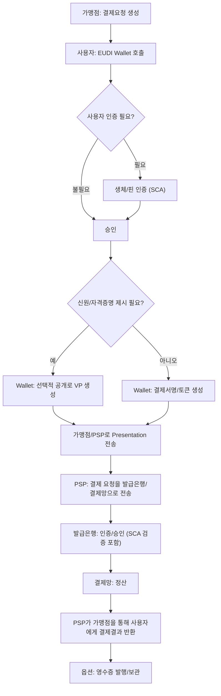

# DPC 시나리오

!!! warning "문서 작성 중"

    이 문서와 하위 문서들은 현재 작성 중이며, 부정확하거나 불완전한 정보를 포함할 수 있습니다.
    프로덕션 환경에서 사용하기 전에 반드시 공식 문서와 표준을 참조하시기 바랍니다.

This illustrates the complete flow of the Digital Payment Credentials scenario using the AP2 framework with the A2A protocol.

## Sequence Diagram



## Key Components

### 1. OpenID4VP Request Structure
The DPC request follows the OpenID for Verifiable Presentations protocol:

```json
{
  "protocol": "openid4vp-v1-unsigned",
  "request": {
    "response_type": "vp_token",
    "response_mode": "dc_api",
    "nonce": "<UUID>",
    "dcql_query": {
      "credentials": [{
        "id": "cred1",
        "format": "mso_mdoc",
        "meta": {
          "doctype_value": "com.emvco.payment_card"
        },
        "claims": [
          {"path": ["com.emvco.payment_card.1", "card_number"]},
          {"path": ["com.emvco.payment_card.1", "holder_name"]}
        ]
      }]
    },
    "transaction_data": ["<base64url-encoded-json>"],
    "client_metadata": {
      "vp_formats_supported": {
        "mso_mdoc": {
          "issuerauth_alg_values": [-7],
          "deviceauth_alg_values": [-7]
        }
      }
    }
  }
}
```

### 2. Transaction Data Structure
The `transaction_data` contains payment details that get signed:

```json
{
  "type": "payment_card",
  "credentialIds": ["cred1"],
  "transactionDataHashesAlg": ["sha-256"],
  "merchantName": "Example Merchant",
  "amount": "US 25000.00",
  "additionalInfo": {
    "title": "Please confirm your purchase details...",
    "tableHeader": ["Name", "Qty", "Price", "Total"],
    "tableRows": [
      ["Tesla Model 3", "1", "25000.0", "25000.0"]
    ],
    "footer": "Your total is 25000.00"
  }
}
```

### 3. Security Features

- **Nonce**: Prevents replay attacks (should be validated by merchant)
- **Transaction Data Signing**: User signs over the exact transaction details
- **Trusted UI**: System-controlled UI prevents UI spoofing
- **Selective Disclosure**: Only requested claims are shared (DCQL)
- **Device Authentication**: ES256 signature from secure element
- **Issuer Authentication**: Credential validity from issuer

## Agent Responsibilities

| Agent | Responsibilities |
|-------|-----------------|
| **Shopping Agent** | Orchestrates flow, manages user interaction, constructs DPC request with OpenID4VP protocol |
| **Merchant Agent** | Product catalog, creates and signs CartMandate, validates DPC and forwards to Payment Processor |
| **Credential Provider (CMWallet)** | Stores digital payment credentials, provides Trusted UI for user approval, generates cryptographically signed VP tokens |
| **Payment Processor** | Validates VP tokens and cryptographic signatures, processes actual payment transactions, generates transaction IDs |

## Protocol Standards

This implementation follows several key standards:

1. **OpenID4VP 1.0**: OpenID for Verifiable Presentations protocol (Final 스펙 - 2025년 7월)
2. **ISO/IEC 18013-5/7**: Mobile driver's license (mdoc) format 및 온라인 검증 프로토콜
3. **DCQL**: Digital Credentials Query Language for selective disclosure (OID4VP 1.0 핵심 컴포넌트)
4. **W3C Digital Credentials API**: 웹 브라우저 기반 credential 요청 API (Chrome 141+, Safari 26+ 지원)
5. **A2A**: Agent-to-Agent communication protocol (AP2 extension)
6. **Android Credential Manager / iOS IdentityCredential**: 플랫폼 API for credential access

> [!NOTE]
> **2025년 주요 마일스톤**: EU는 eIDAS 2.0을 통해 2026년 12월까지 모든 디지털 ID 지갑에 OpenID4VP 사용을 의무화했습니다.
> OpenID Foundation의 2025년 7월 상호운용성 이벤트에서 87%의 성공률을 달성했습니다.

## Comparison with EUDI Wallet

| Aspect | DPC Implementation | EUDI Wallet |
|--------|-------------------|-------------|
| **Protocol** | OpenID4VP | OpenID4VP ✓ |
| **Format** | ISO mdoc (mso_mdoc) | SD-JWT, ISO mdoc ✓ |
| **Doctype** | com.emvco.payment_card | eu.europa.ec.eudi.pid.1 |
| **Use Case** | Payment authentication | Identity verification |
| **Selective Disclosure** | DCQL ✓ | DCQL ✓ |
| **Signature** | ES256 (COSE -7) ✓ | ES256 (COSE -7) ✓ |
| **Platform** | Android Credential Manager | EUDI Wallet App |

## Notes

- This is a demonstration implementation showing the DPC flow
- **Payment Processor integration is currently simulated** in the sample code for simplicity
- In the sequence diagram above, the shaded area shows the Payment Processor flow that should be implemented in production
- Full signature validation is marked as TODO in the merchant agent
- Production implementations should:
  - **Implement Payment Processor** to handle actual payment transactions
  - Validate all cryptographic signatures (issuer and device authentication)
  - Check certificate chains and revocation status
  - Verify nonces and timestamps to prevent replay attacks
  - Forward validated VP tokens to payment processors for actual processing
  - Implement proper error handling and retry logic
  - Add fraud detection mechanisms
  - Generate and store transaction receipts for non-repudiation

## EUID Wallet (EU Digital Identity Wallet) 연관성

DPC 시나리오는 EUID Wallet 표준과 여러 측면에서 밀접하게 연관되어 있습니다

### OID4VP (OpenID for Verifiable Presentation) 프로토콜 사용

```kotlin title="DpcHelper.kt:110~120"
val dcRequest =
  Request(
    responseType = "vp_token",
    responseMode = "dc_api",
    nonce = nonce,
    dcqlQuery = dcqlQuery,
    transactionData = listOf(encodedTransactionData),
    clientMetadata = clientMetadata,
  )

val dpcRequest = DpcRequest(protocol = "openid4vp-v1-unsigned", request = dcRequest)
```

* EUDI Wallet 표준의 핵심: EUDI Wallet 은 OpenID4VP 를 주요 프로토콜로 사용합니다.
* Protocol = "openid4vp-v1-unsigned" - EUDI Wallet 도 동일한 프로토콜을 사용하여 Verifiable Presentation 을 요청합니다
* responseType = "vp_token"

### ISO/IEC 18013-5 mdoc 형식 지원

```kotlin title="DpcHelper.kt:85~91"
val credentialQuery =
    CredentialQuery(
        id = credId,
        format = mdocIdentifier,
        meta = Meta(doctypeValue = "com.emvco.payment_card"),
        claims = claims,
)
```

```kotlin title="DpcHelper.kt:96~100"
val mdocFormatsSupported =
    MdocFormatsSupported(
        issuerauthAlgValues = listOf(-7), // ES256
        deviceauthAlgValues = listOf(-7),
    )
```

* EUID Wallet 의 주요 형식: EUID Wallet 은 ISO mdoc (mDL - Mobile Driver's License) 형식을 핵심 credential 형식으로 사용합니다
* Format = mdocIdentifier (mso_mdoc) - EUID Wallet 에서도 동일한 mdoc 형식을 사용합니다
* ES256 알고리즘 - EUID Wallet 에서 권장하는 암호화 알고리즘입니다

### DCQL (Digital Credentials Query Language) 사용

```kotlin title="DpcHelper.kt:78~93"
// Build the DCQL query to request specific credential claims.
val claims =
  listOf(
    Claim(path = listOf("com.emvco.payment_card.1", "card_number")),
    Claim(path = listOf("com.emvco.payment_card.1", "holder_name")),
  )

val credentialQuery =
  CredentialQuery(
    id = credId,
    format = mdocIdentifier,
    meta = Meta(doctypeValue = "com.emvco.payment_card"),
    claims = claims,
  )

val dcqlQuery = DcqlQuery(credentials = listOf(credentialQuery))
```

* 선택적 공개 (Selective Disclosure) - EUDI Wallet 의 핵심 원칙입니다
* DCQL 을 사용하여 필요한 특정 claim 만 요청합니다 (카드 번호, 소유자 이름 만)
* EUDI Wallet 도 동일한 방식으로 사용자가 공개할 정보를 선택할 수 있습니다

### Android Credential Manager API 통합

```kotlin title="DpcHelper.kt:67~76"
// Build transaction_data payload.
val transactionData =
  TransactionData(
    type = "payment_card",
    credentialIds = listOf(credId),
    transactionDataHashesAlg = listOf("sha-256"),
    merchantName = merchantName,
    amount = "US ${String.format("%.2f", totalValue)}",
    additionalInfo = json.encodeToString(additionalInfo), // Serialize the inner object
  )
```

* Android Credential Manager API 는 EUDI Wallet 의 구현 플랫폼 중 하나입니다
* Transaction Data 에 대한 서명 - EUDI Wallet 에서도 중요한 보안 메커니즘입니다
* transactionDataHashesAlg = "sha-256" - 거래 무결성을 보장합니다

```kotlin title="DpcHelper.kt:59~65"
val additionalInfo =
  AdditionalInfo(
    title = "Please confirm your purchase details...",
    tableHeader = listOf("Name", "Qty", "Price", "Total"),
    tableRows = tableRows,
    footer = footerText,
  )
```

* EUID Wallet 의 핵심 원칙: 사용자가 공유하는 정보를 명확히 보고 동의해야 합니다
* 구매 세부사항을 표시하여 사용자가 서명하는 내용을 정확히 이해할 수 있게 합니다

### Payment process in a EUID Wallet

> **Reference:** ARF v2.2.0 (2025년 11월) - Wallet Unit Attestations(WUA), Pseudonyms, Zero-Knowledge Proofs(ZKP), W3C Digital Credentials API 관련 업데이트 포함
>
> **2025년 주요 CIR(Commission Implementing Regulations):**
> - CIR 2025/846: 국경 간 신원 매칭
> - CIR 2025/847: EUDI Wallet 보안 침해 대응
> - CIR 2025/848: Wallet Relying Party 등록
> - CIR 2025/849: 인증된 EUDI Wallet 목록






-	Selective Disclosure: EUDI Wallet은 필요한 최소 정보만 선택적으로 제공(예: "성인임"만 증명) — 프라이버시 보호.
-	디지털 서명 / VP (Verifiable Presentation): 결제 승인 메시지는 사용자의 서명(혹은 지갑의 결제 토큰)으로 무결성/비부인성 보장.
-	SCA(강한 고객 인증): 금액·리스크 기준에 따라 지문/페이스ID/PIN 같은 추가 인증이 Wallet에서 실행될 수 있음.
-	Verifier의 역할(옵션): 가맹점/PSP가 신원을 직접 검증하지 않고 제3자 검증자에게 확인을 요청할 수 있음.
-	결제 실무(자금 이동): ID/자격 검증은 결제 승인 흐름과 병렬적이거나 선행될 수 있으며, 실제 자금 이체는 기존 결제망(SEPA, 카드네트워크 등)을 통해 이뤄짐.

### DPC vs EUDI Wallet 차이점

* **용도**: DPC는 결제에 특화 (payment_card), EUDI Wallet은 신원 증명이 주요 목적
* **doctype**: com.emvco.payment_card vs EUDI Wallet의 eu.europa.ec.eudi.pid.1 (Personal ID)
* **서명**: 현재는 unsigned 버전을 사용하지만, EUDI Wallet은 강력한 암호화 서명 요구

### DPC 한계점 및 고려사항

**현재의 제약사항 (2025년 1월 기준):**
- **iOS 지원 진행 중**: WWDC25에서 W3C Digital Credentials API 지원 발표, iOS/macOS 26부터 Safari에서 지원
- **생태계 성장 중**: Chrome 141에서 Digital Credentials API 기본 활성화, 크로스 디바이스 presentation 지원 (Chrome 136+)
- **사용자 교육**: 새로운 개념으로 사용자 이해와 신뢰 구축 필요
- **표준화 안정화**: OpenID4VP 1.0 Final (2025년 7월), W3C Digital Credentials API Working Draft (2025년 7월)

**보안 및 개인정보:**
- **검증 메커니즘**: 현재 샘플은 unsigned 버전, 실제 운영에서는 완전한 서명 검증 필수
- **키 관리**: 사용자 기기에서의 안전한 키 저장 및 관리 중요
- **재생 공격 방지**: Nonce 및 타임스탬프 검증 필요
- **프라이버시 역설**: 강력한 인증이 익명성과 상충될 수 있음 (Google Wallet은 Zero Knowledge Proofs 도입 예정)

**기술적 고려사항:**
- **성능**: 암호학적 연산으로 인한 지연 시간 (일반적으로 1-2초)
- **저장 공간**: mDOC 형식의 credential 저장에 필요한 공간
- **네트워크 의존성**: 초기 credential 발급 시 온라인 연결 필요
- **호환성**: 다양한 Android 버전 및 기기 지원 필요

**사업적 고려사항:**
- **가맹점 수용**: 새로운 결제 방식에 대한 가맹점 시스템 업그레이드 필요
- **규제 준수**: 각국의 금융 규제 및 데이터 보호법 준수
- **비즈니스 모델**: 기존 카드 네트워크와의 수익 모델 차이
- **사용자 인센티브**: 복잡한 새 시스템 도입을 정당화할 혜택 제공 필요

## DPC 개선 방향 (Next Steps)

### 서명된 OpenID4VP 흐름으로의 전환

현재 샘플은 `openid4vp-v1-unsigned` 프로파일을 사용하므로, Merchant Agent 는 토큰 진위 여부를 검증하지 못합니다. ARF(Security Level High)와 EUDI Wallet 파일럿에서는 서명/검증이 필수 요소로 간주되므로 다음 작업이 필요합니다.

- **서명 프로파일 채택**: EMVCo DC-API 서명 확장 또는 OpenID4VP `signed` 프로파일로 업그레이드하고, mdoc 기반 credential 서명을 해석할 수 있는 검증 로직을 Merchant Agent 에 추가합니다.
- **검증 서비스 분리**: 지갑에서 반환한 VP 토큰에 대해 issuer 서명, credential 유효기간, nonce를 검증하는 Verifier/Wallet Back-End를 구성합니다.
- **Trust Framework 정합성**: ARF 가이드라인에서 요구하는 신뢰 anchor(국가/회원국 발급자 루트 인증서)와 Revocation 검사를 통합합니다.

### 재현 공격 및 키 관리 개선

- **Replay 방지**: nonce·session binding을 강화하고 Merchants/logger 쪽에서 사용된 토큰을 기록하여 재사용을 차단합니다.
- **지갑 키보호**: Android 하드웨어 백업 키 저장소(Keystore) 및 향후 iOS Secure Enclave를 이용한 키 저장/attestation을 도입합니다.

### Merchant 측 보증 수준 상향

- **거래 영수증**: Merchant Agent 가 검증 결과와 고객 동의 evidence를 보관해 non-repudiation을 달성합니다.
- **Fallback 흐름**: 증명 실패 시 기존 카드 결제 혹은 스텝업 인증으로 전환하는 사용자 경험을 설계합니다.

### iOS 및 기타 플랫폼 정합성 (2025년 업데이트)

- **iOS 지원 공식화 (WWDC25)**: Apple은 WWDC25에서 W3C Digital Credentials API 지원을 발표했습니다. Safari 26 (macOS 26, iOS 26, iPadOS 26)부터 웹사이트가 Apple Wallet 및 서드파티 지갑에서 모바일 ID를 직접 요청할 수 있습니다.
- **프로토콜 정렬**: iOS는 "org-iso-mdoc" 프로토콜만 지원하며 ISO/IEC 18013-7 Annex C 표준을 따릅니다. OpenID4VP는 Chrome/Android에서 지원되며, 플랫폼별 프로토콜 차이를 고려한 설계가 필요합니다.
- **Digital ID 기능**: Apple Wallet에서 미국 여권을 사용한 Digital ID 생성 기능이 2025년 후반 출시 예정이며, 일부 TSA 체크포인트에서 국내선 여행 시 사용 가능합니다.
- **서드파티 앱 통합**: IdentityDocumentServices 프레임워크와 앱 확장을 구현하여 서드파티 앱도 문서 제공자로 기능할 수 있습니다.
- **플랫폼 추상화**: Credential Manager (Android)·IdentityCredential/Digital Credentials API (iOS)·WebAuthn 기반 브라우저 API를 아우르는 공통 추상화 레이어를 설계합니다.
- **Verify with Wallet API**: iOS 앱 개발자는 Apple Wallet에 저장된 디지털 운전면허증이나 주 ID를 사용하여 연령 또는 신원 확인이 가능합니다 (일본 국민 ID는 iOS 18.5+ 필요).

### 생태계 및 규제 대응 (2025년 업데이트)

- **규제 준수**: EU는 eIDAS 2.0을 통해 2026년 12월까지 모든 디지털 ID 지갑에 OpenID4VP 사용을 의무화했으며, 이는 약 4억 5천만 EU 시민에게 영향을 미칩니다.
- **EMVCo-EUDI Wallet 통합**: EMVCo는 European Identity Wallet Consortium(EWC)과 협력하여 EUDI Wallet이 EMV 3DS 거래에서 카드 소유자 인증을 어떻게 촉진할 수 있는지 평가 중입니다 (2025년 7월 결과 예상).
- **Implementing Acts**: EU 위원회는 2024년 11월, 2025년 3월, 2025년 5월 세 차례에 걸쳐 Implementing Acts를 발표했습니다.
- **연령 확인 블루프린트**: 2025년 7월 EU 위원회는 EUDI Wallet과 상호운용 가능한 화이트라벨 연령 확인 블루프린트를 파일럿 프로젝트로 발표했습니다.
- **기업 도입 준비**: 기업들은 2026-2027년 EUDI Wallet 수용을 위해 2025년에 조달 및 기술 매핑을 계획해야 합니다.
- **인증 준비**: 지갑·검증자 모듈을 EUDI Wallet Conformity Assessment (BR-EL, DR-EL) 요구사항에 맞춰 테스트하고, 파일럿 참여국(예: EWC)에서 공개한 상호운용성 체크리스트를 반영합니다.

## 2025년 주요 업데이트 요약

| 항목 | 상태 (2025년 1월 기준) |
|------|------------------------|
| **OpenID4VP** | 1.0 Final (2025년 7월), EU 2026년 12월 의무화 |
| **W3C Digital Credentials API** | Working Draft (2025년 7월), Chrome 141+에서 기본 활성화 |
| **EUDI Wallet ARF** | v2.2.0 (2025년 11월), ZKP/WUA/Pseudonyms 지원 |
| **iOS 지원** | WWDC25 발표, Safari 26+ Digital Credentials API 지원 |
| **Android 지원** | Chrome 136+ 크로스 디바이스, Chrome 143+ credential 발급 지원 |
| **EMVCo 통합** | EWC와 협력하여 EMV 3DS + EUDI Wallet 통합 평가 중 |
| **상호운용성** | OpenID Foundation 이벤트 87% 성공률 (2025년 7월) |
