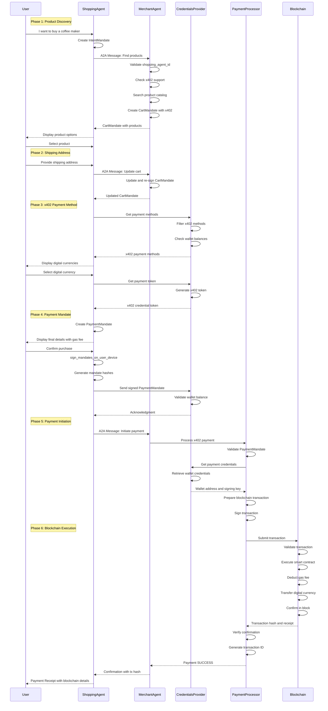

# x402 시나리오

!!! warning "문서 작성 중"

    이 문서와 하위 문서들은 현재 작성 중이며, 부정확하거나 불완전한 정보를 포함할 수 있습니다.
    프로덕션 환경에서 사용하기 전에 반드시 공식 문서와 표준을 참조하시기 바랍니다.

This document illustrates the complete flow of the Human Present x402 Payment scenario using the AP2 framework with the A2A protocol and x402 payment standard.

## Sequence Diagram



## Key Components

### 1. IntentMandate Structure

The IntentMandate captures the user's shopping intent:

```json
{
  "intent_mandate_id": "uuid",
  "natural_language_description": "I want to buy a coffee maker",
  "user_prompt_required": true,
  "merchants": ["merchant_agent"],
  "skus": ["coffee-maker-001"],
  "intent_expiry": "2025-11-18T10:00:00Z",
  "requires_refundability": false
}
```

### 2. CartMandate Structure with x402 Support

The CartMandate contains product and x402 payment request details:

```json
{
  "cart_mandate_id": "uuid",
  "merchant_name": "Example Merchant",
  "cart_expiry": "2025-11-18T10:00:00Z",
  "refund_period": "P30D",
  "payment_request": {
    "method_data": [{
      "supported_methods": ["x402"],
      "data": {
        "supported_chains": ["ethereum", "polygon", "base"],
        "supported_currencies": ["USDC", "USDT", "DAI"],
        "merchant_wallet_address": "0x1234567890abcdef..."
      }
    }],
    "details": {
      "id": "order-123",
      "total": {
        "label": "Total",
        "amount": {"currency": "USDC", "value": "79.99"}
      },
      "displayItems": [
        {"label": "Coffee Maker", "amount": {"value": "69.99"}},
        {"label": "Shipping", "amount": {"value": "5.00"}},
        {"label": "Tax", "amount": {"value": "5.00"}},
        {"label": "Estimated Gas Fee", "amount": {"value": "0.50"}}
      ]
    }
  },
  "merchant_signature": "signature_by_merchant"
}
```

### 3. PaymentMandate Structure for x402

The PaymentMandate authorizes the x402 payment:

```json
{
  "payment_mandate_contents": {
    "payment_mandate_id": "uuid",
    "timestamp": "2025-11-17T12:00:00Z",
    "payment_details_id": "order-123",
    "payment_details_total": {
      "label": "Total",
      "amount": {"currency": "USDC", "value": "79.99"}
    },
    "payment_response": {
      "request_id": "order-123",
      "method_name": "x402",
      "details": {
        "token": {
          "value": "encrypted_x402_token",
          "url": "http://localhost:8002/a2a/credentials_provider"
        },
        "chain_id": "1",
        "currency": "USDC",
        "contract_address": "0xA0b86991c6218b36c1d19D4a2e9Eb0cE3606eB48"
      },
      "shipping_address": {
        "streetAddress": "123 Main St",
        "city": "San Francisco",
        "state": "CA",
        "zipCode": "94102"
      },
      "payer_email": "user@example.com"
    },
    "merchant_agent": "merchant_agent"
  },
  "user_authorization": "cart_hash_payment_hash_signature"
}
```

### 4. x402 Payment Credential Token

The token contains blockchain wallet credentials:

```json
{
  "value": "encrypted_x402_payment_token",
  "url": "http://localhost:8002/a2a/credentials_provider"
}
```

The Credentials Provider decrypts this to reveal:

```json
{
  "wallet_address": "0xabcdef1234567890...",
  "chain_id": "1",
  "currency": "USDC",
  "balance": "1000.00",
  "signing_authority": "delegated_signer_key",
  "is_smart_wallet": true
}
```

### 5. Blockchain Transaction Structure

The transaction submitted to the blockchain:

```json
{
  "from": "0xabcdef1234567890...",
  "to": "0x1234567890abcdef...",
  "value": "0",
  "data": "0xa9059cbb...",
  "chainId": 1,
  "nonce": 42,
  "gasLimit": "100000",
  "maxFeePerGas": "50000000000",
  "maxPriorityFeePerGas": "2000000000"
}
```

### 6. Transaction Receipt

The blockchain receipt confirming the transaction:

```json
{
  "transactionHash": "0x123abc...",
  "blockNumber": 12345678,
  "blockHash": "0x789def...",
  "from": "0xabcdef1234567890...",
  "to": "0xA0b86991c6218b36c1d19D4a2e9Eb0cE3606eB48",
  "gasUsed": "65000",
  "effectiveGasPrice": "50000000000",
  "status": "success"
}
```

## Protocol Flow Details

### Mandate Lifecycle

1. **IntentMandate**: Created by Shopping Agent to express user's shopping intent
2. **CartMandate**: Created by Merchant Agent with product details and x402 payment options
3. **PaymentMandate**: Created by Shopping Agent with selected x402 payment method

### x402 Payment Flow

1. **Merchant advertises x402 support**: Includes supported chains and currencies
2. **User selects digital currency**: Choose from available stablecoins (USDC, USDT, DAI)
3. **Credentials Provider issues token**: Contains wallet address and signing authority
4. **Transaction preparation**: Build blockchain transaction with proper gas settings
5. **Transaction submission**: Submit to blockchain network
6. **Confirmation waiting**: Wait for required number of block confirmations
7. **Receipt generation**: Record transaction hash and on-chain proof

### Security Features

- **Merchant Signature**: CartMandate is signed by merchant to ensure authenticity
- **User Authorization**: PaymentMandate is signed by user to authorize purchase
- **Hash Binding**: User signature includes hashes of both CartMandate and PaymentMandate
- **Smart Wallet Support**: Can use account abstraction for enhanced security
- **On-Chain Verification**: All transactions are verifiable on blockchain
- **Cryptographic Signatures**: Transaction signed with private key
- **Gas Fee Transparency**: Estimated and actual gas fees are disclosed

### Agent Responsibilities

| Agent | Responsibilities |
|-------|-----------------|
| **Shopping Agent** | Orchestrates flow, manages user interaction, creates IntentMandate and PaymentMandate |
| **Merchant Agent** | Product catalog, creates and signs CartMandate, advertises x402 support |
| **Credentials Provider** | Manages digital wallets, provides signing authority, validates balances |
| **Payment Processor** | Builds and submits blockchain transactions, verifies confirmations |
| **Blockchain Network** | Executes transactions, maintains distributed ledger |

## x402 Protocol Integration

### HTTP Payment Flow

The x402 protocol integrates payment into HTTP:

1. **402 Payment Required**: Server responds with x402 payment details
2. **Payment Negotiation**: Client and server agree on payment terms
3. **Transaction Execution**: Payment is processed on blockchain
4. **Service Delivery**: Server delivers requested resource after confirmation

### Key x402 Features

- **Programmable Payments**: AI agents can pay automatically
- **Microtransaction Support**: Efficient for small amounts
- **Multi-Currency**: Support for various stablecoins and cryptocurrencies
- **Cross-Chain**: Can work across different blockchain networks
- **Instant Settlement**: Faster than traditional payment rails
- **No KYC Required**: Permissionless for AI agents

## Comparison with Card Payments

| Aspect | x402 Payment | Card Payment |
|--------|--------------|--------------|
| **Payment Method** | Digital currency (stablecoins) | Tokenized card (DPAN) |
| **Settlement** | On-chain, instant | Traditional payment network |
| **Fees** | Gas fees (blockchain) | Processing fees |
| **Verification** | Blockchain confirmations | OTP challenge |
| **Refunds** | Smart contract or manual | Chargeback system |
| **Cross-Border** | Native support | Currency conversion |
| **Programmability** | Smart contracts | Limited |
| **Transparency** | Fully transparent on-chain | Private transactions |
| **Custody** | Self-custody or delegated | Issuer holds funds |

## Protocol Standards

This implementation follows several key standards:

1. **A2A (Agent-to-Agent)**: Communication protocol between agents
2. **AP2 (Agent Payments Protocol)**: Payment-specific extension to A2A
3. **x402**: HTTP payment protocol for digital currencies
4. **ERC-20**: Token standard for stablecoins on Ethereum
5. **EIP-1559**: Gas fee mechanism for Ethereum transactions
6. **EIP-4337**: Account abstraction for smart wallets
7. **Mandate Pattern**: Structured, signed data objects for cart and payment

## Benefits of x402 in AP2 Context

1. **Payment Agnosticism**: AP2 supports both traditional and digital currencies
2. **AI-Native**: Designed for autonomous agent transactions
3. **Interoperability**: Works across different blockchain networks
4. **Verifiable Credentials**: On-chain proof of all transactions
5. **Future-Proof**: Ready for emerging payment methods
6. **Cost Efficient**: Lower fees for microtransactions
7. **Global Access**: No geographic restrictions

## Implementation Notes

### Current Status

- **AP2 x402 Extension**: Under development
- **Reference Implementation**: Available at [a2a-x402](https://github.com/google-agentic-commerce/a2a-x402/)
- **Alignment with AP2**: In progress to ensure mandate compatibility

### Development Partners

Working with leading Web3 and payment ecosystem partners:

- Coinbase
- CrossMint
- EigenLayer
- Ethereum Foundation
- Mesh
- Metamask
- Mysten Labs

### Coming Soon

- Full mandate lifecycle support in x402 extension
- Smart contract integration examples
- Multi-chain payment routing
- Gas optimization strategies
- Refund and dispute resolution mechanisms

## Notes

- This is a conceptual implementation showing the x402 payment flow
- The actual x402 extension is being developed in collaboration with Web3 partners
- Production implementations should:
  - Implement proper wallet security (hardware wallets, MPC)
  - Handle chain reorganizations and transaction failures
  - Optimize gas fees with batch transactions
  - Implement slippage protection for token swaps
  - Add proper error handling and retry logic
  - Monitor transaction status and confirmations
  - Implement fallback to alternative chains if needed
  - Store private keys securely (never in plain text)
  - Use secure communication channels (TLS/HTTPS)
  - Implement rate limiting and fraud detection
