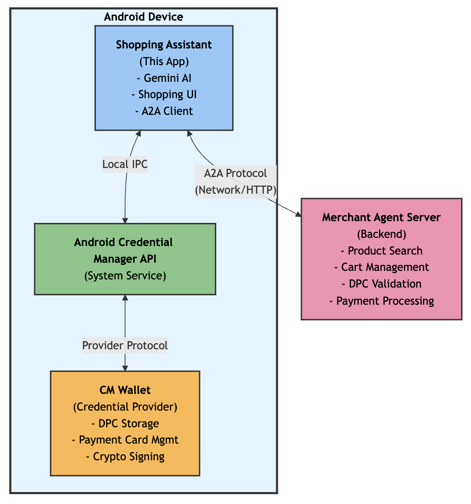

# Agent Payment Protocol Samples

## Introduction

### AP2 프로토콜 개요

AP2(Agent to Payment)는 Google이 제안한 AI 에이전트 시대의 결제 프로토콜입니다. AI 에이전트가 사용자를 대신하여 자율적으로 상품을 구매하고 서비스에 가입하는 미래를 대비하여, 안전하고 효율적인 결제 방법을 정의합니다.

### 세 가지 시나리오

AP2 샘플은 서로 다른 특성과 도입 시기를 가진 **세 가지 결제 시나리오**를 제공합니다. 각 시나리오는 현실적 도입 가능성 순서로 배치되었습니다:

#### 1. Cards - 기존 인프라 활용 (현재: 즉시 도입 가능)
전통적인 신용카드 결제 네트워크를 그대로 활용하는 가장 현실적인 접근 방식입니다. 기존 인프라를 사용하므로 즉시 도입이 가능하며, 전 세계 대부분의 가맹점에서 사용할 수 있습니다.

#### 2. DPC - 디지털 자격증명 기반 (중기: 표준화 진행 중)
Digital Payment Credential을 활용한 차세대 결제 방식입니다. EUDI Wallet과 같은 대규모 디지털 신원 이니셔티브와 연계되어 있으며, 프라이버시와 보안을 최우선으로 합니다. Android Credential Manager API가 이미 존재하고 ISO/OpenID 표준화가 진행 중입니다.

#### 3. x402 - HTTP 네이티브 결제 (장기: 실험적 개념)
HTTP 402 상태 코드를 활용한 웹 네이티브 결제 프로토콜입니다. AI 에이전트 간 M2M(Machine-to-Machine) 거래에 최적화되어 있으나, 아직 표준과 생태계가 구축되지 않은 실험적 단계입니다.

### DPC: 디지털 자격증명 기반 결제

DPC(Digital Payment Credential) 시나리오는 **암호학적으로 검증 가능한 디지털 자격증명**을 결제 수단으로 활용하는 혁신적인 접근 방식입니다. Cards가 기존 카드 네트워크에 기반한다면, DPC는 **EUDI Wallet과 같은 디지털 신원 표준**을 결제 영역으로 확장한 것입니다.

Android Credential Manager API를 통해 상호작용하며, 사용자는 암호학적으로 서명된 증명(cryptographic proof)을 제시하여 결제를 완료합니다. 이는 단순히 카드 정보를 전달하는 것이 아니라, **사용자가 특정 자격증명의 소유자임을 증명**하는 방식입니다.

#### 주요 특징

1. **암호학적 보안**: 공개키 암호화 기반의 서명으로 위변조 불가능
2. **선택적 공개 (Selective Disclosure)**: 필요한 정보만 선택적으로 공개
3. **사용자 통제**: 모든 거래에서 사용자가 명시적으로 승인
4. **표준 기반**: OpenID4VP, ISO 18013-5 mDOC, DCQL 등 국제 표준 준수
5. **프라이버시 보호**: 최소한의 정보만 공유하며, 추적 방지 메커니즘 내장

#### 사용 사례

- **프라이버시 중심 결제**: 최소한의 개인정보만 공개하면서 결제
- **규제 준수 환경**: GDPR, EUDI Wallet 등 엄격한 프라이버시 규제가 있는 EU 시장
- **고가 거래**: 강력한 인증이 필요한 고액 결제
- **신원 연계 결제**: 결제와 동시에 연령 확인이나 자격 증명이 필요한 경우
- **크로스보더 거래**: 국제 표준 기반으로 국경을 넘는 거래에 적합

#### 한계점

- **플랫폼 한정**: 현재 Android에만 구현, iOS 지원 제한적
- **생태계 미성숙**: Credential provider가 아직 초기 단계
- **사용자 교육**: 새로운 개념으로 사용자 이해와 신뢰 구축 필요
- **표준화 진행 중**: OpenID4VP, mDOC 등이 아직 완전히 확립되지 않음

### x402: HTTP 네이티브 결제 (실험적 개념)

#### 개요

x402는 1997년 HTTP/1.1 표준에 정의되었지만 거의 사용되지 않았던 **HTTP 402 상태 코드**를 현대적인 AI 에이전트 생태계에 맞게 재해석한 프로토콜입니다. AP2 샘플의 x402 시나리오는 이 개념을 구현한 것으로, AI 에이전트들이 웹 리소스나 서비스에 접근할 때 자동으로 결제를 처리할 수 있도록 합니다.

#### 동작 방식

```{mermaid}
sequenceDiagram
    participant Agent as AI Agent
    participant Server as Resource Server
    participant Payment as Payment Processor
    
    Agent->>Server: (1) 리소스 요청
    Server-->>Agent: (2) HTTP 402 Payment Required + 결제 정보
    Agent->>Payment: (3) 자동 결제 처리
    Payment-->>Agent: (4) 결제 증명 (토큰)
    Agent->>Server: (5) 결제 증명과 함께 재요청
    Server-->>Agent: (6) 리소스 제공
```

#### 주요 특징

1. **AI 에이전트 친화적**: 사람의 개입 없이 에이전트가 자율적으로 결제 결정
2. **프로토콜 독립적**: 특정 결제 수단이나 통화에 종속되지 않음
3. **표준 기반**: HTTP 표준을 확장하여 웹 생태계와 자연스럽게 통합
4. **마이크로 페이먼트**: 소액 결제에 최적화 (거의 무료에 가까운 수수료)
5. **중개자 불필요**: 판매자와 구매자 간 직접 거래 조건 설정 가능

#### 사용 사례

- **AI 에이전트 모니터링 서비스**: 에이전트의 활동 추적 및 성능 분석에 대한 결제
- **프리미엄 API 접근**: 유료 API나 데이터셋에 대한 자동 결제
- **컴퓨팅 리소스**: 필요한 만큼만 사용하고 즉시 결제하는 온디맨드 서비스
- **콘텐츠 마이크로 페이먼트**: 뉴스 기사, 연구 논문 등 개별 콘텐츠에 대한 소액 결제

#### 한계점 및 고려사항

- **표준 부재**: HTTP 402는 1997년부터 정의되었으나 실제 구현 사례 거의 없음
- **생태계 부재**: 결제 프로세서, 가맹점, 클라이언트 모두 새로 구축 필요
- **보안 표준**: 아직 확립된 보안 표준이나 모범 사례 부족
- **채택 장벽**: 기존 시스템과의 호환성 없어 전면적인 생태계 전환 필요
- **불확실성**: 실험적 단계로 장기적 실용화 여부 불확실

### 문서 구성

이 문서는 다음과 같이 구성되어 있습니다:

1. **Cards 및 DPC 시나리오 상세 설명**: 동작 방식, 주요 특징, 사용 사례, 한계점
2. **DPC 기술 분석**: EUDI Wallet 연관성 및 구현 상세
3. **전체 비교 및 결론**: 세 시나리오의 종합 비교와 도입 전략 제안
4. **Next Steps**: 향후 개선 방향 및 iOS 지원

Cards와 DPC는 실제 구현 가능한 시나리오로, x402는 장기적 비전과 실험적 개념으로 다룹니다. 각 시나리오는 상호 배타적이지 않으며, 사용 사례와 시장 상황에 따라 적절히 조합할 수 있습니다.

### Cards 시나리오

전통적인 신용/직불 카드 결제 인프라를 AI 에이전트가 활용하는 시나리오입니다.

#### 개요

Cards 시나리오는 기존의 **카드 결제 네트워크**(Visa, Mastercard 등)를 통해 AI 에이전트가 자동으로 결제를 수행하는 방식입니다. AP2의 세 가지 시나리오 중 **가장 현실적이고 즉시 도입 가능한** 접근 방식으로, 새로운 HTTP 기반 프로토콜(x402)이나 디지털 credential(DPC)과 달리 **이미 검증된 기존 카드 결제 인프라**를 그대로 활용하여 빠른 도입과 높은 호환성을 제공합니다.

#### 동작 방식

```{mermaid}
sequenceDiagram
    participant Agent as AI Agent
    participant Merchant as Merchant System
    participant Gateway as Payment Gateway
    participant Network as Card Network
    participant Bank as Issuing Bank
    
    Agent->>Merchant: (1) 구매 요청
    Merchant->>Gateway: (2) 결제 요청
    Gateway->>Network: (3) 승인 요청 전송
    Network->>Bank: (4) 사용자 계좌 확인
    Bank-->>Network: (5) 승인/거절 응답
    Network-->>Gateway: (6) 응답 전달
    Gateway-->>Merchant: (7) 결제 결과
    Merchant-->>Agent: (8) 구매 완료 확인
```

#### 주요 특징

1. **기존 인프라 활용**: Visa, Mastercard, AMEX 등 전 세계적으로 구축된 카드 네트워크 사용
2. **즉시 적용 가능**: 새로운 표준이나 프로토콜 도입 없이 기존 시스템과 호환
3. **높은 신뢰성**: 수십 년간 검증된 보안 및 사기 방지 시스템
4. **PCI DSS 준수**: 카드 산업 데이터 보안 표준을 따르는 안전한 처리
5. **광범위한 수용성**: 대부분의 가맹점에서 이미 지원하는 결제 수단

#### AI 에이전트 통합 방식

**1. 토큰화된 카드 정보**
```kotlin
// 에이전트가 안전하게 저장된 토큰화된 카드 정보 사용
val paymentToken = secureStorage.getPaymentToken()
val transaction = Transaction(
    amount = cartTotal,
    currency = "USD",
    paymentMethod = paymentToken,
    merchantId = merchantInfo.id
)
```

**2. 자동 승인 로직**
- 사전 설정된 지출 한도 내에서 자동 승인
- 한도 초과 시 사용자에게 확인 요청
- 이상 거래 패턴 감지 시 거래 중단

**3. 멀티 카드 관리**
- 여러 카드 중 최적의 카드 자동 선택 (포인트, 할인 등)
- 카드 잔액 및 한도 실시간 확인
- 거절 시 다른 카드로 자동 재시도

#### 사용 사례

- **구독 서비스 자동 결제**: AI 에이전트가 필요한 서비스를 자동으로 구독하고 결제
- **일상 구매**: 온라인 쇼핑에서 에이전트가 가격 비교 후 자동 구매
- **B2B 거래**: 기업용 카드를 통한 자동 발주 및 결제
- **동적 예산 관리**: 설정된 예산 범위 내에서 최적의 구매 결정

#### 한계점 및 고려사항

- **수수료**: 카드 네트워크 수수료 (보통 2-3%) 존재
- **보안 요구사항**: PCI DSS 준수를 위한 추가 보안 조치 필요
- **지역별 제약**: 일부 국가에서는 카드 사용 제한 또는 높은 수수료
- **개인정보**: 카드 정보 저장 및 관리에 대한 규제 준수 필요

### DPC 시나리오

디지털 자격증명(Digital Credentials)을 활용한 차세대 모바일 결제 시나리오입니다.

#### 개요

DPC(Digital Payment Credential) 시나리오는 **암호학적으로 검증 가능한 디지털 자격증명**을 결제 수단으로 활용하는 혁신적인 접근 방식입니다. x402가 HTTP 프로토콜에, Cards가 기존 카드 네트워크에 기반한다면, DPC는 **EUDI Wallet과 같은 디지털 신원 표준**을 결제 영역으로 확장한 것입니다.

Android Credential Manager API를 통해 CMWallet과 상호작용하며, 사용자는 암호학적으로 서명된 증명(cryptographic proof)을 제시하여 결제를 완료합니다. 이는 단순히 카드 정보를 전달하는 것이 아니라, **사용자가 특정 자격증명의 소유자임을 증명**하는 방식입니다.

#### 동작 방식

```{mermaid}
sequenceDiagram
    participant SA as Shopping Assistant
    participant MA as Merchant Agent
    participant ACM as Android Credential Manager API
    participant CMW as CM Wallet

    SA->>MA: (1) 장바구니 확정 요청 (네트워크)
    MA-->>SA: (2) Cart Mandate 반환
    SA->>ACM: (3) DPC 요청 생성 (Credential Manager API 호출)
    ACM->>CMW: (4) CM Wallet 호출<br/>UI 표시 & 서명 생성
    CMW-->>ACM: (5) 서명된 토큰 반환
    ACM-->>SA: (5) 토큰 수신
    SA->>MA: (6) 토큰 전송 (네트워크)
    MA-->>MA: 토큰 검증 및 결제 처리
```

#### 주요 특징

1. **암호학적 보안**: 공개키 암호화 기반의 서명으로 위변조 불가능
2. **선택적 공개 (Selective Disclosure)**: 필요한 정보만 선택적으로 공개 (예: 카드 번호, 소유자 이름만)
3. **사용자 통제**: 모든 거래에서 사용자가 명시적으로 승인 (UI를 통한 확인)
4. **표준 기반**: OpenID4VP, ISO 18013-5 mDOC, DCQL 등 국제 표준 준수
5. **프라이버시 보호**: 최소한의 정보만 공유하며, 추적 방지 메커니즘 내장
6. **오프라인 검증 가능**: 서명된 자격증명은 오프라인에서도 검증 가능
7. **플랫폼 네이티브**: Android Credential Manager API와 긴밀히 통합

#### 사용 사례

- **프라이버시 중심 결제**: 최소한의 개인정보만 공개하면서 결제하는 고급 사용자
- **규제 준수 환경**: GDPR, EUDI Wallet 등 엄격한 프라이버시 규제를 따라야 하는 EU 시장
- **고가 거래**: 강력한 인증이 필요한 고액 결제 (예: 부동산, 명품, 귀금속)
- **신원 연계 결제**: 결제와 동시에 연령 확인이나 자격 증명이 필요한 경우 (예: 주류, 담배)
- **B2B 거래**: 기업 자격증명을 활용한 기업 간 거래
- **크로스보더 거래**: 국제 표준 기반으로 국경을 넘는 거래에 적합

#### 기술 상세

##### CMWallet 개요

CMWallet은 Android Credential Manager 생태계에서 **Credential Provider** 역할을 하는 앱입니다. Digital Credential을 관리하는 전용 앱으로, 샘플에서는 2개의 가상 신용카드를 제공합니다.



**핵심 기능:**
- **Digital Payment Credentials (DPC) 보관**: 사용자의 결제 카드 정보를 디지털 자격 증명서로 보관합니다
- **Credential Manager 통합**: Android 시스템의 Credential Manager API를 통해 다른 앱에 자격 증명을 제공합니다
- **사용자 승인 UI**: 결제 승인 시 거래 세부 정보를 표시하고 사용자 확인을 요청합니다
- **암호화 서명**: 기기의 보안 요소를 사용하여 거래에 암호화 서명을 생성합니다

**기술 사양:**
- 사용자는 결제 시 복수의 카드 중 선택 가능
- 각 카드는 ISO 18013-5 mDOC 형식으로 저장
- ES256 알고리즘으로 서명되어 위변조 방지

**왜 별도 앱인가?**
- **역할 분리**: Shopping Agent는 쇼핑 경험에 집중, CMWallet은 결제 자격 증명 관리 역할에 집중합니다
- **보안 격리**: 민감한 결제 정보를 별도 앱에서 관리하여 보안을 강화합니다
- **재사용성**: 하나의 CMWallet이 여러 쇼핑 앱에서 사용 가능합니다
- **표준 준수**: Android Credential Manager의 표준 아키텍처 패턴을 준수합니다

**필수 요구사항:**
- CMWallet은 Shopping Agent와 동일 기기에 설치되어야 합니다

##### Android Credential Manager API 통합 흐름

```{mermaid}
sequenceDiagram
    participant SA as Shopping Assistant
    participant ACM as Android Credential Manager API
    participant CMW as CM Wallet (Credential Provider)

    SA->>ACM: (1) credentialManager.getCredential(request)
    ACM->>ACM: (2) Find appropriate Credential Provider
    ACM->>CMW: (3) Invoke CM Wallet
    CMW->>CMW: (4) Show UI & get user approval
    CMW->>ACM: (5) Generate signed token
    ACM->>SA: (6) Return token
```

**코드 예시:**

```kotlin
// Credential Manager를 통한 DPC 요청
val credentialManager = CredentialManager.create(context)
val result = credentialManager.getCredential(
    request = GetCredentialRequest(
        credentialOptions = listOf(dpcRequest)
    )
)
```

## DPC 시나리오 상세 분석

이 예제 시나리오는 DPC (Digital Payment Credential) 요청을 생성합니다. 주요 기능은 쇼핑 카트 정보를 받아 OID4VP (OpenID 4 Verifiable Presentation) 프로토콜 기반의 인증 요청을 생성하는 것입니다.

## EUID Wallet (EU Digital Identity Wallet) 표준 연관성

DPC 시나리오는 EUID Wallet 표준과 여러 측면에서 밀접하게 연관되어 있습니다

### OID4VP (OpenID for Verifiable Presentaiton) 프로토콜 사용

```{code-block} kotlin
:caption: DpcHelper.kt:110~120

val dcRequest =
  Request(
    responseType = "vp_token",
    responseMode = "dc_api",
    nonce = nonce,
    dcqlQuery = dcqlQuery,
    transactionData = listOf(encodedTransactionData),
    clientMetadata = clientMetadata,
  )

val dpcRequest = DpcRequest(protocol = "openid4vp-v1-unsigned", request = dcRequest)
```

* EUDI Wallet 표준의 핵심: EUDI Wallet 은 OpenID4VP 를 주요 프로토콜로 사용합니다.
* Protocol = "openid4vp-v1-unsigned" - EUDI Wallet 도 동일한 프로토콜을 사용하여 Verifiable Presentation 을 요청합니다
* responseType = "vp_token"

### ISO/IEC 18013-5 mode 형식 지원

```{code-block} kotlin
:caption: DpcHelper.kt:85~91

val credentialQuery =
    CredentialQuery(
        id = credId,
        format = mdocIdentifier,
        meta = Meta(doctypeValue = "com.emvco.payment_card"),
        claims = claims,
)
```

```{code-block} kotlin
:caption: DpcHelper.kt:96~100

val mdocFormatsSupported =
    MdocFormatsSupported(
        issuerauthAlgValues = listOf(-7), // ES256
        deviceauthAlgValues = listOf(-7),
    )
```

* EUID Wallet 의 주요 형식: EUID Wallet 은 ISO mdoc (mDL - Mobile Driver's License) 형식을 핵심 credential 형식으로 사용합니다
* Format = mdocIdentifier (mso_mdoc) - EUID Wallet 에서도 동일한 mdoc 형식을 사용합니다
* ES256 알고리즘 - EUID Wallet 에서 권장하는 암호화 알고리즘입니다

### DCQL (Digital Credentials Query Language) 사용

```{code-block} kotlin
:caption: DpcHelper.kt:78~93

  // Build the DCQL query to request specific credential claims.
  val claims =
    listOf(
      Claim(path = listOf("com.emvco.payment_card.1", "card_number")),
      Claim(path = listOf("com.emvco.payment_card.1", "holder_name")),
    )

  val credentialQuery =
    CredentialQuery(
      id = credId,
      format = mdocIdentifier,
      meta = Meta(doctypeValue = "com.emvco.payment_card"),
      claims = claims,
    )

  val dcqlQuery = DcqlQuery(credentials = listOf(credentialQuery))
```

* 선택적 공개 (Selective Disclosure) - EUDI Wallet 의 핵심 원칙입니다
* DCQL 을 사용하여 필요한 특정 claim 만 요청합니다 (카드 번호, 소유자 이름 만)
* EUDI Wallet 도 동일한 방식으로 사용자가 공개할 정보를 선택할 수 있습니다

### Android Credential Manager API 통합

```{code-block} kotlin
:caption: DpcHelpper.kt:67~76

  // Build transaction_data payload.
  val transactionData =
    TransactionData(
      type = "payment_card",
      credentialIds = listOf(credId),
      transactionDataHashesAlg = listOf("sha-256"),
      merchantName = merchantName,
      amount = "US ${String.format("%.2f", totalValue)}",
      additionalInfo = json.encodeToString(additionalInfo), // Serialize the inner object
    )
```

* Android Credential Manager API 는 EUDI Wallet 의 구현 플랫폼 중 하나입니다
* Transaction Data 에 대한 서명 - EUDI Wallet 에서도 중요한 보안 메커니즘입니다
* transactionDataHashesAlg = "sha-256" - 거래 무결성을 보장합니다

```{code-block} kotkin
:caption: DpcHelper.kt:59~65
  val additionalInfo =
    AdditionalInfo(
      title = "Please confirm your purchase details...",
      tableHeader = listOf("Name", "Qty", "Price", "Total"),
      tableRows = tableRows,
      footer = footerText,
    )
```

* EUID Wallet 의 핵심 원칙: 사용자가 공유하는 정보를 명확히 보고 동의해야 합니다
* 구매 세부사항을 표시하여 사용자가 서명하는 내용을 정확히 이해할 수 있게 합니다

### DPC vs EUDI Wallet 차이점

* **용도**: DPC는 결제에 특화 (payment_card), EUDI Wallet은 신원 증명이 주요 목적
* **doctype**: com.emvco.payment_card vs EUDI Wallet의 eu.europa.ec.eudi.pid.1 (Personal ID)
* **서명**: 현재는 unsigned 버전을 사용하지만, EUDI Wallet은 강력한 암호화 서명 요구

### DPC 한계점 및 고려사항

**현재의 제약사항:**
- **플랫폼 한정**: 현재 Android에만 구현, iOS 지원 제한적
- **생태계 미성숙**: CMWallet 등 credential provider가 아직 초기 단계
- **사용자 교육**: 새로운 개념으로 사용자 이해와 신뢰 구축 필요
- **표준화 진행 중**: OpenID4VP, mDOC 등이 아직 완전히 확립되지 않음

**보안 및 개인정보:**
- **검증 메커니즘**: 현재 샘플은 unsigned 버전, 실제 운영에서는 완전한 서명 검증 필수
- **키 관리**: 사용자 기기에서의 안전한 키 저장 및 관리 중요
- **재생 공격 방지**: Nonce 및 타임스탬프 검증 필요
- **프라이버시 역설**: 강력한 인증이 익명성과 상충될 수 있음

**기술적 고려사항:**
- **성능**: 암호학적 연산으로 인한 지연 시간 (일반적으로 1-2초)
- **저장 공간**: mDOC 형식의 credential 저장에 필요한 공간
- **네트워크 의존성**: 초기 credential 발급 시 온라인 연결 필요
- **호환성**: 다양한 Android 버전 및 기기 지원 필요

**사업적 고려사항:**
- **가맹점 수용**: 새로운 결제 방식에 대한 가맹점 시스템 업그레이드 필요
- **규제 준수**: 각국의 금융 규제 및 데이터 보호법 준수
- **비즈니스 모델**: 기존 카드 네트워크와의 수익 모델 차이
- **사용자 인센티브**: 복잡한 새 시스템 도입을 정당화할 혜택 제공 필요

### DPC 개선 방향 (Next Steps)

#### 서명된 OpenID4VP 흐름으로의 전환

현재 샘플은 `openid4vp-v1-unsigned` 프로파일을 사용하므로, Merchant Agent 는 토큰 진위 여부를 검증하지 못합니다. ARF(Security Level High)와 EUDI Wallet 파일럿에서는 서명/검증이 필수 요소로 간주되므로 다음 작업이 필요합니다.

- **서명 프로파일 채택**: EMVCo DC-API 서명 확장 또는 OpenID4VP `signed` 프로파일로 업그레이드하고, mdoc 기반 credential 서명을 해석할 수 있는 검증 로직을 Merchant Agent 에 추가합니다.
- **검증 서비스 분리**: 지갑에서 반환한 VP 토큰에 대해 issuer 서명, credential 유효기간, nonce를 검증하는 Verifier/Wallet Back-End를 구성합니다.
- **Trust Framework 정합성**: ARF 가이드라인에서 요구하는 신뢰 anchor(국가/회원국 발급자 루트 인증서)와 Revocation 검사를 통합합니다.

#### 재현 공격 및 키 관리 개선

- **Replay 방지**: nonce·session binding을 강화하고 Merchants/logger 쪽에서 사용된 토큰을 기록하여 재사용을 차단합니다.
- **지갑 키보호**: Android 하드웨어 백업 키 저장소(Keystore) 및 향후 iOS Secure Enclave를 이용한 키 저장/attestation을 도입합니다.

#### Merchant 측 보증 수준 상향

- **거래 영수증**: Merchant Agent 가 검증 결과와 고객 동의 evidence를 보관해 non-repudiation을 달성합니다.
- **Fallback 흐름**: 증명 실패 시 기존 카드 결제 혹은 스텝업 인증으로 전환하는 사용자 경험을 설계합니다.

#### iOS 및 기타 플랫폼 정합성

- **iOS 지원 현실화**: WWDC24에서 공개된 IdentityCredential / Digital Credentials API는 개발자 프리뷰 수준이므로, Apple의 Public Release 일정을 추적하고 베타 프레임워크 실험을 병행합니다.
- **프로토콜 정렬**: 현재 iOS 프레임워크는 ISO 18013-5/7 기반 mdoc 흐름만 공식 지원 예정으로 알려져 있으므로, OpenID4VP support roadmap 공개 시까지는 SD-JWT VC 또는 web-based bridge 방식을 병행합니다.
- **플랫폼 추상화**: Credential Manager (Android)·IdentityCredential(iOS)·WebAuthn 기반 브라우저 API를 아우르는 공통 추상화 레이어를 설계하여, 지갑/발급자/검증자 역할을 ARF와 동일한 구조로 매핑합니다.

#### 생태계 및 규제 대응

- **규제 일치**: EMVCo DC-API, ETSI TS 119 495(수신자 서명) 등 결제용 표준을 모니터링하고, EUDI Wallet 시행규정(2024/1183)에서 요구하는 PID/EAA(전자 속성) 처리 절차를 문서화합니다.
- **인증 준비**: 지갑·검증자 모듈을 EUDI Wallet Conformity Assessment (BR-EL, DR-EL) 요구사항에 맞춰 테스트하고, 파일럿 참여국(예: EWC, NOBCCS)에서 공개한 상호운용성 체크리스트를 반영합니다.

## 전체 결론

### 세 가지 시나리오 비교

AP2 프로토콜은 AI 에이전트 시대의 다양한 결제 요구사항을 충족하기 위해 세 가지 차별화된 접근 방식을 제시합니다.

#### 도입 타임라인

```
현재 (2025)          중기 (2027-2030)         장기 (2030+)
    │                      │                      │
  Cards ━━━━━━━━━━━━━> DPC ━━━━━━━━━━━━━> x402
 (즉시 가능)          (표준화 진행)        (실험적 개념)
```

#### 상세 비교

| 특징 | Cards | DPC | x402 |
|------|-------|-----|------|
| **기반 기술** | 카드 네트워크 | Digital Credentials | HTTP 402 |
| **보안 수준** | PCI DSS | 암호학적 증명 | 토큰 기반 |
| **프라이버시** | 낮음 | 매우 높음 (Selective Disclosure) | 중간 |
| **사용자 경험** | 익숙함 | 명시적 승인 필요 | 투명함 |
| **도입 장벽** | 낮음 | 중간 | 매우 높음 |
| **도입 난이도** | 낮음 (기존 인프라) | 중간 (새로운 API) | 높음 (신규 표준) |
| **적용 범위** | 전통적 커머스 | 모바일 중심 | 웹 리소스/API |
| **사용자 개입** | 초기 설정 후 없음 | 승인 시 필요 | 거의 없음 |
| **미래 전망** | 안정적 | 성장 가능성 높음 | 실험적 |
| **국제 표준** | 확립됨 | 표준화 진행 중 (EUDI) | 제안 단계 |
| **거래 비용** | 2-3% 수수료 | 매우 낮음 | 거의 없음 |
| **오프라인 지원** | 제한적 | 가능 (서명 검증) | 불가능 |
| **주요 장점** | 즉시 사용 가능 | 향후 표준 | M2M 최적화 |

### 각 시나리오의 포지셔닝

**1. Cards - 현재의 실용적 해결책**
- ✅ 즉시 도입 가능
- ✅ 전 세계 인프라 구축 완료
- ✅ 검증된 보안 및 규제 준수
- ⚠️ 높은 수수료
- ⚠️ 프라이버시 제한

**2. DPC - 균형잡힌 미래**
- ✅ 실행 가능한 기술 (Android Credential Manager API 존재)
- ✅ 국제 표준화 진행 중 (EUDI Wallet)
- ✅ 프라이버시와 보안 최우선
- ⚠️ 플랫폼별 지원 차이
- ⚠️ 생태계 미성숙

**3. x402 - 혁신적 비전**
- ✅ 인터넷 네이티브 결제의 이상적 모델
- ✅ M2M 결제에 최적화
- ✅ 낮은 비용
- ❌ 표준 부재
- ❌ 생태계 미구축
- ❌ 채택 불확실성

### 권장 도입 전략

**단계별 접근:**

1. **현재 (2025)**: Cards 기반 구현
   - AI 에이전트에 카드 결제 통합
   - 빠른 시장 진입 및 사용자 확보

2. **중기 (2027-2030)**: DPC 준비 및 전환
   - EUDI Wallet 표준 확립 대기
   - iOS 지원 추가
   - 프라이버시 중시 시장 진출

3. **장기 (2030+)**: x402 모니터링
   - 표준화 진행 상황 추적
   - 실험적 파일럿 프로젝트
   - M2M 거래 특화 영역 탐색

### 결론

AP2 프로토콜의 세 가지 시나리오는 AI 에이전트 결제의 진화 경로를 보여줍니다:

- **Cards**는 오늘의 현실을 다루고
- **DPC**는 내일의 표준을 준비하며
- **x402**는 미래의 가능성을 탐색합니다

현명한 전략은 Cards로 시작하여 즉시 가치를 제공하면서, DPC 표준 성숙을 추적하고, x402의 장기적 잠재력을 모니터링하는 것입니다. 각 시나리오는 상호 배타적이지 않으며, 사용 사례와 시장 상황에 따라 적절히 조합할 수 있습니다.

특히 DPC는 EUDI Wallet과 같은 대규모 정부 주도 이니셔티브의 지원을 받고 있어, **중기적으로 가장 유망한 선택지**로 평가됩니다. 프라이버시와 보안이 점점 더 중요해지는 디지털 시대에, DPC는 사용자 통제와 검증 가능성을 제공하는 차세대 표준이 될 것입니다.

## References

- [Official Documentation](https://cloud.google.com/blog/products/ai-machine-learning/announcing-agents-to-payments-ap2-protocol)
- [GitHub Repository](https://github.com/google-agentic-commerce/AP2)
- [EU Digital Identity Wallet ARF overview](https://en.wikipedia.org/wiki/EU_Digital_Identity_Wallet)
