# ChameleonUltra & 스마트카드 비접촉 프로토콜 분석 정리

## 1. ChameleonUltra 개요

ChameleonUltra는 **듀얼 모드 RFID 디바이스**로, Tag Emulation과 Reader 두 가지 모드를 지원한다.
(단, Reader 모드는 **ChameleonUltra 전용** — Chameleon Lite는 미지원)

### 1.1 동작 모드

| 모드 | 기능 | 비고 |
|------|------|------|
| Tag Emulation | RFID 카드를 에뮬레이션 | HF + LF 동시 에뮬레이션 가능 |
| Reader | RFID 태그를 읽기/쓰기/공격 | Ultra 전용, HF/LF 순차 전환 |

### 1.2 지원 주파수 및 프로토콜

#### HF (13.56 MHz) Reader

| 프로토콜 | 읽기 | 쓰기 | 공격 | CLI 명령어 |
|----------|------|------|------|-----------|
| ISO14443A | O | O | - | `hf 14a scan` |
| MIFARE Classic 1K/4K | O | O | O | `hf mf ...` |
| MIFARE Ultralight | O | - | - | `hf mfu ...` |
| NTAG (213/215/216) | O | - | - | `hf mfu ...` |

MIFARE Classic 공격: Darkside, Nested, Static Nested, Hard Nested

#### LF (125 kHz) Reader

| 태그 타입 | 읽기 | T55xx 쓰기 | CLI 명령어 |
|-----------|------|-----------|-----------|
| EM410x | O | O | `lf em 410x read` |
| HID Prox | O | O | `lf hid prox read` |
| Viking | O | O | `lf viking read` |

### 1.3 동시 동작 제약

| 동작 조합 | 가능 | 원인 |
|-----------|------|------|
| HF Reader 단독 | O | - |
| LF Reader 단독 | O | - |
| HF + LF 동시 읽기 | X | 명령별 순차 전환 |
| HF + LF 동시 에뮬레이션 | O | 별도 안테나/페리퍼럴 |
| Reader + Tag Emulation 동시 | X | HF 안테나 스위치 제약 |

**하드웨어 원인**: HF 안테나가 RF 스위치(`HF_ANT_SEL`, GPIO P1.10)로 RC522(Reader) 또는 nRF52840 NFCT(Tag Emulation) 중 하나에만 연결된다.

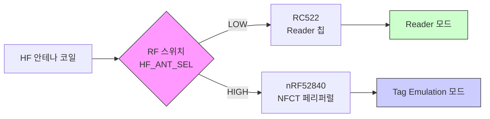
```mermaid
graph LR
    ANT[HF 안테나 코일] --> SW{RF 스위치<br/>HF_ANT_SEL}
    SW -->|LOW| RC[RC522<br/>Reader 칩]
    SW -->|HIGH| NFC[nRF52840<br/>NFCT 페리퍼럴]
    RC --> RM[Reader 모드]
    NFC --> TM[Tag Emulation 모드]

    style SW fill:#f9f,stroke:#333
    style RM fill:#cfc,stroke:#333
    style TM fill:#ccf,stroke:#333
```

---

## 2. 스마트카드 인터페이스 규격

### 2.1 접촉식 (Contact) — ISO/IEC 7816

카드 표면에 **금색 접점(8핀 금속 패드)** 이 있는 방식.

| 핀 | 이름 | 기능 | 핀 | 이름 | 기능 |
|----|------|------|----|------|------|
| C1 | VCC | 전원 | C5 | GND | 접지 |
| C2 | RST | 리셋 | C6 | VPP | 프로그래밍 전압 |
| C3 | CLK | 클럭 | C7 | I/O | 데이터 |
| C4 | RFU | 예약 | C8 | RFU | 예약 |

| 표준 | 내용 |
|------|------|
| ISO 7816-1 | 물리적 특성 (카드 크기, 강도) |
| ISO 7816-2 | 접점 위치 및 크기 |
| ISO 7816-3 | 전기 인터페이스, 전송 프로토콜 (T=0, T=1) |
| ISO 7816-4 | 명령어 체계 (APDU 명령/응답) |

**RF 주파수 없음** — 금속 접점으로 직접 전기 신호 전달

### 2.2 비접촉식 (Contactless) — ISO 14443

13.56 MHz 무선 RF를 사용하는 방식.

| 표준 | 내용 |
|------|------|
| ISO 14443-1 | 물리적 특성 |
| ISO 14443-2 | RF 전력 및 변조 (Type A / Type B) |
| ISO 14443-3 | 초기화, 안티콜리전, UID 선택 |
| ISO 14443-4 | 전송 프로토콜 (T=CL), RATS/ATS |

### 2.3 프로토콜 스택 비교

ISO 14443과 ISO 7816은 선택지가 아니라 **계층적으로 쌓이는 레이어**이다.

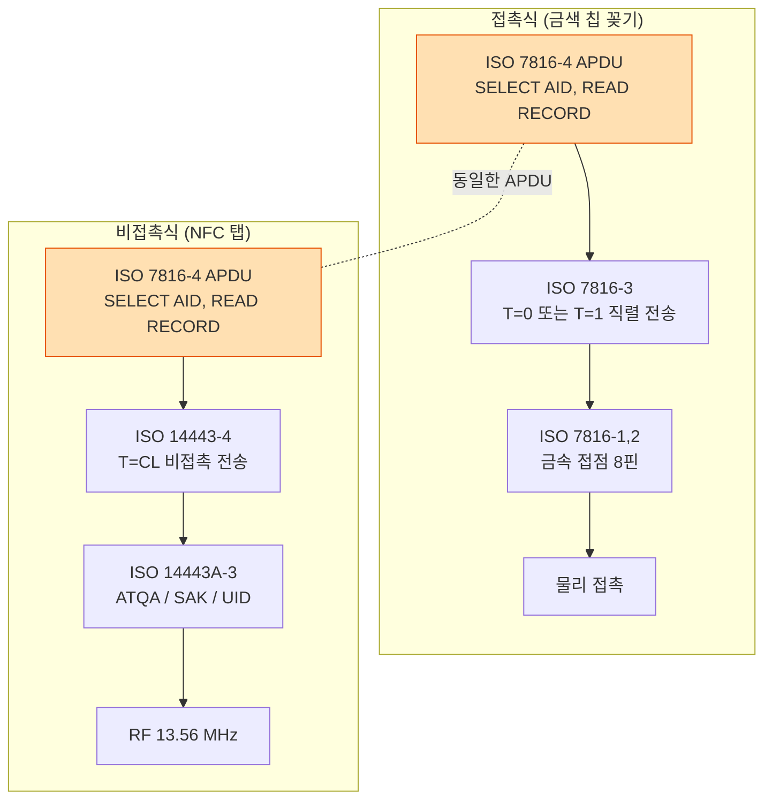
```mermaid
graph TB
    subgraph 접촉식["접촉식 (금색 칩 꽂기)"]
        CA[ISO 7816-4 APDU<br/>SELECT AID, READ RECORD]
        CB[ISO 7816-3<br/>T=0 또는 T=1 직렬 전송]
        CC[ISO 7816-1,2<br/>금속 접점 8핀]
        CD[물리 접촉]
        CA --> CB --> CC --> CD
    end

    subgraph 비접촉식["비접촉식 (NFC 탭)"]
        NA[ISO 7816-4 APDU<br/>SELECT AID, READ RECORD]
        NB[ISO 14443-4<br/>T=CL 비접촉 전송]
        NC[ISO 14443A-3<br/>ATQA / SAK / UID]
        ND[RF 13.56 MHz]
        NA --> NB --> NC --> ND
    end

    CA -.-|동일한 APDU| NA

    style CA fill:#ffe0b2,stroke:#e65100
    style NA fill:#ffe0b2,stroke:#e65100
```

**핵심**: 맨 위의 APDU 명령어(ISO 7816-4)는 동일하고, 전달 방법만 다르다.

### 2.4 듀얼 인터페이스 카드

하나의 칩이 접촉식(ISO 7816)과 비접촉식(ISO 14443) 인터페이스를 모두 탑재한다.

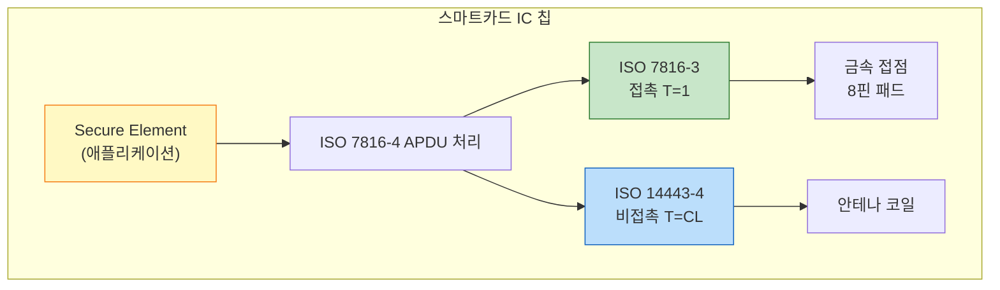
```mermaid
graph TB
    subgraph CARD["스마트카드 IC 칩"]
        SE["Secure Element<br/>(애플리케이션)"]
        APDU["ISO 7816-4 APDU 처리"]
        SE --> APDU
        APDU --> C_IF["ISO 7816-3<br/>접촉 T=1"]
        APDU --> N_IF["ISO 14443-4<br/>비접촉 T=CL"]
        C_IF --> PAD["금속 접점<br/>8핀 패드"]
        N_IF --> COIL["안테나 코일"]
    end

    style SE fill:#fff9c4,stroke:#f57f17
    style C_IF fill:#c8e6c9,stroke:#2e7d32
    style N_IF fill:#bbdefb,stroke:#1565c0
```

**하나의 칩, 하나의 앱, 두 개의 통로** — 꽂든 탭하든 같은 SE의 같은 애플리케이션에 접근한다.

---

## 3. Android HCE vs 물리 카드

### 3.1 비교

| 항목 | 물리 카드 (SE) | Android HCE |
|------|---------------|-------------|
| APDU 처리 위치 | 카드 내부 Secure Element | Android 앱 (HostApduService) |
| 보안 수준 | 하드웨어 보안칩 (탬퍼 방지) | 소프트웨어 기반 (루팅 시 노출) |
| 전원 필요 | 불필요 (리더 RF 전력 사용) | 필요 (폰 배터리) |
| UID | 고정 또는 랜덤 | 보통 랜덤 UID (보안 목적) |
| AID 라우팅 | 카드 자체가 AID 처리 | Android OS가 AID별로 앱에 라우팅 |
| 유연성 | 고정 (발급 후 변경 어려움) | 앱 업데이트로 자유롭게 변경 |
| 오프라인 동작 | 항상 가능 | 폰 꺼지면 불가능 |

### 3.2 에뮬레이션 범위 비교

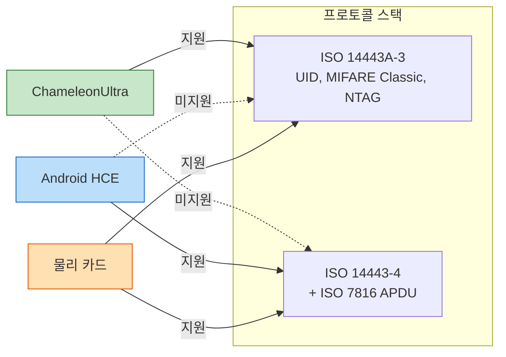
```mermaid
graph LR
    subgraph 프로토콜 스택
        L1["ISO 14443A-3<br/>UID, MIFARE Classic, NTAG"]
        L2["ISO 14443-4<br/>+ ISO 7816 APDU"]
    end

    CU["ChameleonUltra"] -->|지원| L1
    CU -.->|미지원| L2
    HCE["Android HCE"] -.->|미지원| L1
    HCE -->|지원| L2
    PC["물리 카드"] -->|지원| L1
    PC -->|지원| L2

    style CU fill:#c8e6c9,stroke:#2e7d32
    style HCE fill:#bbdefb,stroke:#1565c0
    style PC fill:#ffe0b2,stroke:#e65100
```

### 3.3 Android HCE 동작 구조

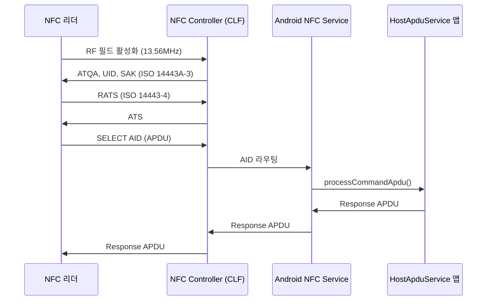
```mermaid
sequenceDiagram
    participant R as NFC 리더
    participant CLF as NFC Controller (CLF)
    participant OS as Android NFC Service
    participant APP as HostApduService 앱

    R->>CLF: RF 필드 활성화 (13.56MHz)
    CLF->>R: ATQA, UID, SAK (ISO 14443A-3)
    R->>CLF: RATS (ISO 14443-4)
    CLF->>R: ATS
    R->>CLF: SELECT AID (APDU)
    CLF->>OS: AID 라우팅
    OS->>APP: processCommandApdu()
    APP->>OS: Response APDU
    OS->>CLF: Response APDU
    CLF->>R: Response APDU
```

RF 프로토콜(L1~L3)은 동일하여 리더 입장에서 구분이 안 된다.

---

## 4. ChameleonUltra CLI로 카드 분석하기

### 4.1 기본 스캔

```bash
hf 14a info
```

출력 항목:

| 필드 | 설명 |
|------|------|
| UID | 카드 고유 식별자 (4/7/10 바이트) |
| ATQA | Answer To Request Type A (2 바이트) |
| SAK | Select Acknowledge (1 바이트) — **카드 타입 판별 핵심** |
| ATS | Answer To Select (ISO 14443-4 지원 시에만 존재) |

### 4.2 SAK 값 해석표

| SAK | 카드 타입 | ISO 14443-4 | ChameleonUltra 에뮬레이션 |
|-----|----------|-------------|--------------------------|
| 0x00 | MIFARE Ultralight / NTAG 2xx | X | O |
| 0x08 | MIFARE Classic 1K / Plus SE 1K | X | O |
| 0x09 | MIFARE Mini 0.3K | X | O |
| 0x10 | MIFARE Plus 2K | X | - |
| 0x11 | MIFARE Plus 4K | X | - |
| 0x18 | MIFARE Classic 4K / Plus S 4K | X | O |
| 0x19 | MIFARE Classic 2K | X | O |
| 0x20 | DESFire EV1/2/3 / MIFARE Plus EV1/2 / NTAG 4xx | O | X |
| 0x28 | SmartMX + MIFARE Classic 1K | O | 부분적 (MF Classic 부분만) |
| 0x38 | SmartMX + MIFARE Classic 4K | O | 부분적 (MF Classic 부분만) |

#### SAK 비트 판별 기준

| 비트 | 마스크 | 의미 |
|------|--------|------|
| bit 3 | 0x08 | MIFARE Classic 호환 |
| bit 5 | 0x20 | ISO 14443-4 지원 (ATS 자동 수신) |

### 4.3 SAK별 예상 결과

#### SAK = 0x08/0x18 — MIFARE Classic

```
- UID  : A1B2C3D4
- ATQA : 0004
- SAK  : 08
- ATS  : (없음)
- Guessed type(s): MIFARE Classic 1K
- Mifare Classic technology
  # Prng: WEAK
```

> ChameleonUltra로 **읽기/복제/에뮬레이션 가능**

#### SAK = 0x20 — DESFire / MIFARE Plus

```
- UID  : 04A1B2C3D4E5F6
- ATQA : 0344
- SAK  : 20
- ATS  : 0675338102806403
- Guessed type(s): DESFire EV1/EV2/EV3 | ...
```

> ChameleonUltra로 **UID만 확인 가능**, 에뮬레이션 불가

#### SAK = 0x28 — SmartMX + MIFARE Classic 1K

SAK 0x28 = `0010 1000` (2진수) — bit 3 (0x08)과 bit 5 (0x20) 모두 설정됨.

비접촉 인터페이스 안에 **두 개의 프로토콜이 공존**하는 카드:

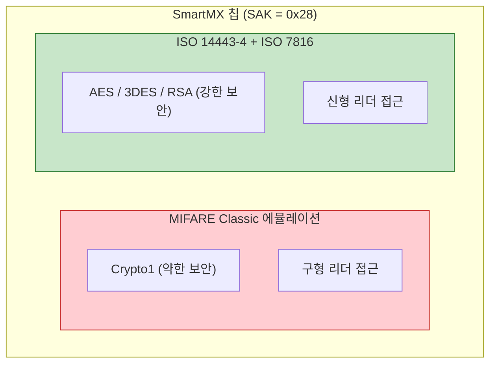
```mermaid
graph TB
    subgraph SmartMX["SmartMX 칩 (SAK = 0x28)"]
        subgraph MFC["MIFARE Classic 에뮬레이션"]
            C1["Crypto1 (약한 보안)"]
            C1A["구형 리더 접근"]
        end
        subgraph ISO["ISO 14443-4 + ISO 7816"]
            C2["AES / 3DES / RSA (강한 보안)"]
            C2A["신형 리더 접근"]
        end
    end

    style MFC fill:#ffcdd2,stroke:#c62828
    style ISO fill:#c8e6c9,stroke:#2e7d32
```

대표 사용 사례: NXP JCOP (Java Card), 공공기관 ID, 교통+출입+결제 통합 카드

| 영역 | ChameleonUltra | 설명 |
|------|---------------|------|
| MIFARE Classic 섹터 읽기 | O | Crypto1 인증, 키 크래킹 가능 |
| MIFARE Classic 복제 | O | 키를 알면 에뮬레이션 가능 |
| ISO 14443-4 APDU 통신 | X | ChameleonUltra 미지원 |
| SmartMX 보안 앱 접근 | X | APDU + 강한 암호 필요 |

#### SAK = 0x00 — MIFARE Ultralight / NTAG

```
- UID  : 04A1B2C3D4E5F6
- ATQA : 0044
- SAK  : 00
- Guessed type(s): MIFARE Ultralight | NTAG 2xx
```

> `hf mfu version`으로 상세 확인 가능

### 4.4 분석 플로우차트

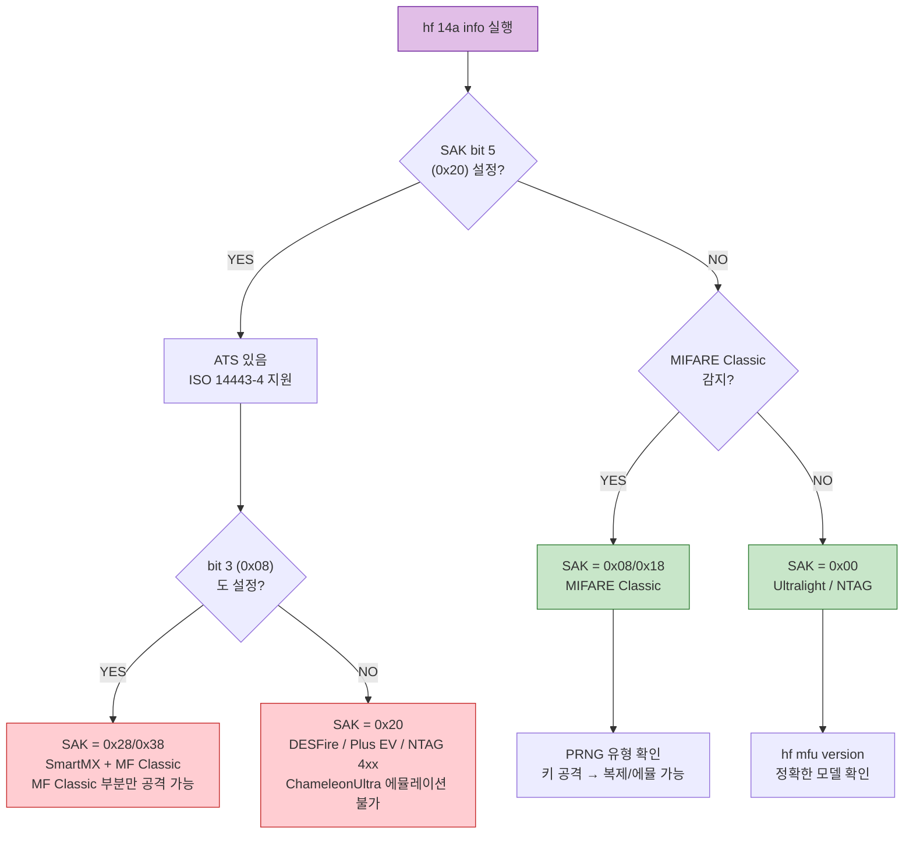
```mermaid
flowchart TD
    START["hf 14a info 실행"] --> SAK{"SAK bit 5<br/>(0x20) 설정?"}

    SAK -->|YES| ATS["ATS 있음<br/>ISO 14443-4 지원"]
    SAK -->|NO| MFC{"MIFARE Classic<br/>감지?"}

    ATS --> BOTH{"bit 3 (0x08)<br/>도 설정?"}
    BOTH -->|YES| SMX["SAK = 0x28/0x38<br/>SmartMX + MF Classic<br/>MF Classic 부분만 공격 가능"]
    BOTH -->|NO| DES["SAK = 0x20<br/>DESFire / Plus EV / NTAG 4xx<br/>ChameleonUltra 에뮬레이션 불가"]

    MFC -->|YES| CLASSIC["SAK = 0x08/0x18<br/>MIFARE Classic"]
    MFC -->|NO| UL["SAK = 0x00<br/>Ultralight / NTAG"]

    CLASSIC --> PRNG["PRNG 유형 확인<br/>키 공격 → 복제/에뮬 가능"]
    UL --> VER["hf mfu version<br/>정확한 모델 확인"]

    style START fill:#e1bee7,stroke:#6a1b9a
    style SMX fill:#ffcdd2,stroke:#c62828
    style DES fill:#ffcdd2,stroke:#c62828
    style CLASSIC fill:#c8e6c9,stroke:#2e7d32
    style UL fill:#c8e6c9,stroke:#2e7d32
```

### 4.5 추가 분석 명령어

| 목적 | 명령어 | 설명 |
|------|--------|------|
| Ultralight/NTAG 모델 확인 | `hf mfu version` | GET_VERSION으로 칩 식별 |
| NXP 정품 서명 확인 | `hf mfu signature` | ECC 서명 검증 |
| 전체 데이터 덤프 | `hf mfu dump` | 모든 페이지 읽기 |
| 수동 RATS 전송 | `hf 14a raw -sc -d E080` | ISO 14443-4 확인 |
| RATS + 필드 유지 | `hf 14a raw -sc -d E080 -k` | 후속 APDU 전송용 |
| SELECT AID 전송 | `hf 14a raw -c -d 00A40400 -k` | ISO 7816 APDU 테스트 |

### 4.6 ChameleonUltra 비접촉 인터페이스 지원 요약

| 인터페이스 | 지원 | 비고 |
|-----------|------|------|
| 접촉식 (ISO 7816) | X | 물리적 접점 없음 |
| 비접촉식 HF (ISO 14443A-3) | O | 읽기/에뮬레이션 |
| 비접촉식 LF (125kHz) | O | 읽기/에뮬레이션 |
| ISO 14443-4 APDU | X | 상위 프로토콜 미지원 |

---

## 5. MIFARE Classic 출입카드를 Android 앱으로 대체할 수 있는가?

### 5.1 결론

**표준 Android에서는 불가능하다.** 근본적인 원인은 프로토콜 계층이 다르기 때문이다.

### 5.2 프로토콜 계층 불일치

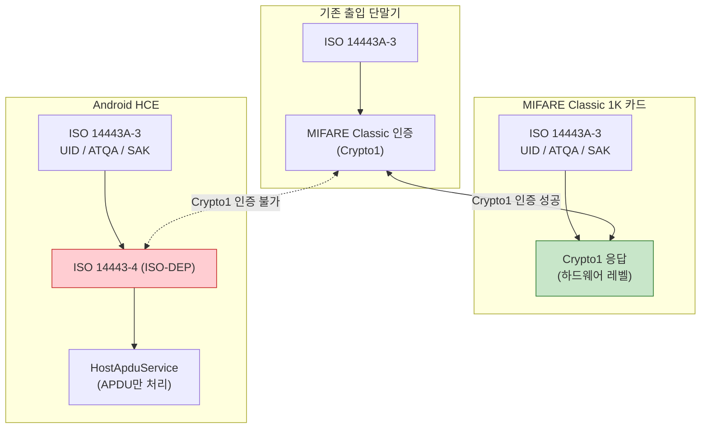
```mermaid
graph TB
    subgraph 출입리더["기존 출입 단말기"]
        R1["ISO 14443A-3"]
        R2["MIFARE Classic 인증<br/>(Crypto1)"]
        R1 --> R2
    end

    subgraph 물리카드["MIFARE Classic 1K 카드"]
        C1["ISO 14443A-3<br/>UID / ATQA / SAK"]
        C2["Crypto1 응답<br/>(하드웨어 레벨)"]
        C1 --> C2
    end

    subgraph Android["Android HCE"]
        A1["ISO 14443A-3<br/>UID / ATQA / SAK"]
        A2["ISO 14443-4 (ISO-DEP)"]
        A3["HostApduService<br/>(APDU만 처리)"]
        A1 --> A2 --> A3
    end

    R2 <-->|Crypto1 인증 성공| C2
    R2 <-.->|Crypto1 인증 불가| A2

    style C2 fill:#c8e6c9,stroke:#2e7d32
    style A2 fill:#ffcdd2,stroke:#c62828
```

| 구분 | MIFARE Classic 카드 | Android HCE |
|------|-------------------|-------------|
| 동작 계층 | ISO 14443A-3 | ISO 14443-4 |
| 인증 방식 | Crypto1 (HW 레벨) | APDU (SW 레벨) |
| SAK 응답 | 0x08 (Classic) | 0x20 (ISO-DEP) |
| 리더가 보내는 명령 | AUTH (0x60/0x61) | RATS (0xE0) → SELECT AID |

출입 리더는 카드에 **Crypto1 인증 명령(0x60)**을 보내는데, Android HCE는 이 명령을 **수신 자체를 할 수 없다.** HCE는 ISO 14443-4(ISO-DEP) 이후의 APDU만 처리 가능하다.

### 5.3 Android NFC 아키텍처의 한계

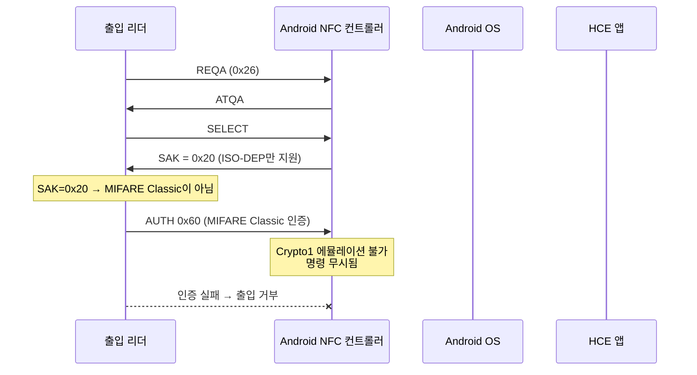
```mermaid
sequenceDiagram
    participant R as 출입 리더
    participant CLF as Android NFC 컨트롤러
    participant OS as Android OS
    participant APP as HCE 앱

    R->>CLF: REQA (0x26)
    CLF->>R: ATQA
    R->>CLF: SELECT
    CLF->>R: SAK = 0x20 (ISO-DEP만 지원)

    Note over R: SAK=0x20 → MIFARE Classic이 아님

    R->>CLF: AUTH 0x60 (MIFARE Classic 인증)

    Note over CLF: Crypto1 에뮬레이션 불가<br/>명령 무시됨

    R--xCLF: 인증 실패 → 출입 거부
```

핵심 문제:

| 문제 | 설명 |
|------|------|
| SAK 값 불일치 | Android는 SAK=0x20(ISO-DEP)으로 응답. 리더는 SAK=0x08(Classic)을 기대 |
| Crypto1 미지원 | NFC 컨트롤러가 MIFARE Classic 태그 에뮬레이션을 지원하지 않음 |
| OS 제약 | Android는 HCE를 ISO 14443-4 레이어에서만 노출. 하위 레이어 접근 차단 |

### 5.4 가능한 대안

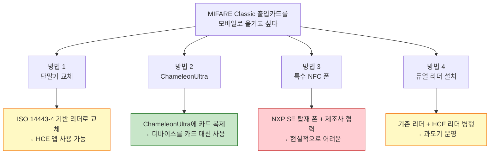
```mermaid
flowchart TD
    Q["MIFARE Classic 출입카드를<br/>모바일로 옮기고 싶다"]

    Q --> A["방법 1<br/>단말기 교체"]
    Q --> B["방법 2<br/>ChameleonUltra"]
    Q --> C["방법 3<br/>특수 NFC 폰"]
    Q --> D["방법 4<br/>듀얼 리더 설치"]

    A --> A1["ISO 14443-4 기반 리더로 교체<br/>→ HCE 앱 사용 가능"]
    B --> B1["ChameleonUltra에 카드 복제<br/>→ 디바이스를 카드 대신 사용"]
    C --> C1["NXP SE 탑재 폰 + 제조사 협력<br/>→ 현실적으로 어려움"]
    D --> D1["기존 리더 + HCE 리더 병행<br/>→ 과도기 운영"]

    style A1 fill:#fff9c4,stroke:#f57f17
    style B1 fill:#c8e6c9,stroke:#2e7d32
    style C1 fill:#ffcdd2,stroke:#c62828
    style D1 fill:#fff9c4,stroke:#f57f17
```

| 방법 | 단말기 교체 | 실현 가능성 | 설명 |
|------|-----------|-----------|------|
| HCE 앱 | 필요 (ISO 14443-4 리더로) | 높음 | 리더를 DESFire/HCE 호환으로 교체 |
| ChameleonUltra | 불필요 | 높음 | 카드 복제 후 에뮬레이션 (MIFARE Classic 대응) |
| NXP SE 폰 | 불필요 | 매우 낮음 | 제조사/통신사 협력 필요, API 비공개 |
| 듀얼 리더 | 추가 설치 | 중간 | 기존 Classic 리더 + HCE 리더 병행 |

### 5.5 요약

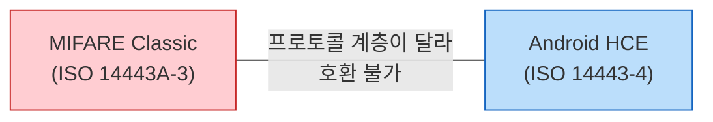
```mermaid
graph LR
    MF["MIFARE Classic<br/>(ISO 14443A-3)"]
    HCE["Android HCE<br/>(ISO 14443-4)"]

    MF ---|프로토콜 계층이 달라<br/>호환 불가| HCE

    style MF fill:#ffcdd2,stroke:#c62828
    style HCE fill:#bbdefb,stroke:#1565c0
```

**단말기 교체 없이 Android 앱만으로는 불가능하다.** MIFARE Classic의 Crypto1 인증은 ISO 14443A-3 레벨에서 일어나고, Android HCE는 ISO 14443-4 레벨에서만 동작하기 때문이다.

단말기를 바꾸지 않고 모바일로 전환하려면, **ChameleonUltra 같은 전용 에뮬레이션 하드웨어**가 현실적인 유일한 방법이다.

---

## 6. ChameleonUltra를 출입 단말기로 교체할 수 있는가?

기존 MIFARE Classic 1K 출입 단말기를 ChameleonUltra로 교체하여 기존 카드와 Android HCE 앱을 동시 지원할 수 있는지 분석한다.

### 6.1 결론

**적합하지 않다.** 프로토콜, 하드웨어, 운영 방식 세 가지 레벨에서 모두 문제가 있다.

### 6.2 프로토콜 문제 — ISO 14443-4 전송 계층 부재

ChameleonUltra Reader 모드는 MIFARE Classic은 완벽히 지원하지만, Android HCE 통신에 필요한 **ISO 14443-4 전송 계층이 펌웨어에 구현되어 있지 않다.**

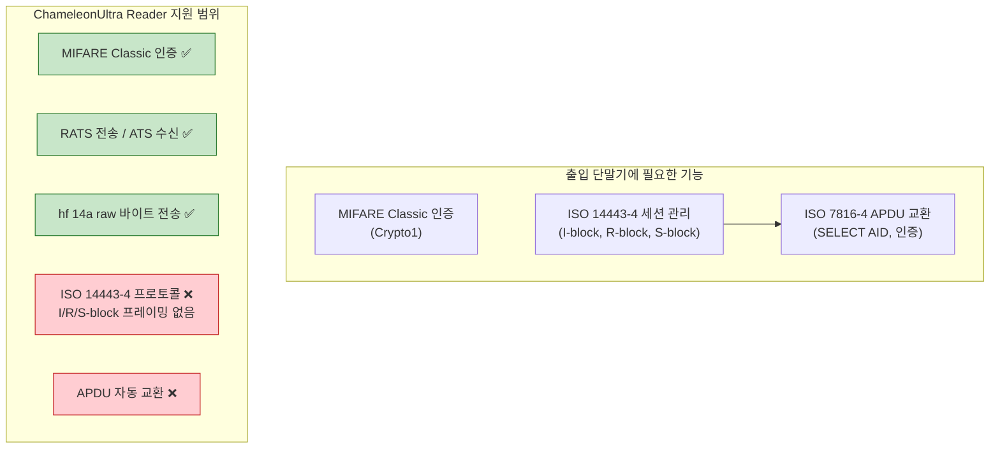
```mermaid
graph TB
    subgraph 필요한것["출입 단말기에 필요한 기능"]
        N1["MIFARE Classic 인증<br/>(Crypto1)"]
        N2["ISO 14443-4 세션 관리<br/>(I-block, R-block, S-block)"]
        N3["ISO 7816-4 APDU 교환<br/>(SELECT AID, 인증)"]
        N1 ~~~ N2 --> N3
    end

    subgraph CU["ChameleonUltra Reader 지원 범위"]
        S1["MIFARE Classic 인증 ✅"]
        S2["RATS 전송 / ATS 수신 ✅"]
        S3["hf 14a raw 바이트 전송 ✅"]
        S4["ISO 14443-4 프로토콜 ❌<br/>I/R/S-block 프레이밍 없음"]
        S5["APDU 자동 교환 ❌"]
    end

    style S1 fill:#c8e6c9,stroke:#2e7d32
    style S2 fill:#c8e6c9,stroke:#2e7d32
    style S3 fill:#c8e6c9,stroke:#2e7d32
    style S4 fill:#ffcdd2,stroke:#c62828
    style S5 fill:#ffcdd2,stroke:#c62828
```

`hf 14a raw`로 바이트 단위 전송은 가능하지만, ISO 14443-4에 필요한 다음 기능이 펌웨어에 없다:

| ISO 14443-4 필수 기능 | ChameleonUltra |
|----------------------|----------------|
| I-block / R-block / S-block 프레이밍 | X |
| Block 번호 관리 및 토글 | X |
| Chaining (254바이트 초과 데이터) | X |
| WTX (Waiting Time Extension) 처리 | X |
| PPS (Protocol Parameter Selection) | X |
| FWT (Frame Waiting Time) 계산 | X |

### 6.3 하드웨어 문제 — 출입 단말기로 부적합

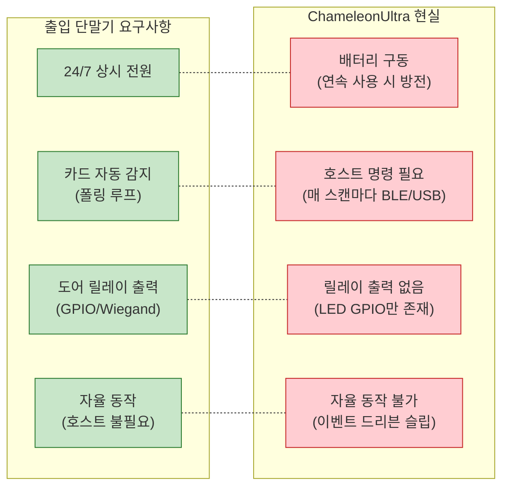
```mermaid
graph LR
    subgraph 출입단말기["출입 단말기 요구사항"]
        P1["24/7 상시 전원"]
        P2["카드 자동 감지<br/>(폴링 루프)"]
        P3["도어 릴레이 출력<br/>(GPIO/Wiegand)"]
        P4["자율 동작<br/>(호스트 불필요)"]
    end

    subgraph CU2["ChameleonUltra 현실"]
        C1["배터리 구동<br/>(연속 사용 시 방전)"]
        C2["호스트 명령 필요<br/>(매 스캔마다 BLE/USB)"]
        C3["릴레이 출력 없음<br/>(LED GPIO만 존재)"]
        C4["자율 동작 불가<br/>(이벤트 드리븐 슬립)"]
    end

    P1 -.- C1
    P2 -.- C2
    P3 -.- C3
    P4 -.- C4

    style P1 fill:#c8e6c9,stroke:#2e7d32
    style C1 fill:#ffcdd2,stroke:#c62828
    style P2 fill:#c8e6c9,stroke:#2e7d32
    style C2 fill:#ffcdd2,stroke:#c62828
    style P3 fill:#c8e6c9,stroke:#2e7d32
    style C3 fill:#ffcdd2,stroke:#c62828
    style P4 fill:#c8e6c9,stroke:#2e7d32
    style C4 fill:#ffcdd2,stroke:#c62828
```

| 요구사항 | ChameleonUltra | 비고 |
|---------|---------------|------|
| 상시 전원 | X | 배터리 전용, 연속 Reader 모드 시 빠르게 방전 |
| 자동 카드 감지 | X | 호스트(BLE/USB)에서 매번 명령 필요 |
| 릴레이/Wiegand 출력 | X | 도어 컨트롤러 연결 불가 |
| 자율 동작 | X | 독립 실행 모드 없음, 반드시 호스트 필요 |
| 24/7 내구성 | X | 포터블 연구 도구로 설계됨 |

### 6.4 권장 구성 — MIFARE Classic + HCE 동시 지원

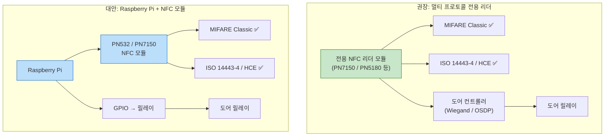
```mermaid
flowchart TD
    subgraph 권장구성["권장: 멀티 프로토콜 전용 리더"]
        DR["전용 NFC 리더 모듈<br/>(PN7150 / PN5180 등)"]
        DR --> MF_OK["MIFARE Classic ✅"]
        DR --> HCE_OK["ISO 14443-4 / HCE ✅"]
        DR --> DC["도어 컨트롤러<br/>(Wiegand / OSDP)"]
        DC --> DOOR["도어 릴레이"]
    end

    subgraph DIY구성["대안: Raspberry Pi + NFC 모듈"]
        RPI["Raspberry Pi"]
        NFC_MOD["PN532 / PN7150<br/>NFC 모듈"]
        RPI --> NFC_MOD
        NFC_MOD --> MF2["MIFARE Classic ✅"]
        NFC_MOD --> HCE2["ISO 14443-4 / HCE ✅"]
        RPI --> GPIO_R["GPIO → 릴레이"]
        GPIO_R --> DOOR2["도어 릴레이"]
    end

    style DR fill:#c8e6c9,stroke:#2e7d32
    style RPI fill:#bbdefb,stroke:#1565c0
    style NFC_MOD fill:#bbdefb,stroke:#1565c0
```

| 구성 | MIFARE Classic | Android HCE | 상시 전원 | 릴레이 출력 | 난이도 |
|------|---------------|-------------|---------|-----------|--------|
| 전용 NFC 리더 (HID Signo 등) | O | O | O | O (Wiegand) | 낮음 |
| Raspberry Pi + PN532 | O | O | O | O (GPIO) | 중간 |
| Raspberry Pi + PN7150 | O | O | O | O (GPIO) | 중간 |
| ChameleonUltra | O | X | X | X | - |

### 6.5 요약

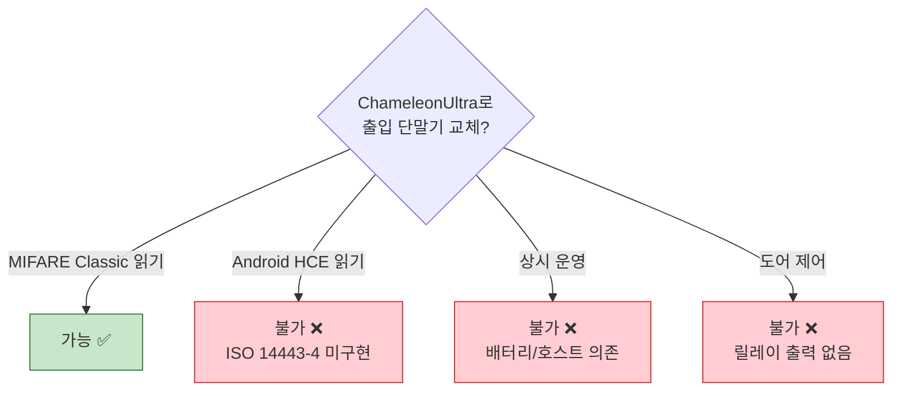
```mermaid
graph TB
    Q{"ChameleonUltra로<br/>출입 단말기 교체?"}
    Q -->|MIFARE Classic 읽기| YES["가능 ✅"]
    Q -->|Android HCE 읽기| NO1["불가 ❌<br/>ISO 14443-4 미구현"]
    Q -->|상시 운영| NO2["불가 ❌<br/>배터리/호스트 의존"]
    Q -->|도어 제어| NO3["불가 ❌<br/>릴레이 출력 없음"]

    style YES fill:#c8e6c9,stroke:#2e7d32
    style NO1 fill:#ffcdd2,stroke:#c62828
    style NO2 fill:#ffcdd2,stroke:#c62828
    style NO3 fill:#ffcdd2,stroke:#c62828
```

**ChameleonUltra는 RFID 연구/테스트 도구이지, 출입 단말기가 아니다.** MIFARE Classic + HCE 동시 지원 출입 시스템을 구축하려면 **PN7150/PN5180 기반 전용 NFC 리더** 또는 **Raspberry Pi + NFC 모듈** 조합이 적합하다.

---

## 7. ChameleonUltra를 BLE 브릿지로 활용한 모바일 출입 지원

섹션 6에서 ChameleonUltra를 출입 단말기(리더)로 **교체**하는 것은 부적합하다고 결론지었다. 그러나 발상을 전환하여, 기존 출입 리더는 그대로 두고 ChameleonUltra를 리더 앞단에 **BLE 수신 → MIFARE Classic 에뮬레이션 브릿지**로 배치하는 구성은 가능하다.

### 7.1 아키텍처 개요

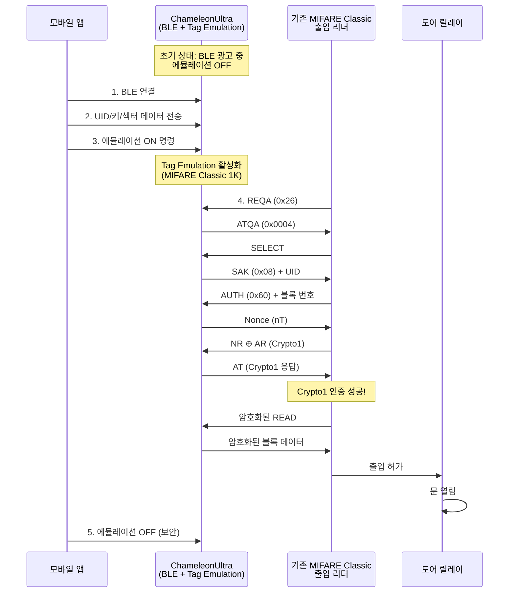
```mermaid
sequenceDiagram
    participant APP as 모바일 앱
    participant CU as ChameleonUltra<br/>(BLE + Tag Emulation)
    participant RDR as 기존 MIFARE Classic<br/>출입 리더
    participant DOOR as 도어 릴레이

    Note over CU: 초기 상태: BLE 광고 중<br/>에뮬레이션 OFF

    APP->>CU: 1. BLE 연결
    APP->>CU: 2. UID/키/섹터 데이터 전송
    APP->>CU: 3. 에뮬레이션 ON 명령

    Note over CU: Tag Emulation 활성화<br/>(MIFARE Classic 1K)

    RDR->>CU: 4. REQA (0x26)
    CU->>RDR: ATQA (0x0004)
    RDR->>CU: SELECT
    CU->>RDR: SAK (0x08) + UID
    RDR->>CU: AUTH (0x60) + 블록 번호
    CU->>RDR: Nonce (nT)
    RDR->>CU: NR ⊕ AR (Crypto1)
    CU->>RDR: AT (Crypto1 응답)

    Note over RDR: Crypto1 인증 성공!

    RDR->>CU: 암호화된 READ
    CU->>RDR: 암호화된 블록 데이터
    RDR->>DOOR: 출입 허가
    DOOR->>DOOR: 문 열림

    APP->>CU: 5. 에뮬레이션 OFF (보안)
```

### 7.2 기술적 가능 근거

#### 7.2.1 BLE + Tag Emulation 동시 동작

nRF52840 칩에서 BLE 라디오(2.4 GHz)와 NFCT 페리퍼럴(13.56 MHz)은 **독립적으로 동작**한다.

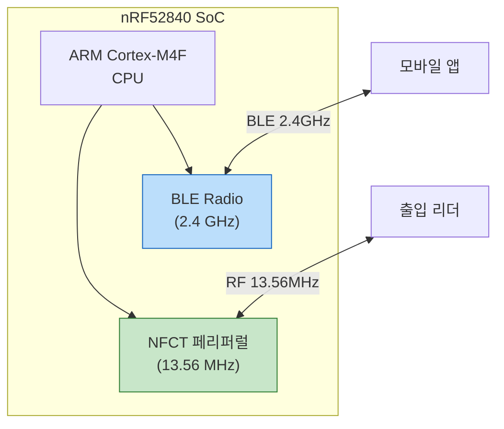
```mermaid
graph TB
    subgraph nRF52840["nRF52840 SoC"]
        CPU["ARM Cortex-M4F<br/>CPU"]
        BLE["BLE Radio<br/>(2.4 GHz)"]
        NFCT["NFCT 페리퍼럴<br/>(13.56 MHz)"]
        CPU --> BLE
        CPU --> NFCT
        BLE ~~~ NFCT
    end

    APP2["모바일 앱"] <-->|BLE 2.4GHz| BLE
    RDR2["출입 리더"] <-->|RF 13.56MHz| NFCT

    style BLE fill:#bbdefb,stroke:#1565c0
    style NFCT fill:#c8e6c9,stroke:#2e7d32
```

| 항목 | 상태 | 근거 |
|------|------|------|
| BLE 연결 중 Tag Emulation | O | 독립 페리퍼럴, 충돌 없음 |
| Tag Emulation 중 BLE 명령 수신 | O | 메인 루프에서 병렬 처리 |
| 모드 전환 시 BLE 끊김 | 없음 | BLE는 항상 유지됨 |

#### 7.2.2 BLE로 카드 데이터 즉시 업데이트

에뮬레이션을 중지하지 않고도 RAM의 카드 데이터를 직접 수정할 수 있다.

| 명령 | 기능 | 에뮬레이션 재시작 필요 |
|------|------|----------------------|
| `hf14a_set_anti_coll_data()` | UID, ATQA, SAK 변경 | 불필요 |
| `mf1_write_emu_block_data()` | 블록 데이터 쓰기 (키 포함) | 불필요 |
| `set_active_slot()` | 슬롯 전환 (8개 저장) | 불필요 |
| `set_slot_enable()` | 에뮬레이션 ON/OFF | 불필요 |

#### 7.2.3 MIFARE Classic 에뮬레이션 완전 지원

| 기능 | 지원 |
|------|------|
| Crypto1 인증 (Key A / Key B) | O |
| 16개 섹터 x 4블록 데이터 응답 | O |
| Access Control Bits 적용 | O |
| Value Block 연산 | O |
| Gen1A/Gen2 매직 카드 모드 | O |

#### 7.2.4 에뮬레이션 ON/OFF 제어

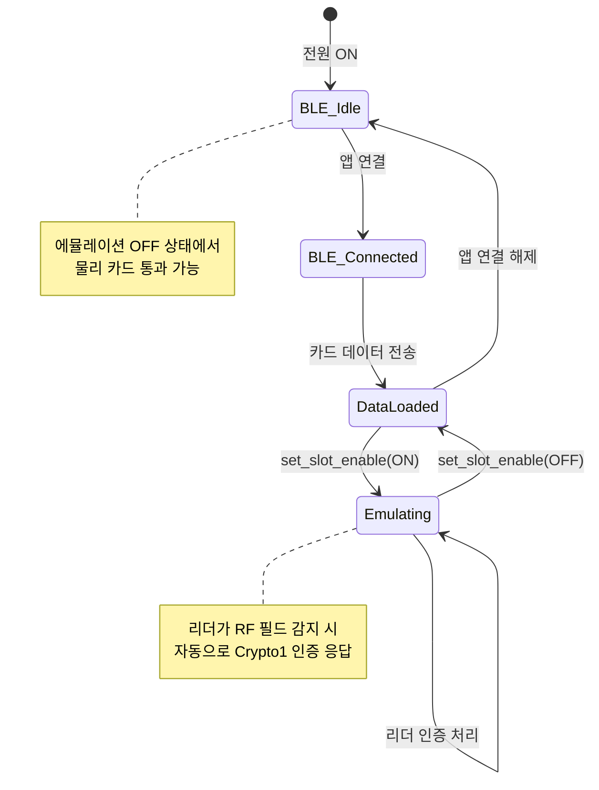
```mermaid
stateDiagram-v2
    [*] --> BLE_Idle: 전원 ON
    BLE_Idle --> BLE_Connected: 앱 연결
    BLE_Connected --> DataLoaded: 카드 데이터 전송
    DataLoaded --> Emulating: set_slot_enable(ON)
    Emulating --> DataLoaded: set_slot_enable(OFF)
    Emulating --> Emulating: 리더 인증 처리
    DataLoaded --> BLE_Idle: 앱 연결 해제

    note right of Emulating
        리더가 RF 필드 감지 시
        자동으로 Crypto1 인증 응답
    end note

    note right of BLE_Idle
        에뮬레이션 OFF 상태에서
        물리 카드 통과 가능
    end note
```

### 7.3 물리 카드와의 공존

에뮬레이션이 OFF일 때 ChameleonUltra 안테나는 **고임피던스 상태**가 되어 RF 필드를 차단하지 않는다.

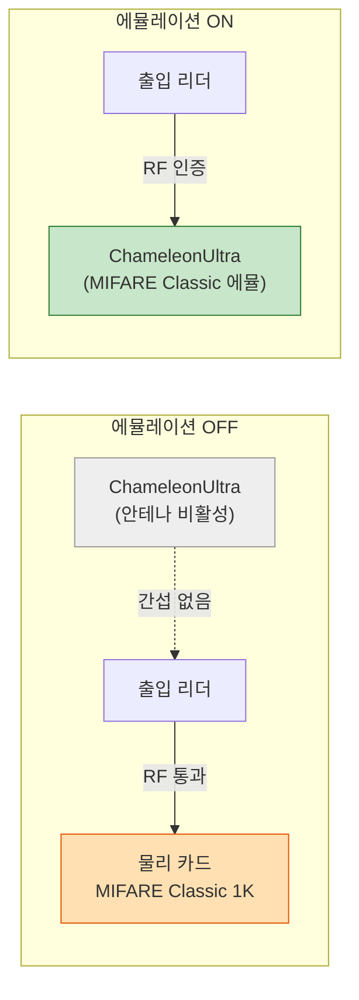
```mermaid
flowchart LR
    subgraph EMU_OFF["에뮬레이션 OFF"]
        R1["출입 리더"] -->|RF 통과| CARD["물리 카드<br/>MIFARE Classic 1K"]
        CU1["ChameleonUltra<br/>(안테나 비활성)"] -.->|간섭 없음| R1
    end

    subgraph EMU_ON["에뮬레이션 ON"]
        R2["출입 리더"] -->|RF 인증| CU2["ChameleonUltra<br/>(MIFARE Classic 에뮬)"]
    end

    style CU1 fill:#eeeeee,stroke:#999
    style CU2 fill:#c8e6c9,stroke:#2e7d32
    style CARD fill:#ffe0b2,stroke:#e65100
```

| 상태 | 물리 카드 사용 | 모바일 앱 사용 |
|------|--------------|--------------|
| 에뮬레이션 OFF | O — RF 통과 | X |
| 에뮬레이션 ON | X — ChameleonUltra가 먼저 응답 | O |

### 7.4 전원 방식

| 전원 | 연속 운영 | BLE + Emulation | 비고 |
|------|---------|-----------------|------|
| USB 전원 | O | 무제한 | USB 연결 시 자동 슬립 방지 |
| 배터리 | 제한적 | 약 8~12시간 | BLE 광고 + 에뮬레이션 대기 |
| 배터리 + 온디맨드 | O | 수일 | 평시 슬립, 앱 연결 시만 활성 |

### 7.5 구현 예시 (Python 클라이언트)

```python
# 1. BLE 연결
chameleon.connect()

# 2. 카드 데이터 로드
chameleon.hf14a_set_anti_coll_data(
    uid=bytes.fromhex("A1B2C3D4"),
    atqa=bytes.fromhex("0004"),
    sak=bytes.fromhex("08"),
    ats=b""
)

# 3. 전체 섹터 데이터 + 키 쓰기
for block in range(64):
    chameleon.mf1_write_emu_block_data(block, block_data[block])

# 4. 에뮬레이션 활성화 → 리더에 카드처럼 인식됨
chameleon.set_slot_enable(0, TAG_SENSE_HF, True)

# ... 사용자가 문 앞에서 태그 → 인증 자동 처리 → 문 열림 ...

# 5. 보안을 위해 에뮬레이션 비활성화
chameleon.set_slot_enable(0, TAG_SENSE_HF, False)
```

### 7.6 주의사항

| 항목 | 설명 |
|------|------|
| 인증 중 데이터 변경 금지 | 리더 인증 진행 중 키/데이터 업데이트 시 세션 실패 가능 |
| 물리 배치 | ChameleonUltra가 리더 안테나 범위 내 (~5cm)에 고정 필요 |
| 동시 응답 충돌 | 에뮬레이션 ON 상태에서 물리 카드도 대면 충돌 발생 |
| BLE 범위 | ~10m 이내에서 앱 조작 후 리더에 접근 |
| 보안 | BLE 통신 구간 카드 데이터 암호화 필요 (키 노출 방지) |

### 7.7 요약

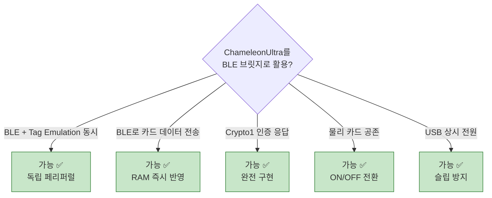
```mermaid
graph TB
    Q{"ChameleonUltra를<br/>BLE 브릿지로 활용?"}
    Q -->|BLE + Tag Emulation 동시| YES1["가능 ✅<br/>독립 페리퍼럴"]
    Q -->|BLE로 카드 데이터 전송| YES2["가능 ✅<br/>RAM 즉시 반영"]
    Q -->|Crypto1 인증 응답| YES3["가능 ✅<br/>완전 구현"]
    Q -->|물리 카드 공존| YES4["가능 ✅<br/>ON/OFF 전환"]
    Q -->|USB 상시 전원| YES5["가능 ✅<br/>슬립 방지"]

    style YES1 fill:#c8e6c9,stroke:#2e7d32
    style YES2 fill:#c8e6c9,stroke:#2e7d32
    style YES3 fill:#c8e6c9,stroke:#2e7d32
    style YES4 fill:#c8e6c9,stroke:#2e7d32
    style YES5 fill:#c8e6c9,stroke:#2e7d32
```

기존 출입 리더를 교체하지 않고, ChameleonUltra를 **BLE 수신 → MIFARE Classic 에뮬레이션 브릿지**로 앞단에 배치하면, **기존 물리 카드와 모바일 앱 출입을 동시 지원**할 수 있다.
