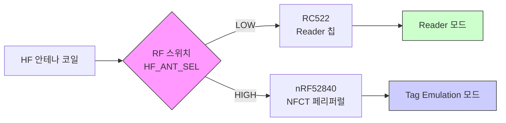
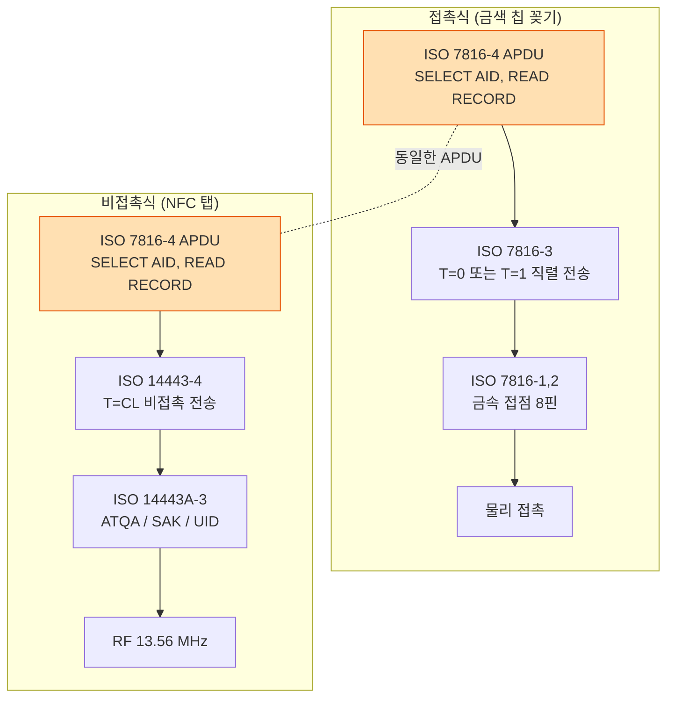
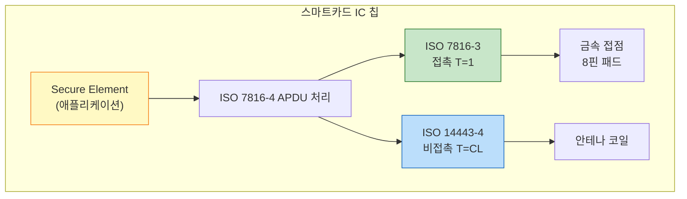
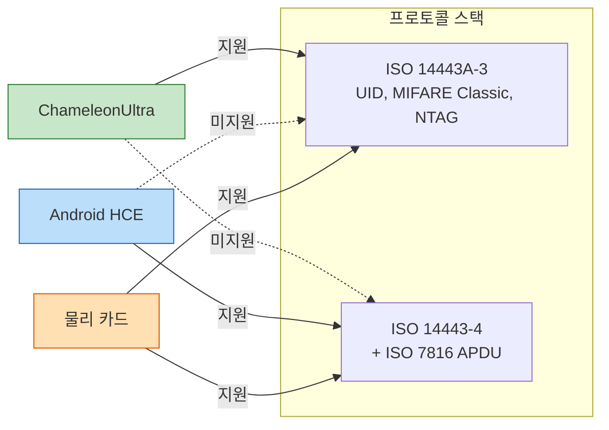
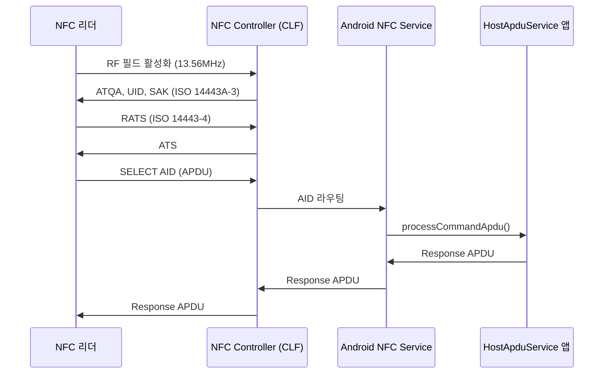
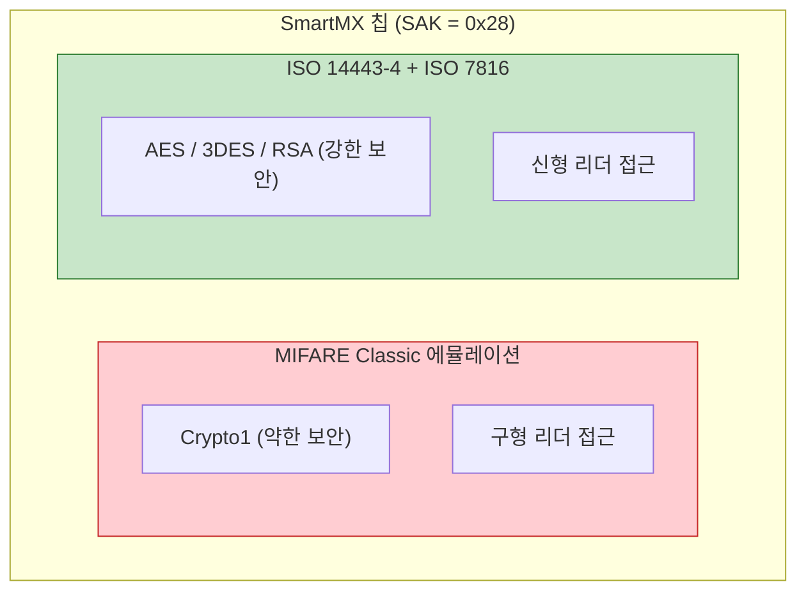
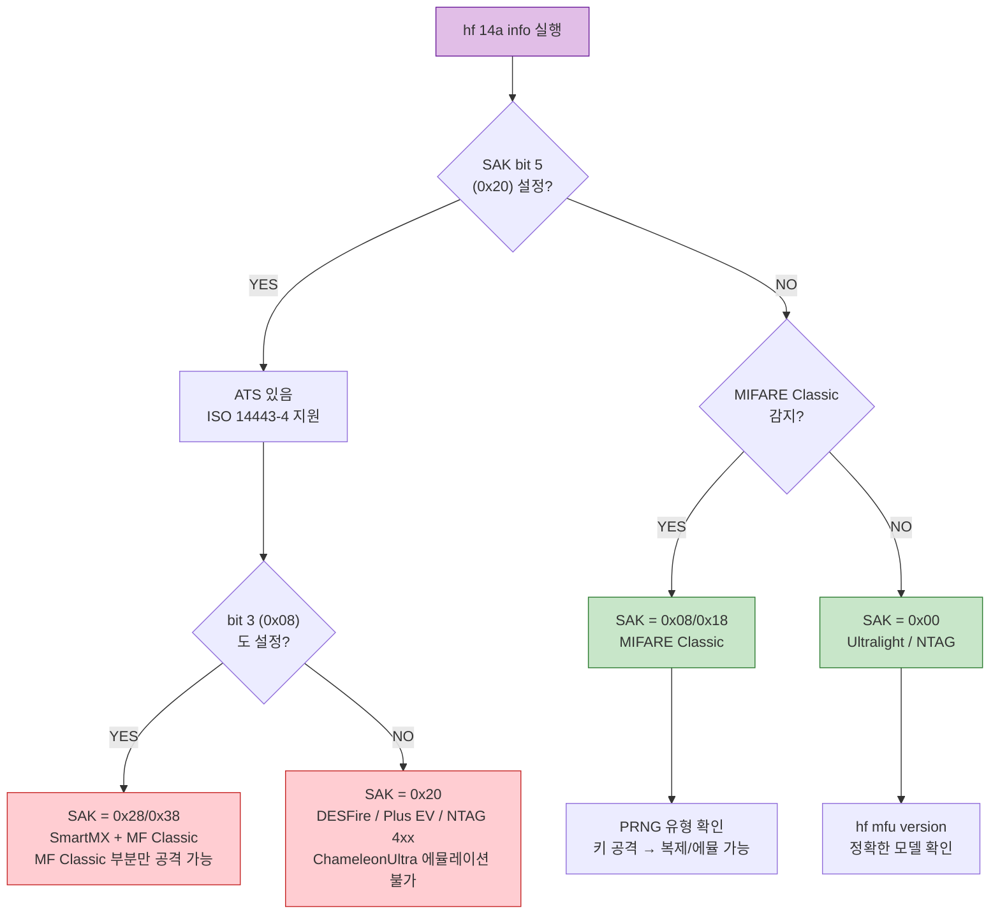

 ChameleonUltra & 스마트카드 비접촉 프로토콜 분석 정리

## 1. ChameleonUltra 개요

ChameleonUltra는 **듀얼 모드 RFID 디바이스**로, Tag Emulation과 Reader 두 가지 모드를 지원한다.
(단, Reader 모드는 **ChameleonUltra 전용** — Chameleon Lite는 미지원)

### 1.1 동작 모드

| 모드 | 기능 | 비고 |
|------|------|------|
| Tag Emulation | RFID 카드를 에뮬레이션 | HF + LF 동시 에뮬레이션 가능 |
| Reader | RFID 태그를 읽기/쓰기/공격 | Ultra 전용, HF/LF 순차 전환 |

### 1.2 지원 주파수 및 프로토콜

#### HF (13.56 MHz) Reader

| 프로토콜 | 읽기 | 쓰기 | 공격 | CLI 명령어 |
|----------|------|------|------|-----------|
| ISO14443A | O | O | - | `hf 14a scan` |
| MIFARE Classic 1K/4K | O | O | O | `hf mf ...` |
| MIFARE Ultralight | O | - | - | `hf mfu ...` |
| NTAG (213/215/216) | O | - | - | `hf mfu ...` |

MIFARE Classic 공격: Darkside, Nested, Static Nested, Hard Nested

#### LF (125 kHz) Reader

| 태그 타입 | 읽기 | T55xx 쓰기 | CLI 명령어 |
|-----------|------|-----------|-----------|
| EM410x | O | O | `lf em 410x read` |
| HID Prox | O | O | `lf hid prox read` |
| Viking | O | O | `lf viking read` |

### 1.3 동시 동작 제약

| 동작 조합 | 가능 | 원인 |
|-----------|------|------|
| HF Reader 단독 | O | - |
| LF Reader 단독 | O | - |
| HF + LF 동시 읽기 | X | 명령별 순차 전환 |
| HF + LF 동시 에뮬레이션 | O | 별도 안테나/페리퍼럴 |
| Reader + Tag Emulation 동시 | X | HF 안테나 스위치 제약 |

**하드웨어 원인**: HF 안테나가 RF 스위치(`HF_ANT_SEL`, GPIO P1.10)로 RC522(Reader) 또는 nRF52840 NFCT(Tag Emulation) 중 하나에만 연결된다.



---

## 2. 스마트카드 인터페이스 규격

### 2.1 접촉식 (Contact) — ISO/IEC 7816

카드 표면에 **금색 접점(8핀 금속 패드)** 이 있는 방식.

| 핀 | 이름 | 기능 | 핀 | 이름 | 기능 |
|----|------|------|----|------|------|
| C1 | VCC | 전원 | C5 | GND | 접지 |
| C2 | RST | 리셋 | C6 | VPP | 프로그래밍 전압 |
| C3 | CLK | 클럭 | C7 | I/O | 데이터 |
| C4 | RFU | 예약 | C8 | RFU | 예약 |

| 표준 | 내용 |
|------|------|
| ISO 7816-1 | 물리적 특성 (카드 크기, 강도) |
| ISO 7816-2 | 접점 위치 및 크기 |
| ISO 7816-3 | 전기 인터페이스, 전송 프로토콜 (T=0, T=1) |
| ISO 7816-4 | 명령어 체계 (APDU 명령/응답) |

**RF 주파수 없음** — 금속 접점으로 직접 전기 신호 전달

### 2.2 비접촉식 (Contactless) — ISO 14443

13.56 MHz 무선 RF를 사용하는 방식.

| 표준 | 내용 |
|------|------|
| ISO 14443-1 | 물리적 특성 |
| ISO 14443-2 | RF 전력 및 변조 (Type A / Type B) |
| ISO 14443-3 | 초기화, 안티콜리전, UID 선택 |
| ISO 14443-4 | 전송 프로토콜 (T=CL), RATS/ATS |

### 2.3 프로토콜 스택 비교

ISO 14443과 ISO 7816은 선택지가 아니라 **계층적으로 쌓이는 레이어**이다.



**핵심**: 맨 위의 APDU 명령어(ISO 7816-4)는 동일하고, 전달 방법만 다르다.

### 2.4 듀얼 인터페이스 카드

하나의 칩이 접촉식(ISO 7816)과 비접촉식(ISO 14443) 인터페이스를 모두 탑재한다.



**하나의 칩, 하나의 앱, 두 개의 통로** — 꽂든 탭하든 같은 SE의 같은 애플리케이션에 접근한다.

---

## 3. Android HCE vs 물리 카드

### 3.1 비교

| 항목 | 물리 카드 (SE) | Android HCE |
|------|---------------|-------------|
| APDU 처리 위치 | 카드 내부 Secure Element | Android 앱 (HostApduService) |
| 보안 수준 | 하드웨어 보안칩 (탬퍼 방지) | 소프트웨어 기반 (루팅 시 노출) |
| 전원 필요 | 불필요 (리더 RF 전력 사용) | 필요 (폰 배터리) |
| UID | 고정 또는 랜덤 | 보통 랜덤 UID (보안 목적) |
| AID 라우팅 | 카드 자체가 AID 처리 | Android OS가 AID별로 앱에 라우팅 |
| 유연성 | 고정 (발급 후 변경 어려움) | 앱 업데이트로 자유롭게 변경 |
| 오프라인 동작 | 항상 가능 | 폰 꺼지면 불가능 |

### 3.2 에뮬레이션 범위 비교



### 3.3 Android HCE 동작 구조



RF 프로토콜(L1~L3)은 동일하여 리더 입장에서 구분이 안 된다.

---

## 4. ChameleonUltra CLI로 카드 분석하기

### 4.1 기본 스캔

```bash
hf 14a info
```

출력 항목:

| 필드 | 설명 |
|------|------|
| UID | 카드 고유 식별자 (4/7/10 바이트) |
| ATQA | Answer To Request Type A (2 바이트) |
| SAK | Select Acknowledge (1 바이트) — **카드 타입 판별 핵심** |
| ATS | Answer To Select (ISO 14443-4 지원 시에만 존재) |

### 4.2 SAK 값 해석표

| SAK | 카드 타입 | ISO 14443-4 | ChameleonUltra 에뮬레이션 |
|-----|----------|-------------|--------------------------|
| 0x00 | MIFARE Ultralight / NTAG 2xx | X | O |
| 0x08 | MIFARE Classic 1K / Plus SE 1K | X | O |
| 0x09 | MIFARE Mini 0.3K | X | O |
| 0x10 | MIFARE Plus 2K | X | - |
| 0x11 | MIFARE Plus 4K | X | - |
| 0x18 | MIFARE Classic 4K / Plus S 4K | X | O |
| 0x19 | MIFARE Classic 2K | X | O |
| 0x20 | DESFire EV1/2/3 / MIFARE Plus EV1/2 / NTAG 4xx | O | X |
| 0x28 | SmartMX + MIFARE Classic 1K | O | 부분적 (MF Classic 부분만) |
| 0x38 | SmartMX + MIFARE Classic 4K | O | 부분적 (MF Classic 부분만) |

#### SAK 비트 판별 기준

| 비트 | 마스크 | 의미 |
|------|--------|------|
| bit 3 | 0x08 | MIFARE Classic 호환 |
| bit 5 | 0x20 | ISO 14443-4 지원 (ATS 자동 수신) |

### 4.3 SAK별 예상 결과

#### SAK = 0x08/0x18 — MIFARE Classic

```
- UID  : A1B2C3D4
- ATQA : 0004
- SAK  : 08
- ATS  : (없음)
- Guessed type(s): MIFARE Classic 1K
- Mifare Classic technology
  # Prng: WEAK
```

> ChameleonUltra로 **읽기/복제/에뮬레이션 가능**

#### SAK = 0x20 — DESFire / MIFARE Plus

```
- UID  : 04A1B2C3D4E5F6
- ATQA : 0344
- SAK  : 20
- ATS  : 0675338102806403
- Guessed type(s): DESFire EV1/EV2/EV3 | ...
```

> ChameleonUltra로 **UID만 확인 가능**, 에뮬레이션 불가

#### SAK = 0x28 — SmartMX + MIFARE Classic 1K

SAK 0x28 = `0010 1000` (2진수) — bit 3 (0x08)과 bit 5 (0x20) 모두 설정됨.

비접촉 인터페이스 안에 **두 개의 프로토콜이 공존**하는 카드:



대표 사용 사례: NXP JCOP (Java Card), 공공기관 ID, 교통+출입+결제 통합 카드

| 영역 | ChameleonUltra | 설명 |
|------|---------------|------|
| MIFARE Classic 섹터 읽기 | O | Crypto1 인증, 키 크래킹 가능 |
| MIFARE Classic 복제 | O | 키를 알면 에뮬레이션 가능 |
| ISO 14443-4 APDU 통신 | X | ChameleonUltra 미지원 |
| SmartMX 보안 앱 접근 | X | APDU + 강한 암호 필요 |

#### SAK = 0x00 — MIFARE Ultralight / NTAG

```
- UID  : 04A1B2C3D4E5F6
- ATQA : 0044
- SAK  : 00
- Guessed type(s): MIFARE Ultralight | NTAG 2xx
```

> `hf mfu version`으로 상세 확인 가능

### 4.4 분석 플로우차트



### 4.5 추가 분석 명령어

| 목적 | 명령어 | 설명 |
|------|--------|------|
| Ultralight/NTAG 모델 확인 | `hf mfu version` | GET_VERSION으로 칩 식별 |
| NXP 정품 서명 확인 | `hf mfu signature` | ECC 서명 검증 |
| 전체 데이터 덤프 | `hf mfu dump` | 모든 페이지 읽기 |
| 수동 RATS 전송 | `hf 14a raw -sc -d E080` | ISO 14443-4 확인 |
| RATS + 필드 유지 | `hf 14a raw -sc -d E080 -k` | 후속 APDU 전송용 |
| SELECT AID 전송 | `hf 14a raw -c -d 00A40400 -k` | ISO 7816 APDU 테스트 |

### 4.6 ChameleonUltra 비접촉 인터페이스 지원 요약

| 인터페이스 | 지원 | 비고 |
|-----------|------|------|
| 접촉식 (ISO 7816) | X | 물리적 접점 없음 |
| 비접촉식 HF (ISO 14443A-3) | O | 읽기/에뮬레이션 |
| 비접촉식 LF (125kHz) | O | 읽기/에뮬레이션 |
| ISO 14443-4 APDU | X | 상위 프로토콜 미지원 |
