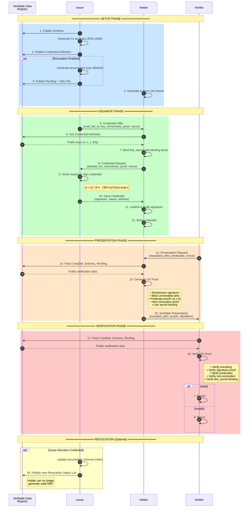
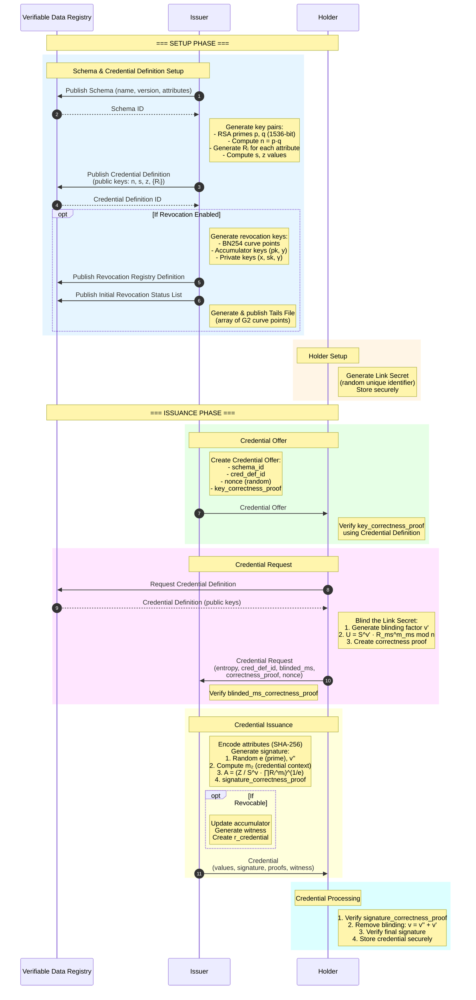
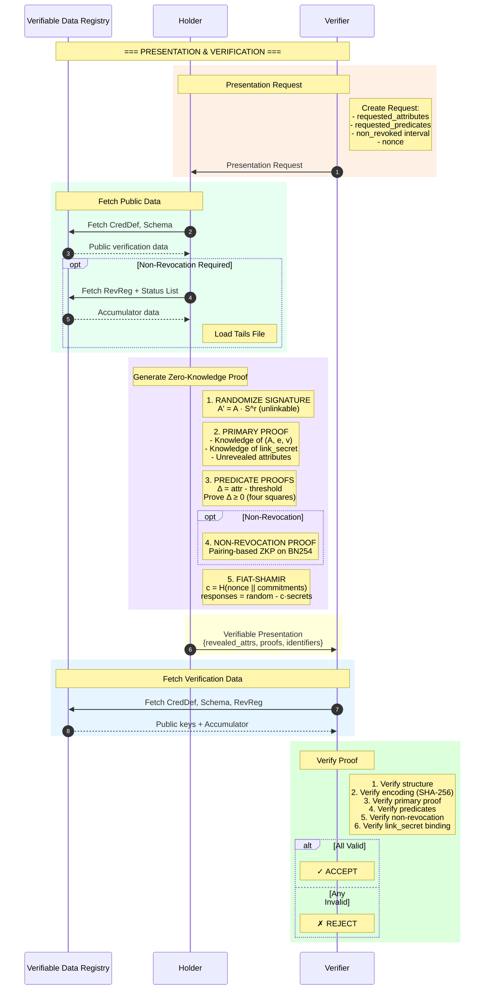

# AnonCreds 1.0 Cryptographic Primitives

## Overview

AnonCreds (Anonymous Credentials) is a Zero-Knowledge Proof (ZKP) based verifiable credential system built on **CL Signatures** (Camenisch-Lysyanskaya). This document covers the cryptographic primitives and sequence flows for credential issuance and verification.

> **Key Features:**
> - Selective Disclosure
> - Predicates (prove conditions without revealing values)
> - Unlinkability (presentations cannot be correlated)
> - Efficient Revocation

---

## Cryptographic Primitives Summary

| Primitive | Algorithm/Curve | Purpose |
|-----------|-----------------|---------|
| Digital Signatures | CL Signatures (RSA-2048) | Sign credential attributes |
| Key Generation | Sophie Germain / Safe Primes | Generate secure RSA modulus |
| Commitments | Pedersen-style | Blind link secret & attributes |
| Hash Function | SHA-256 | Encode attributes, Fiat-Shamir |
| Accumulator | CKS variant on BN254 | Revocation status |
| Pairing | Ate pairing on BN254 | Non-revocation proofs |
| ZK Proofs | Schnorr-style + Fiat-Shamir | Prove knowledge without revealing |
| Predicates | Four-squares decomposition | Range proofs (≥, ≤, etc.) |

---

## 1. CL Signatures (Camenisch-Lysyanskaya)

CL Signatures are a form of digital signature invented by Jan Camenisch and Anna Lysyanskaya (papers: 2001, 2003, 2004). They provide two key protocols:

1. **Blind Signing Protocol**: A signer can issue a signature to a user without learning all the messages being signed or the complete signature.

2. **Proof of Knowledge Protocol**: The signature owner can prove they have a signature on many messages without revealing the signature and only a (possibly empty) subset of the messages.

### Historical Context

- 1983: David Chaum publishes blind signatures
- 2001: Camenisch & Lysyanskaya publish CL Signatures
- 2016: Hyperledger Indy created
- 2017: AnonCreds implementation begins

---

## 2. RSA Groups & Key Generation

### Credential Definition Key Generation

The Credential Definition uses RSA-2048 with Sophie Germain and Safe primes:

1. Generate random 1536-bit primes `p`, `q` such that `p'` and `q'` are primes too
   - Where `p = 2p' + 1` and `q = 2q' + 1` (Safe primes)
2. Compute `n = p · q`
3. Compute random values `Rᵢ` for each attribute
4. Compute `s` (random quadratic residue) and `z`

**Public Key**: `(n, s, z, {Rᵢ})`  
**Private Key**: `(p, q)`

All integers in the Credential Definition are 2048-bit integers (617 decimal digits).

---

## 3. Blinded Secrets & Commitments

### Blinded Secret

A cryptographic technique where a secret value is blinded before sharing, allowing later proof of knowledge without revealing the value.

### Blinding Factor

A random BigNumber selected from integers up to the RSA group order `n`. Generated by the holder to blind their link secret during credential issuance.

**Blinding Formula**:
```
U = S^v' · R_link_secret^m_link_secret mod n
```

Where:
- `v'` = blinding factor
- `m_link_secret` = the holder's link secret
- `S`, `R_link_secret` = public keys from Credential Definition

---

## 4. Revocation: Cryptographic Accumulators

### Accumulator Scheme

The revocation scheme uses a pairing-based dynamic accumulator (CKS variant) with Type 3 elliptic curve pairing on **BN254** curve (254-bit prime).

### Pairing Groups

- **G1**: Subgroup of E1 (more compact representation)
- **G2**: Subgroup of E2
- **GT**: Subgroup of multiplicative group of field extension
- **e**: G1 × G2 → GT (non-degenerate bilinear map)

### Public Revocation Keys

| Key | Description |
|-----|-------------|
| `g` | Generator for G1 |
| `g_dash` | Generator for G2 |
| `h, h0, h1, h2, htilde` | Random points in G1 |
| `h_cap, u, y` | Points in G2 |
| `pk` | Public key: `g^sk` |

### Private Revocation Keys

| Key | Description |
|-----|-------------|
| `x` | Integer modulo group order |
| `sk` | Integer modulo group order |
| `gamma` | Secret for accumulator construction |

### Tails File

Array of G2 curve points, one per credential in the registry:
```
tail[index] = g_dash * (gamma ^ index)
```

---

## 5. Link Secret (Master Secret)

A unique identifier known only to the holder used to:

- Bind credentials to the holder
- Demonstrate that all credentials in a presentation belong to the same holder
- Enable multi-credential presentations

During issuance and presentation, the link secret is blinded with a blinding factor and a correctness proof is provided.

---

## 6. Zero-Knowledge Proofs

### Proof Types

| Proof Type | Purpose |
|------------|---------|
| Blinded Secrets Correctness Proof | Prove blinded secret was produced correctly |
| Signature Correctness Proof | Prove signature validity without revealing |
| Non-Revocation Proof | Prove credential not revoked without revealing index |
| Predicate Proof | Prove attribute satisfies condition |

### ZKP Capabilities

- Prove knowledge of link secret
- Share data from multiple credentials without revealing correlatable identifiers
- Selective disclosure of necessary claims
- Predicates to minimize shared data
- Prove credentials not revoked without unique identifiers

---

## 7. Predicates

A zero-knowledge proof predicate is a boolean assertion (`<=`, `<`, `>`, `>=`) about an integer claim value without disclosing the value.

**Example**: Prove `age >= 21` without revealing actual age.

**Method**: Four-squares decomposition to prove `Δ = attribute - threshold >= 0`

---

## Sequence Diagrams

### Full Lifecycle Overview



---

### Detailed Credential Issuance



---

### Detailed Presentation & Verification



---

## Key Algorithms

### Credential Signature Generation

```
A = (Z / (S^v · R₁^m₁ · R₂^m₂ · ... · R_L^m_L))^(1/e) mod n
```

Where:
- `Z, S, Rᵢ` = public keys from Credential Definition
- `v` = random value
- `mᵢ` = encoded attribute values
- `e` = random prime
- `n` = RSA modulus

### Signature Verification

Verify that:
```
A^e · S^v · ∏(Rᵢ^mᵢ) ≡ Z (mod n)
```

### Attribute Encoding (SHA-256)

1. Keep integers as-is
2. Convert string integers to integers
3. For other types:
   - Convert to string (use "None" for null)
   - Encode via UTF-8 to bytes
   - Apply SHA-256
   - Convert digest bytes (big-endian) to integer
   - Stringify as decimal

---

## Data Structures

### Schema

```json
{
  "issuerId": "did:example:issuer",
  "name": "Example Schema",
  "version": "1.0.0",
  "attrNames": ["name", "age", "birthdate"]
}
```

### Credential Definition

```json
{
  "issuerId": "did:example:issuer",
  "schemaId": "did:example:schema/1.0.0",
  "type": "CL",
  "tag": "default",
  "value": {
    "primary": {
      "n": "779...397",
      "s": "750...893",
      "z": "632...005",
      "r": {
        "name": "294...298",
        "age": "533...284",
        "link_secret": "521...922"
      },
      "rctxt": "774...977"
    },
    "revocation": {
      "g": "1 154...813 1 11C...D0D 2 095..8A8",
      "g_dash": "1 1F0...000",
      "h": "1 131...8A8",
      "pk": "1 0E7...8A8",
      "y": "1 068...000"
    }
  }
}
```

### Credential

```json
{
  "schema_id": "did:example:schema/1.0.0",
  "cred_def_id": "did:example:creddef/1.0.0",
  "values": {
    "name": {
      "raw": "Alice",
      "encoded": "113...335"
    },
    "age": {
      "raw": "25",
      "encoded": "25"
    }
  },
  "signature": {
    "p_credential": {
      "m_2": "992...312",
      "a": "548...252",
      "e": "259...199",
      "v": "977...597"
    }
  },
  "signature_correctness_proof": {
    "se": "898...935",
    "c": "935...598"
  }
}
```

---

## Quick Reference: Key Flows

### Issuance Flow (10 steps)

1. **Issuer → VDR**: Publish Schema & CredDef
2. **Holder**: Generate Link Secret
3. **Issuer → Holder**: Credential Offer (nonce, key_correctness_proof)
4. **Holder**: Verify offer, blind link_secret with factor v'
5. **Holder → Issuer**: Credential Request (blinded_ms, correctness_proof)
6. **Issuer**: Sign credential `A = (Z / S^v · ∏Rᵢ^mᵢ)^(1/e) mod n`
7. **Issuer → Holder**: Credential (signature, values, witness)
8. **Holder**: Unblind signature (`v = v'' + v'`), verify, store

### Verification Flow (8 steps)

1. **Verifier → Holder**: Presentation Request (attrs, predicates, nonce)
2. **Holder**: Fetch CredDef, Schema, RevReg from VDR
3. **Holder**: Randomize signature `A' = A · S^r`
4. **Holder**: Generate ZKP (signature proof, predicates, NRP)
5. **Holder → Verifier**: Verifiable Presentation
6. **Verifier**: Fetch public keys from VDR
7. **Verifier**: Verify all proofs
8. **Verifier**: Accept or Reject

---

## References

- **Official Specification**: [https://hyperledger.github.io/anoncreds-spec/](https://hyperledger.github.io/anoncreds-spec/)
- **Rust Implementation**: [https://github.com/hyperledger/anoncreds-rs](https://github.com/hyperledger/anoncreds-rs)
- **CL Signatures Library**: [https://github.com/hyperledger/anoncreds-clsignatures-rs](https://github.com/hyperledger/anoncreds-clsignatures-rs)
- **Specification Repository**: [https://github.com/hyperledger/anoncreds-spec](https://github.com/hyperledger/anoncreds-spec)
- **AnonCreds Whitepaper**: [Anonymous credentials with type-3 revocation](https://github.com/hyperledger/anoncreds-spec/blob/main/spec/ursaAnonCreds.pdf)

---

## Original Papers

- Camenisch, J., & Lysyanskaya, A. (2001). *Efficient non-transferable anonymous multi-show credential system with optional anonymity revocation*. EUROCRYPT 2001.
- Camenisch, J., & Lysyanskaya, A. (2002). *Dynamic accumulators and application to efficient revocation of anonymous credentials*. CRYPTO 2002.
- Camenisch, J., & Lysyanskaya, A. (2003). *A signature scheme with efficient protocols*. SCN 2002.
- Camenisch, J., & Lysyanskaya, A. (2004). *Signature schemes and anonymous credentials from bilinear maps*. CRYPTO 2004.
