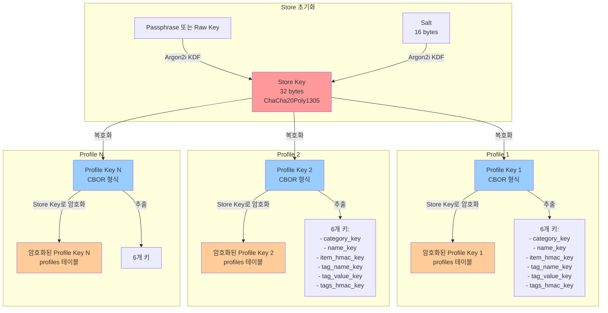
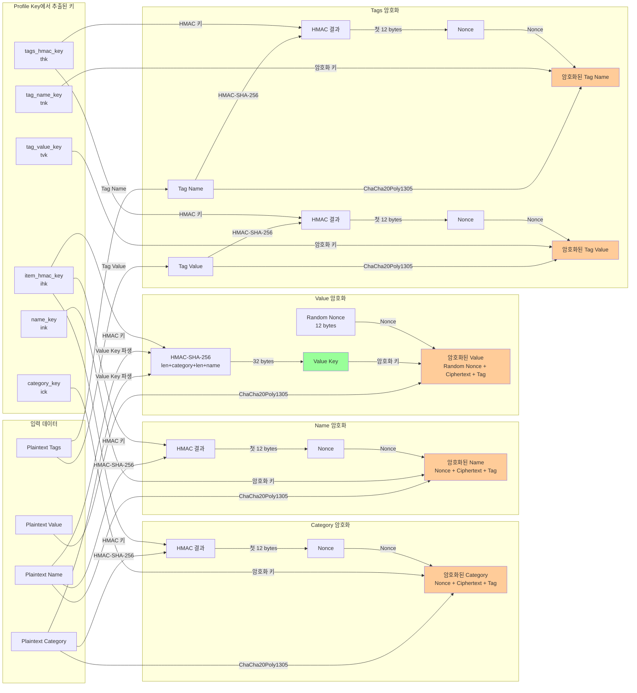
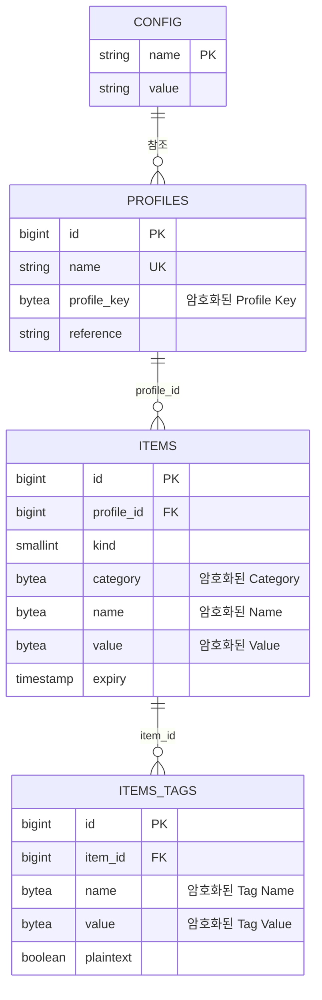
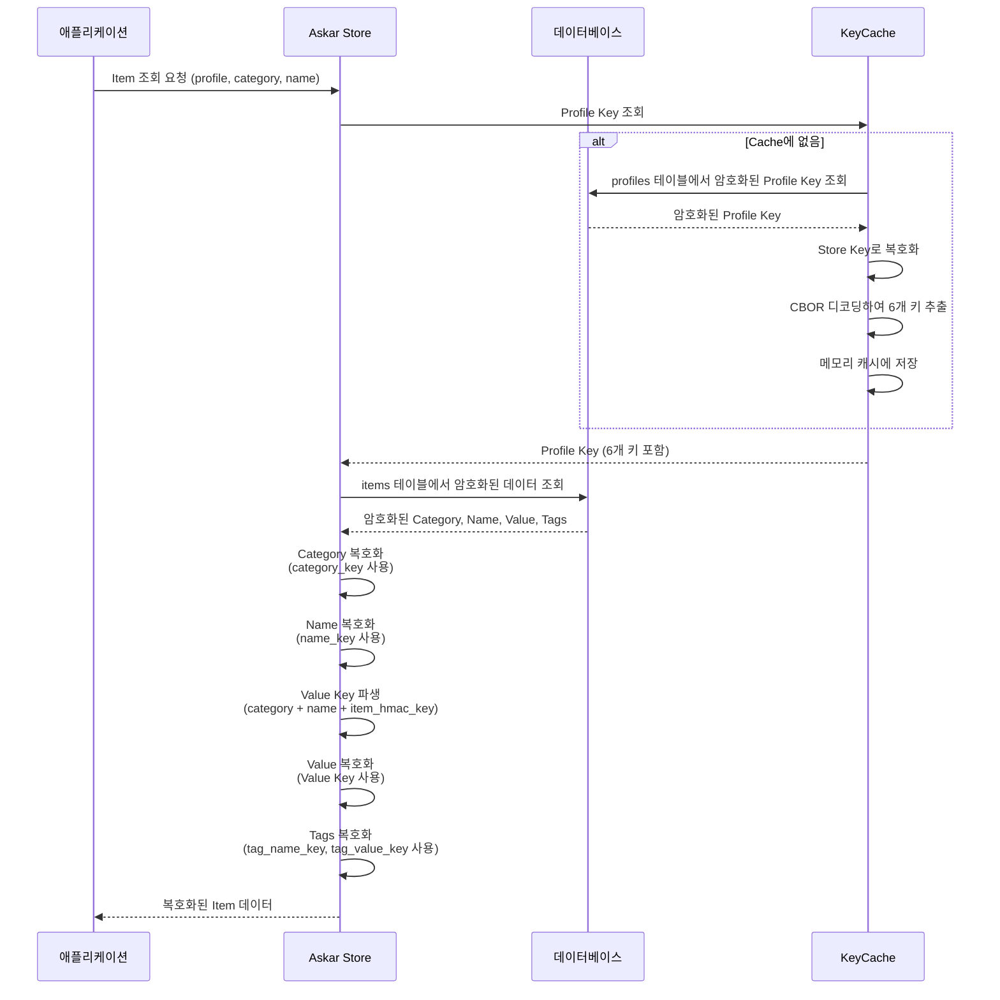
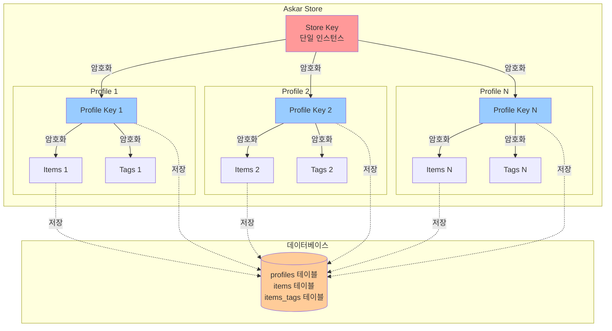
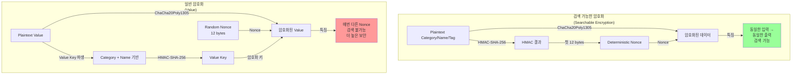

# Askar Multitenancy Mode 데이터 암호화 과정

## 개요

Askar는 multitenancy mode에서 여러 개의 독립적인 profile을 지원합니다. 각 profile은 자신만의 암호화 키를 가지며, 모든 profile의 키는 공통의 Store Key로 암호화되어 저장됩니다. 이 문서는 이러한 구조에서 데이터가 어떻게 암호화되어 저장되는지 설명합니다.

## 키 계층 구조

Askar의 암호화는 3단계 키 계층 구조를 사용합니다:

1. **Store Key (최상위 키)**
   - 모든 profile key를 암호화하는 마스터 키
   - Passphrase + Argon2i KDF 또는 Raw Key로 생성
   - 데이터베이스에 저장되지 않음 (메모리에만 존재)

2. **Profile Key (프로필별 키)**
   - 각 profile마다 고유하게 생성되는 키
   - Store Key로 암호화되어 `profiles` 테이블에 저장
   - 6개의 하위 키를 포함:
     - `ick` (item category key): Category 암호화용
     - `ink` (item name key): Name 암호화용
     - `ihk` (item HMAC key): Item 검색 가능한 암호화용 HMAC
     - `tnk` (tag name key): Tag 이름 암호화용
     - `tvk` (tag value key): Tag 값 암호화용
     - `thk` (tags HMAC key): Tag 검색 가능한 암호화용 HMAC

3. **Derived Keys (파생 키)**
   - Item Value 암호화를 위해 category와 name으로부터 동적으로 생성
   - HMAC-SHA-256을 사용하여 파생

## 데이터 암호화 과정

### 1. Store 초기화 및 Store Key 생성

```
Passphrase (또는 Raw Key)
    ↓
Argon2i KDF (salt 사용)
    ↓
Store Key (32 bytes, ChaCha20Poly1305 키)
```

**Store Key 생성 파라미터:**
- KDF: Argon2i
- Time Cost: 6 (moderate) 또는 4 (interactive)
- Memory Cost: 131072 (128MB, moderate) 또는 32768 (32MB, interactive)
- Parallelism: argon2 라이브러리 기본값 사용 (명시적으로 설정되지 않음)
- Hash Length: 32 bytes

### 2. Profile 생성 및 Profile Key 암호화

각 profile이 생성될 때:

1. **Profile Key 생성**
   - 6개의 랜덤 키 생성 (category_key, name_key, item_hmac_key, tag_name_key, tag_value_key, tags_hmac_key)
   - CBOR 형식으로 직렬화

2. **Profile Key 암호화**
   ```
   Profile Key (CBOR)
       ↓
   ChaCha20Poly1305 (Store Key 사용)
       ↓
   [Nonce (12 bytes)][Ciphertext + Tag (16 bytes)]
       ↓
   profiles 테이블에 저장
   ```

### 3. Item 데이터 암호화

Item은 다음 필드로 구성됩니다:
- **Category**: 검색 가능한 암호화 (searchable encryption)
- **Name**: 검색 가능한 암호화 (searchable encryption)
- **Value**: 파생 키로 암호화 (random nonce)
- **Tags**: 검색 가능한 암호화 (searchable encryption)

#### 3.1 Category 암호화

```
Plaintext Category
    ↓
HMAC-SHA-256(Plaintext Category, item_hmac_key)
    ↓
Nonce = HMAC 결과의 첫 12 bytes
    ↓
ChaCha20Poly1305(Category, category_key, Nonce)
    ↓
[Nonce (12 bytes)][Ciphertext + Tag (16 bytes)]
```

**특징:**
- 동일한 category는 항상 동일한 암호문 생성 (deterministic)
- 검색 가능 (같은 category로 검색 가능)

#### 3.2 Name 암호화

```
Plaintext Name
    ↓
HMAC-SHA-256(Plaintext Name, item_hmac_key)
    ↓
Nonce = HMAC 결과의 첫 12 bytes
    ↓
ChaCha20Poly1305(Name, name_key, Nonce)
    ↓
[Nonce (12 bytes)][Ciphertext + Tag (16 bytes)]
```

**특징:**
- 동일한 name은 항상 동일한 암호문 생성 (deterministic)
- 검색 가능

#### 3.3 Value 암호화

```
Plaintext Value
    ↓
Value Key 파생:
HMAC-SHA-256(
    u_int32(len(category)) || category ||
    u_int32(len(name)) || name,
    item_hmac_key
)
    ↓
Value Key = HMAC 결과 (32 bytes)
    ↓
Random Nonce 생성 (12 bytes)
    ↓
ChaCha20Poly1305(Value, Value Key, Random Nonce)
    ↓
[Nonce (12 bytes)][Ciphertext + Tag (16 bytes)]
```

**특징:**
- 매번 다른 nonce 사용 (non-deterministic)
- Category와 Name 조합에 따라 다른 키 사용
- 검색 불가능 (보안 강화)

#### 3.4 Tags 암호화

**Tag Name:**
```
Plaintext Tag Name
    ↓
HMAC-SHA-256(Plaintext Tag Name, tags_hmac_key)
    ↓
Nonce = HMAC 결과의 첫 12 bytes
    ↓
ChaCha20Poly1305(Tag Name, tag_name_key, Nonce)
```

**Tag Value (암호화된 태그인 경우):**
```
Plaintext Tag Value
    ↓
HMAC-SHA-256(Plaintext Tag Value, tags_hmac_key)
    ↓
Nonce = HMAC 결과의 첫 12 bytes
    ↓
ChaCha20Poly1305(Tag Value, tag_value_key, Nonce)
```

**특징:**
- Tag Name과 Tag Value 모두 검색 가능
- Plaintext 태그도 지원 (plaintext 플래그 사용)

## 데이터베이스 스키마

### config 테이블

| 컬럼명 | 타입 | 설명 |
|--------|------|------|
| `name` | string | 설정 키 (PK, 예: `default_profile`, `key`, `version`) |
| `value` | string | 설정 값 (`default_profile`의 경우 기본 profile 이름, `key`의 경우 Store Key 메타데이터, `version`의 경우 스키마 버전) |

### profiles 테이블

| 컬럼명 | 타입 | 설명 |
|--------|------|------|
| `id` | BIGSERIAL/INTEGER | Profile ID (PK) |
| `name` | TEXT | Profile 이름 (UNIQUE) |
| `profile_key` | BYTEA/BLOB | 암호화된 Profile Key |
| `reference` | string | 참조 정보 (선택적) |

### items 테이블

| 컬럼명 | 타입 | 설명 |
|--------|------|------|
| `id` | BIGSERIAL/INTEGER | Item ID (PK) |
| `profile_id` | BIGINT | Profile ID (FK) |
| `kind` | SMALLINT | KMS (1) 또는 Item (2) |
| `category` | BYTEA | 암호화된 Category |
| `name` | BYTEA | 암호화된 Name |
| `value` | BYTEA | 암호화된 Value |
| `expiry` | TIMESTAMP/DATETIME | 만료 시간 |

### items_tags 테이블

| 컬럼명 | 타입 | 설명 |
|--------|------|------|
| `id` | BIGSERIAL/INTEGER | Tag ID (PK) |
| `item_id` | BIGINT | Item ID (FK) |
| `name` | BYTEA | 암호화된 Tag Name |
| `value` | BYTEA | 암호화된 Tag Value |
| `plaintext` | BOOLEAN/SMALLINT | 평문 여부 |

## 복호화 과정

### 1. Store Key 복원
```
Passphrase + Salt
    ↓
Argon2i KDF
    ↓
Store Key
```

### 2. Profile Key 복호화
```
암호화된 Profile Key (profiles 테이블)
    ↓
Store Key로 복호화
    ↓
Profile Key (CBOR)
    ↓
CBOR 디코딩
    ↓
6개의 키 추출
```

### 3. Item 데이터 복호화

#### Category 복호화
```
암호화된 Category
    ↓
Nonce 추출 (첫 12 bytes)
    ↓
ChaCha20Poly1305 복호화 (category_key 사용)
    ↓
Plaintext Category
```

#### Name 복호화
```
암호화된 Name
    ↓
Nonce 추출 (첫 12 bytes)
    ↓
ChaCha20Poly1305 복호화 (name_key 사용)
    ↓
Plaintext Name
```

#### Value 복호화
```
암호화된 Value
    ↓
Nonce 추출 (첫 12 bytes)
    ↓
Category와 Name으로 Value Key 파생
    ↓
ChaCha20Poly1305 복호화 (Value Key 사용)
    ↓
Plaintext Value
```

## 보안 특징

1. **키 격리**: 각 profile은 독립적인 키를 가지므로, 한 profile의 데이터는 다른 profile의 키로 복호화할 수 없습니다.

2. **검색 가능한 암호화**: Category, Name, Tags는 deterministic 암호화를 사용하여 검색이 가능하지만, Value는 non-deterministic으로 더 높은 보안을 제공합니다.

3. **키 파생**: Value Key는 category와 name의 조합으로부터 파생되므로, 같은 category와 name을 가진 항목들도 서로 다른 Value Key를 사용할 수 있습니다.

4. **Store Key 보호**: Store Key는 데이터베이스에 저장되지 않으며, 메모리에서만 사용됩니다. Passphrase 기반 KDF를 사용하면 brute force 공격에 대한 보호가 제공됩니다.

## 다이어그램

### 전체 키 계층 구조 및 암호화 흐름



### Item 데이터 암호화 과정



### 데이터베이스 저장 구조



### 복호화 과정



### Multitenancy 구조



### 검색 가능한 암호화 vs 일반 암호화



