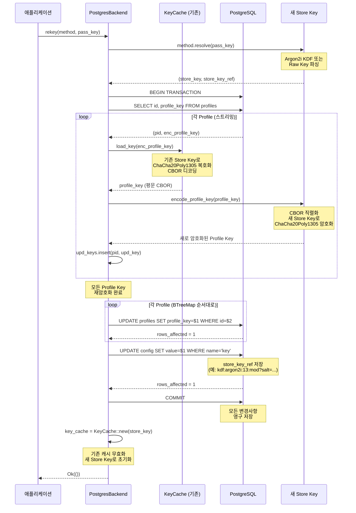
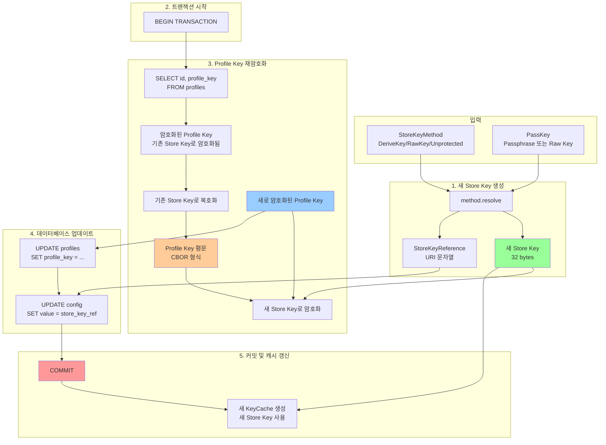
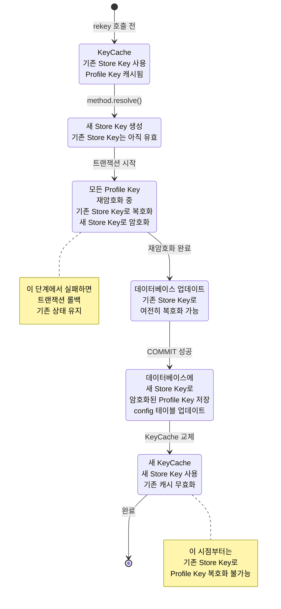

# rekey 함수 구현 상세 분석

## 개요

`rekey` 함수는 Askar Store의 Store Key를 변경하고, 모든 Profile Key를 새로운 Store Key로 재암호화하는 핵심 기능입니다. 이 함수는 보안상 중요한 작업이므로 원자성(atomicity)을 보장하기 위해 트랜잭션을 사용합니다.

**위치:** `askar-storage/src/backend/postgres/mod.rs:232-284`

## 함수 시그니처

```rust
fn rekey(
    &mut self,
    method: StoreKeyMethod,
    pass_key: PassKey<'_>,
) -> BoxFuture<'_, Result<(), Error>>
```

**파라미터:**

| 파라미터 | 타입 | 설명 |
| :--- | :--- | :--- |
| `&mut self` | `PostgresBackend` | PostgresBackend의 가변 참조 (KeyCache 업데이트 필요) |
| `method` | `StoreKeyMethod` | 새로운 Store Key 생성 방법<br>• `DeriveKey`: Argon2i KDF 사용<br>• `RawKey`: Raw Key 사용<br>• `Unprotected`: 암호화 없음 |
| `pass_key` | `PassKey<'_>` | Store Key 생성에 필요한 패스프레이즈 또는 Raw Key |

**반환값:**
- `BoxFuture<'_, Result<(), Error>>`: 비동기 작업의 Future

## 구현 단계별 분석

### 1단계: PassKey 소유권 확보

```rust
let pass_key = pass_key.into_owned();
```

**목적:** PassKey의 소유권을 확보하여 비동기 컨텍스트에서 사용할 수 있도록 합니다.

**이유:** 
- `PassKey<'_>`는 수명 파라미터를 가지므로 비동기 블록에서 직접 사용할 수 없습니다.
- `into_owned()`를 통해 `PassKey<'static>`으로 변환합니다.

### 2단계: 새로운 Store Key 생성

```rust
let (store_key, store_key_ref) = unblock(move || method.resolve(pass_key)).await?;
let store_key = Arc::new(store_key);
```

**동작:**
1. `method.resolve(pass_key)`: 새로운 Store Key와 StoreKeyReference를 생성
   - `DeriveKey`: Argon2i KDF로 키 파생
   - `RawKey`: Base58 디코딩 또는 랜덤 생성
   - `Unprotected`: 빈 키 생성

2. `unblock()`: CPU 집약적인 작업을 별도 스레드 풀에서 실행
   - Argon2i KDF는 CPU 집약적이므로 블로킹되지 않도록 처리

3. `Arc::new()`: 여러 곳에서 공유할 수 있도록 Arc로 래핑

**StoreKeyReference:**
- Store Key의 메타데이터를 담은 참조 정보
- 예: `kdf:argon2i:13:mod?salt=...`
- config 테이블에 저장되어 다음에 Store를 열 때 사용

### 3단계: 데이터베이스 연결 및 트랜잭션 시작

```rust
let mut conn = self.conn_pool.acquire().await?;
let mut txn = conn.begin().await?;
```

**동작:**
1. 연결 풀에서 연결 획득
2. 트랜잭션 시작 (BEGIN)

**중요성:**
- 모든 Profile Key 재암호화와 config 업데이트가 원자적으로 실행되어야 함
- 중간에 실패하면 롤백되어 데이터 일관성 유지

### 4단계: 모든 Profile Key 조회 및 재암호화

```rust
let mut rows = sqlx::query("SELECT id, profile_key FROM profiles").fetch(txn.as_mut());
let mut upd_keys = BTreeMap::<ProfileId, Vec<u8>>::new();
while let Some(row) = rows.next().await {
    let row = row?;
    let pid = row.try_get(0)?;           // Profile ID
    let enc_key = row.try_get(1)?;       // 암호화된 Profile Key (기존 Store Key로 암호화됨)
    
    // 기존 Store Key로 Profile Key 복호화
    let profile_key = self.key_cache.load_key(enc_key).await?;
    
    // 새 Store Key로 Profile Key 재암호화
    let upd_key = unblock({
        let store_key = store_key.clone();
        move || encode_profile_key(&profile_key, &store_key)
    }).await?;
    
    upd_keys.insert(pid, upd_key);
}
drop(rows);
```

**상세 분석:**

#### 4.1 Profile Key 조회
```sql
SELECT id, profile_key FROM profiles
```
- 모든 Profile의 ID와 암호화된 Profile Key를 조회
- 트랜잭션 내에서 실행되므로 일관된 스냅샷 보장

#### 4.2 Profile Key 복호화
```rust
let profile_key = self.key_cache.load_key(enc_key).await?;
```

**내부 동작:**
1. `load_key()`는 `KeyCache`의 메서드
2. 기존 Store Key (`self.key_cache.store_key`)로 암호화된 Profile Key를 복호화
3. CBOR 디코딩하여 `ProfileKey` 구조체로 변환

**코드 경로:** `askar-storage/src/protect/mod.rs:41-50`
```rust
pub async fn load_key(&self, ciphertext: Vec<u8>) -> Result<ProfileKey, Error> {
    let store_key = self.store_key.clone();
    unblock(move || {
        let data = store_key
            .unwrap_data(ciphertext)
            .map_err(err_map!(Encryption, "Error decrypting profile key"))?;
        Ok(ProfileKey::from_slice(data.as_ref())?)
    }).await
}
```

**과정:**
1. `store_key.unwrap_data(ciphertext)`: Store Key로 복호화
   - Nonce 추출 (첫 12 bytes)
   - ChaCha20Poly1305 복호화
   - CBOR 데이터 반환
2. `ProfileKey::from_slice()`: CBOR 디코딩하여 ProfileKey 구조체 생성

#### 4.3 Profile Key 재암호화
```rust
let upd_key = unblock({
    let store_key = store_key.clone();
    move || encode_profile_key(&profile_key, &store_key)
}).await?;
```

**내부 동작:**
1. `encode_profile_key()`: Profile Key를 새 Store Key로 암호화
   - Profile Key를 CBOR로 직렬화
   - 새 Store Key로 ChaCha20Poly1305 암호화
   - `[Nonce (12 bytes)][Ciphertext][Tag (16 bytes)]` 형식으로 반환 (일반적으로 Tag는 Ciphertext 뒤에 붙음)

**코드 경로:** `askar-storage/src/backend/db_utils.rs:622-627`
```rust
pub fn encode_profile_key(
    profile_key: &ProfileKey,
    store_key: &StoreKey,
) -> Result<Vec<u8>, Error> {
    store_key.wrap_data(profile_key.to_bytes()?)
}
```

**과정:**
1. `profile_key.to_bytes()`: Profile Key를 CBOR로 직렬화
2. `store_key.wrap_data()`: 새 Store Key로 암호화
   - Random Nonce 생성 (12 bytes)
   - ChaCha20Poly1305 암호화
   - `[Nonce][Ciphertext][Tag]` 형식으로 반환

#### 4.4 BTreeMap에 저장
```rust
upd_keys.insert(pid, upd_key);
```

**이유:**
- Profile ID를 키로 하여 정렬된 맵에 저장
- 나중에 순서대로 업데이트하기 위함
- 메모리 효율성: 모든 재암호화가 완료된 후에만 DB 업데이트

### 5단계: Profile Key 업데이트

```rust
for (pid, key) in upd_keys {
    if sqlx::query("UPDATE profiles SET profile_key=$1 WHERE id=$2")
        .bind(key)
        .bind(pid)
        .execute(txn.as_mut())
        .await?
        .rows_affected()
        != 1
    {
        return Err(err_msg!(Backend, "Error updating profile key"));
    }
}
```

**동작:**
1. 각 Profile의 `profile_key` 컬럼을 새로 암호화된 값으로 업데이트
2. `rows_affected() != 1` 체크: 정확히 1개 행이 업데이트되어야 함
   - 0개: Profile이 존재하지 않음 (데이터 불일치)
   - 2개 이상: 중복 ID (불가능하지만 방어적 코딩)

**에러 처리:**
- 업데이트 실패 시 즉시 에러 반환
- 트랜잭션이 롤백됨

### 6단계: Config 테이블 업데이트

```rust
if sqlx::query("UPDATE config SET value=$1 WHERE name='key'")
    .bind(store_key_ref.into_uri())
    .execute(txn.as_mut())
    .await?
    .rows_affected()
    != 1
{
    return Err(err_msg!(Backend, "Error updating store key"));
}
```

**동작:**
1. `config` 테이블의 `key` 항목을 새 Store Key Reference로 업데이트
2. `store_key_ref.into_uri()`: StoreKeyReference를 URI 문자열로 변환
   - 예: `kdf:argon2i:13:mod?salt=...`
   - 예: `raw`
   - 예: `none`

**중요성:**
- 다음에 Store를 열 때 새 Store Key를 사용할 수 있도록 메타데이터 저장
- 이 단계가 실패하면 모든 Profile Key는 새 키로 암호화되었지만, Store를 다시 열 수 없음

### 7단계: 트랜잭션 커밋

```rust
txn.commit().await?;
conn.return_to_pool().await;
```

**동작:**
1. `txn.commit()`: 모든 변경사항을 데이터베이스에 영구 저장
2. `conn.return_to_pool()`: 연결을 풀에 반환

**원자성 보장:**
- 이 시점까지 모든 작업이 성공해야만 커밋됨
- 중간에 실패하면 자동 롤백

### 8단계: KeyCache 갱신

```rust
self.key_cache = Arc::new(KeyCache::new(store_key));
```

**동작:**
1. 기존 KeyCache를 새 Store Key로 생성된 KeyCache로 교체
2. 메모리에 캐시된 Profile Key는 모두 무효화됨
3. 다음 접근 시 새 Store Key로 Profile Key를 복호화

**중요성:**
- 메모리 상태를 새 Store Key와 일치시킴
- 기존 Store Key로 복호화하려는 시도를 방지

## 전체 흐름도

### 시퀀스 다이어그램



### 데이터 흐름도



### 메모리 상태 변화



## 보안 고려사항

### 1. 원자성 보장
- 모든 작업이 단일 트랜잭션에서 실행됨
- 중간 실패 시 자동 롤백
- 부분적으로 업데이트된 상태가 남지 않음

### 2. 메모리 보안
- 기존 Store Key는 즉시 폐기되지 않지만, KeyCache가 교체되어 더 이상 사용되지 않음
- Rust의 소유권 시스템으로 메모리 안전성 보장

### 3. 에러 처리
- 각 단계에서 실패 시 즉시 에러 반환
- 트랜잭션 롤백으로 데이터 일관성 유지

### 4. 동시성 제어 및 한계
- **트랜잭션 격리**: 현재 구현은 `SELECT` 시 `FOR UPDATE`나 테이블 락을 사용하지 않습니다.
- **Race Condition 위험**: `rekey`가 실행되는 동안 다른 프로세스나 연결에서 새로운 Profile을 생성(INSERT)하면, 해당 Profile은 **기존 Store Key**로 암호화되어 저장됩니다.
- **결과**: `rekey` 완료 후 Config가 **새 Store Key**로 업데이트되면, `rekey` 도중 생성된 Profile은 복호화할 수 없게 됩니다 (Data Loss).
- **권장사항**: `rekey` 작업은 반드시 애플리케이션 점검 시간 등 **단독 접근이 보장된 환경**에서 수행해야 합니다.

## 잠재적 문제점 및 해결책

### 1. 대량의 Profile이 있는 경우

**문제:**
- 모든 Profile Key를 메모리에 로드하면 메모리 사용량이 증가할 수 있음

**현재 구현:**
- 스트리밍 방식으로 한 번에 하나씩 처리 (`rows.next().await`)
- BTreeMap에 저장하지만 암호화된 데이터만 저장 (평문 Profile Key는 즉시 폐기)

**개선 가능성:**
- 배치 처리로 메모리 사용량 제한
- 하지만 현재 구현도 충분히 효율적

### 2. 트랜잭션 타임아웃

**문제:**
- Profile이 많으면 트랜잭션이 오래 지속될 수 있음
- 데이터베이스 타임아웃 발생 가능

**현재 구현:**
- 단일 트랜잭션으로 처리하여 원자성 보장
- 타임아웃은 데이터베이스 설정에 의존

**해결책:**
- 데이터베이스 타임아웃 설정 조정
- 또는 배치 처리로 나누되, 각 배치를 별도 트랜잭션으로 처리 (원자성 약화)

### 3. 중간 실패 시 복구

**문제:**
- 트랜잭션 중 실패 시 롤백되지만, KeyCache는 이미 교체됨

**현재 구현:**
- 트랜잭션 실패 시 에러 반환
- KeyCache는 교체되었지만, 데이터베이스는 롤백되어 불일치 상태

**해결책:**
- KeyCache 교체를 트랜잭션 커밋 성공 후에만 수행하도록 수정 가능
- 하지만 현재는 커밋 직전에 교체하므로 문제 없음 (커밋 실패 시 함수가 에러 반환)

## 사용 예제

```rust
use askar_storage::backend::postgres::PostgresBackend;
use askar_storage::protect::{StoreKeyMethod, PassKey};

// Store Key 변경 (Argon2i KDF 사용)
let new_method = StoreKeyMethod::DeriveKey(KdfMethod::Argon2i(Level::Moderate));
let new_passphrase = PassKey::from("new_secret_passphrase");

backend.rekey(new_method, new_passphrase).await?;
```

## 관련 함수 및 구조체

### StoreKeyMethod::resolve()
- 위치: `askar-storage/src/protect/store_key.rs:133-159`
- 역할: PassKey로부터 StoreKey와 StoreKeyReference 생성

### KeyCache::load_key()
- 위치: `askar-storage/src/protect/mod.rs:41-50`
- 역할: 암호화된 Profile Key를 복호화하여 ProfileKey 구조체 반환

### encode_profile_key()
- 위치: `askar-storage/src/backend/db_utils.rs:622-627`
- 역할: Profile Key를 Store Key로 암호화

### StoreKey::wrap_data()
- 위치: `askar-storage/src/protect/store_key.rs:63-72`
- 역할: 데이터를 Store Key로 암호화 (ChaCha20Poly1305)

### StoreKey::unwrap_data()
- 위치: `askar-storage/src/protect/store_key.rs:75-85`
- 역할: Store Key로 암호화된 데이터를 복호화

## 결론

`rekey` 함수는 다음과 같은 특징을 가진 잘 설계된 함수입니다:

1. **원자성 보장**: 트랜잭션을 사용하여 모든 작업이 성공하거나 모두 롤백됨
2. **효율성**: 스트리밍 방식으로 메모리 사용량 최소화
3. **안전성**: 각 단계에서 에러 체크 및 방어적 코딩
4. **비동기 처리**: CPU 집약적 작업을 별도 스레드에서 처리

이 함수는 Store Key를 안전하게 변경하고 모든 Profile Key를 재암호화하는 핵심 메커니즘을 제공합니다.

