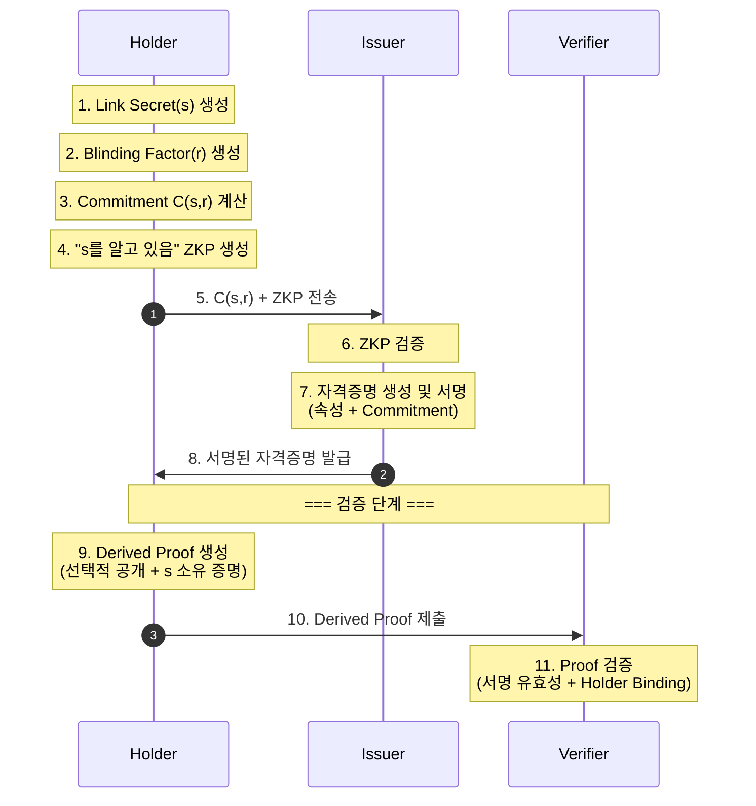
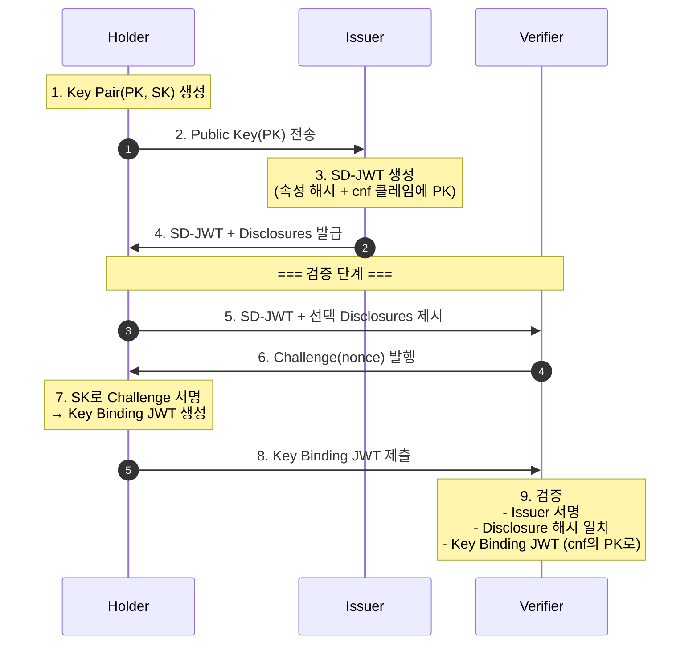
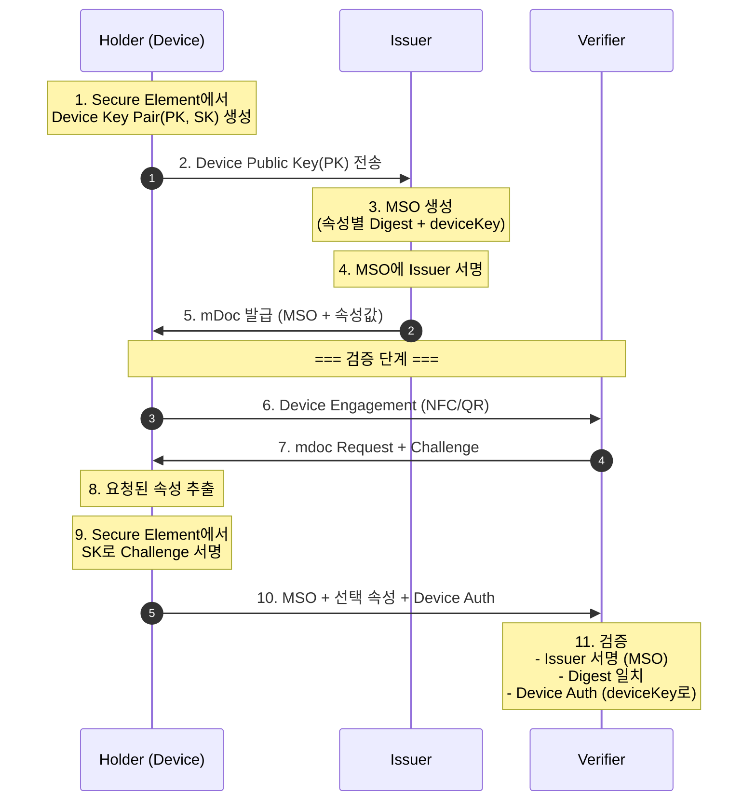

# 프라이버시 보존 자격증명 기술 비교

## 1. 개요

본 문서는 디지털 자격증명 시스템에서 사용되는 주요 프라이버시 보존 기술들을 비교 분석한다. W3C VC(BBS+), SD-JWT, ISO mDoc의 세 가지 자격증명 포맷과 이들의 기반이 되는 암호 기술, 그리고 Holder Binding 메커니즘을 다룬다.

---

## 2. 자격증명 포맷 비교

### 2.1 W3C VC + BBS+ (Data Integrity)

#### 정의

W3C Verifiable Credentials 데이터 모델에 BBS+ 서명을 결합한 방식이다. JSON-LD 형식으로 데이터를 표현하며, 페어링 기반 암호학을 통해 강력한 프라이버시 기능을 제공한다.

#### 핵심 특성

| 특성 | 설명 |
|------|------|
| 선택적 공개 | 서명된 속성 중 일부만 공개하면서 서명 유효성 증명 |
| 영지식 증명 | 원본 서명 없이 유효한 서명 보유 사실만 증명 |
| 비연결성 | 동일 자격증명의 반복 사용 간 연결 불가 |
| 술어 증명 | 값 자체를 공개하지 않고 조건 증명 (예: 나이 ≥ 19) |

#### 선택적 공개 동작 원리

BBS+ 서명은 여러 메시지를 하나의 서명으로 묶는 **다중 메시지 서명** 방식이다.

```
서명 생성:
σ = Sign(sk, m₁, m₂, m₃, ..., mₙ)

선택적 공개 (m₂만 공개):
π = DeriveProof(σ, m₁, m₂, m₃, ..., reveal={m₂})

검증:
Verify(π, m₂) → true/false
```

검증자는 m₂의 값과 "유효한 서명이 존재함"만 알 수 있고, 다른 속성(m₁, m₃, ...)은 알 수 없다.

#### 비연결성의 원리

매 제시마다 새로운 영지식 증명(π)이 생성된다. 이 증명에는 랜덤 요소가 포함되어 있어, 동일한 자격증명에서 파생되었더라도 두 증명 간의 연결이 수학적으로 불가능하다.

---

### 2.2 SD-JWT (Selective Disclosure JWT)

#### 정의

기존 JWT 구조를 확장하여 선택적 공개를 지원하는 방식이다. IETF에서 표준화되었으며(RFC 9449), JWT 생태계와의 호환성이 높다.

#### 핵심 특성

| 특성 | 설명 |
|------|------|
| 선택적 공개 | 해시+솔트 방식으로 속성별 공개 여부 결정 |
| 영지식 증명 | 미지원 |
| 비연결성 | 미지원 (Key Binding 시 동일 공개키 재사용) |
| 술어 증명 | 미지원 |

#### 선택적 공개 동작 원리

SD-JWT는 **해시 프리이미지 공개** 방식을 사용한다.

```
발급 시:
{
  "_sd": [
    hash(salt₁ || "name" || "홍길동"),
    hash(salt₂ || "age" || "25"),
    hash(salt₃ || "address" || "서울시")
  ]
}

+ Disclosures:
  ~base64(salt₁, "name", "홍길동")
  ~base64(salt₂, "age", "25")
  ~base64(salt₃, "address", "서울시")

제시 시 (name만 공개):
  JWT + ~base64(salt₁, "name", "홍길동")

검증:
  hash(salt₁ || "name" || "홍길동") == _sd[0] → true
```

#### 한계

속성을 공개하려면 **실제 값을 그대로 전달**해야 한다. 따라서 술어 증명("나이 ≥ 19")이 불가능하고, 공개된 값은 검증자가 완전히 알게 된다.

---

### 2.3 ISO mDoc (ISO/IEC 18013-5)

#### 정의

모바일 운전면허증(mDL)을 위해 ISO/IEC에서 표준화한 규격이다. CBOR 형식을 사용하며, 하드웨어 기반 보안을 강조한다.

#### 핵심 특성

| 특성 | 설명 |
|------|------|
| 선택적 공개 | MSO(Mobile Security Object) 내 Digest 대조 방식 |
| 영지식 증명 | 미지원 |
| 비연결성 | 제한적 (Batch Issuance로 완화 가능) |
| 술어 증명 | 미지원 (age_over_NN 같은 사전 계산된 속성으로 대체) |

#### 선택적 공개 동작 원리

```
발급 시:
MSO = {
  digestAlgorithm: "SHA-256",
  valueDigests: {
    "name": hash(salt₁ || "홍길동"),
    "age": hash(salt₂ || "25"),
    "address": hash(salt₃ || "서울시")
  },
  deviceKey: <Holder의 공개키>
}
+ IssuerSignature(MSO)

제시 시 (name만 공개):
  MSO + IssuerSignature + { "name": (salt₁, "홍길동") }

검증:
  1. IssuerSignature 검증
  2. hash(salt₁ || "홍길동") == MSO.valueDigests["name"]
```

#### 비연결성의 한계

MSO와 IssuerSignature가 정적이므로, 동일 자격증명을 여러 번 제시하면 추적이 가능하다. 이를 완화하기 위해 **Batch Issuance**(동일 내용의 자격증명을 여러 개 발급)를 사용한다.

---

## 3. 핵심 암호 기술

### 3.1 CL-Signature

#### 정의

2001년 Jan Camenisch와 Anna Lysyanskaya가 제안한 서명 방식이다. Strong RSA 가정에 기반하며, 익명 자격증명 시스템의 초기 구현(Hyperledger Indy 등)에서 사용되었다.

#### 수학적 구조

```
서명:
A = (a₀ · a₁^m₁ · a₂^m₂ · ... · aₙ^mₙ · v^vₑ)^(1/e) mod n

- m₁, m₂, ..., mₙ: 서명될 속성들
- e: 소수 지수
- n: RSA 모듈러스
```

#### 특성

BBS+와 유사하게 선택적 공개, 영지식 증명, 술어 증명을 지원한다. 다만 서명 크기가 크고 연산이 느리다는 단점이 있어, 최근에는 BBS+로 대체되는 추세이다.

---

### 3.2 BBS+ Signature

#### 정의

타원곡선 페어링을 기반으로 한 서명 방식이다. CL-Signature와 동일한 프라이버시 기능을 제공하면서, 더 작은 서명 크기와 빠른 연산 속도를 가진다.

#### 수학적 구조

```
서명:
σ = (A, e, s)
A = (g₁ · h₀^s · h₁^m₁ · h₂^m₂ · ... · hₙ^mₙ)^(1/(e+x))

- g₁, h₀, h₁, ..., hₙ: 타원곡선 상의 생성자
- x: 서명자의 비밀키
- e, s: 서명 관련 랜덤값
```

#### CL-Signature와 비교

| 구분 | CL-Signature | BBS+ |
|------|--------------|------|
| 수학적 기반 | RSA 그룹 | 타원곡선 페어링 |
| 서명 크기 | 큼 (~3KB) | 작음 (~100B) |
| 연산 속도 | 느림 | 빠름 |
| 주요 구현 | Hyperledger Indy | W3C VC Data Integrity |

---

### 3.3 Pedersen Commitment

#### 정의

값을 숨긴 채로 해당 값에 바인딩하는 암호학적 기법이다. Link Secret 구현의 핵심 요소이다.

#### 수학적 구조

```
정수 그룹:
C = g^s · h^r mod p

타원곡선 그룹:
C = s·G + r·H

- s: 숨기려는 값 (link_secret)
- r: 블라인딩 팩터 (랜덤값)
- g, h (또는 G, H): 공개된 생성자
```

#### 핵심 속성

| 속성 | 설명 |
|------|------|
| 은닉성 (Hiding) | 커밋먼트 C만으로는 s의 값을 알 수 없음 |
| 바인딩 (Binding) | 커밋먼트 생성 후 s를 다른 값으로 바꿀 수 없음 |

---

### 3.4 Blinding vs Blinded Signature

두 용어 모두 "blind"를 사용하지만, 완전히 다른 개념이다.

#### Blinding (블라인딩)

Pedersen Commitment에서 랜덤값 r을 사용하여 실제 값 s를 숨기는 것을 말한다. 이는 커밋먼트 스킴 자체의 **은닉 속성**이다.

```
C = g^s · h^r
        ↑
    블라인딩 팩터
```

#### Blinded Signature (블라인드 서명)

서명자가 메시지 내용을 모른 채 서명하는 **프로토콜**이다.

```
1. Holder: m' = blind(m, r)     ← 메시지 블라인딩
2. Holder → Signer: m' 전송
3. Signer: σ' = sign(m')        ← 블라인드된 메시지에 서명
4. Signer → Holder: σ' 반환
5. Holder: σ = unblind(σ', r)   ← 원본 메시지에 대한 유효한 서명 획득
```

#### 비교

| 구분 | 블라인딩 (Pedersen) | 블라인드 서명 |
|------|---------------------|---------------|
| 본질 | 커밋먼트의 속성 | 서명 프로토콜 |
| 목적 | 값을 숨긴 채 바인딩 | 서명자가 메시지 모른 채 서명 |
| 결과물 | 커밋먼트 값 | 유효한 서명 |
| 용도 | Link Secret 구현 | 익명 투표, 전자화폐 |

**Link Secret 구현에서는 Pedersen Commitment의 블라인딩을 사용하며, Blinded Signature 프로토콜은 사용하지 않는다.**

---

## 4. Holder Binding 메커니즘

### 4.1 정의

자격증명이 정당한 소유자에게 귀속되어 있음을 증명하는 메커니즘이다. Holder Binding이 없으면 자격증명 양도/도용이 가능해진다.

### 4.2 Link Secret 방식

W3C VC(BBS+) 및 CL-Signature 환경에서 사용한다.

#### 발급 과정

```
1. Holder가 link_secret(s)을 생성 (한 번 생성 후 재사용)
2. Holder가 커밋먼트 C = commit(s, r)을 계산
3. Holder가 C와 "s를 알고 있다는 ZKP"를 Issuer에게 전송
4. Issuer가 C를 자격증명 속성에 포함하여 서명
5. Holder는 s 자체를 절대 공개하지 않음
```

이 과정에서 Issuer는 link_secret의 실제 값을 알 수 없다. 따라서 **발급 시점에서도 부분적 프라이버시가 보장**된다.

#### 검증 과정

```
1. Holder가 자격증명의 유효한 서명을 보유하고 있음을 ZKP로 증명
2. Holder가 서명에 포함된 link_secret을 알고 있음을 ZKP로 증명
3. 검증자는 link_secret 값 자체는 알 수 없음
```

#### 특성

| 장점 | 단점 |
|------|------|
| 비연결성 보장 | 구현 복잡도 높음 |
| 발급 시점 부분 프라이버시 | ZKP 연산 비용 |

---

### 4.3 Key Binding 방식

SD-JWT에서 사용한다.

#### 발급 과정

```
1. Holder가 키 쌍(PK, SK) 생성
2. Holder가 공개키 PK를 Issuer에게 전송
3. Issuer가 PK를 cnf(confirmation) 클레임에 포함하여 서명
```

#### 검증 과정

```
1. Holder가 SD-JWT 제시
2. Verifier가 챌린지(nonce) 발행
3. Holder가 SK로 챌린지 서명 → Key Binding JWT 생성
4. Verifier가 SD-JWT 내 PK로 Key Binding JWT 검증
```

#### 특성

| 장점 | 단점 |
|------|------|
| 구현 단순 | 비연결성 없음 (동일 PK 재사용) |
| JWT 생태계 호환 | 발급 시점 프라이버시 없음 |

---

### 4.4 Device Binding 방식

ISO mDoc에서 사용한다.

#### 발급 과정

```
1. Holder 기기의 Secure Element에서 키 쌍(PK, SK) 생성
2. PK를 Issuer에게 전송
3. Issuer가 PK를 MSO의 deviceKey에 포함하여 서명
```

#### 검증 과정

```
1. Verifier가 Device Engagement 시작
2. Verifier가 챌린지 발행
3. Holder 기기가 SK로 챌린지 서명 (Secure Element 내에서)
4. Verifier가 MSO 내 deviceKey로 서명 검증
```

#### 특성

| 장점 | 단점 |
|------|------|
| 하드웨어 보안 (키 추출 불가) | 비연결성 제한적 |
| 오프라인 검증 가능 | 기기 종속성 |

---

### 4.5 방식 비교

| 구분 | Link Secret | Key Binding | Device Binding |
|------|-------------|-------------|----------------|
| 비연결성 | 있음 | 없음 | 제한적 |
| 발급 시 프라이버시 | 부분적 | 없음 | 없음 |
| 하드웨어 보안 | 불필요 | 선택적 | 필수 |
| 구현 복잡도 | 높음 | 낮음 | 중간 |
| 적용 포맷 | BBS+, CL-Sig | SD-JWT | mDoc |

---

## 5. 프라이버시 설계 시 주의사항

### 5.1 DID와 Link Secret의 관계

credentialSubject에 DID가 포함되어 공개되면, Link Secret의 프라이버시 효과가 무력화된다.

| 상황 | 프라이버시 효과 |
|------|----------------|
| DID 공개 + Link Secret | 없음 (Holder 식별 가능) |
| DID 숨김 + Link Secret | 비연결성 확보 |
| DID 없음 + Link Secret | 완전한 익명성 |

### 5.2 올바른 설계 방식

**방식 1: DID 없이 발급**

```json
{
  "credentialSubject": {
    "age": 25
  }
}
```

Holder Binding은 오직 Link Secret으로만 이루어진다.

**방식 2: DID 포함하되 선택적 공개에서 제외**

```
발급 시: credentialSubject.id = "did:example:12345" (포함)
제시 시: id는 숨기고 필요한 속성만 공개, Link Secret으로 소유권 증명
```

### 5.3 술어 증명 활용

나이 확인이 필요한 경우, 실제 나이 대신 술어 증명을 사용한다.

```
❌ 좋지 않은 방식: age = 25 공개
✅ 좋은 방식: "age ≥ 19" 술어 증명 (실제 나이 비공개)
```

단, 술어 증명은 BBS+/CL-Signature에서만 가능하다. SD-JWT와 mDoc에서는 age_over_19 같은 **사전 계산된 속성**을 별도로 발급해야 한다.

---

## 6. 기술 비교 요약

### 6.1 포맷별 비교

| 구분 | W3C VC (BBS+) | SD-JWT | ISO mDoc |
|------|---------------|--------|----------|
| 데이터 형식 | JSON-LD | JSON (JWT) | CBOR |
| 서명 방식 | BBS+ (페어링) | ECDSA/EdDSA | ECDSA/EdDSA (COSE) |
| 선택적 공개 | ZKP 기반 | 해시+솔트 | Digest 대조 |
| 영지식 증명 | 지원 | 미지원 | 미지원 |
| 술어 증명 | 지원 | 미지원 | 미지원 |
| 비연결성 | 수학적 보장 | 없음 | 제한적 |
| Holder Binding | Link Secret | Key Binding JWT | Device Binding |

### 6.2 기술 선택 가이드

| 요구사항 | 권장 기술 |
|----------|----------|
| 높은 프라이버시 (비연결성 필수) | W3C VC (BBS+) |
| 술어 증명 필요 (예: 나이 ≥ 19) | W3C VC (BBS+) |
| JWT 생태계 호환성 중시 | SD-JWT |
| 하드웨어 보안 및 오프라인 검증 | ISO mDoc |
| 구현 단순성 우선 | SD-JWT |

---

## 7. 구현 절차 다이어그램

### 7.1 Link Secret Binding (W3C VC + BBS+)



### 7.2 Key Binding (SD-JWT)



### 7.3 Device Binding (ISO mDoc)



---

## 8. 참고

- W3C Verifiable Credentials Data Model 2.0
- W3C VC Data Integrity (BBS+ Cryptosuite)
- BBS+ Signatures (IETF Draft: draft-irtf-cfrg-bbs-signatures)
- SD-JWT (IETF RFC 9449)
- SD-JWT VC (IETF Draft: draft-ietf-oauth-sd-jwt-vc)
- ISO/IEC 18013-5:2021 (mDL)
- Camenisch, J., & Lysyanskaya, A. (2001). An Efficient System for Non-transferable Anonymous Credentials with Optional Anonymity Revocation